# Báo cáo deep-dive: AI-DLC, Spec-Driven Development và các framework AI coding workflow

Ngày lập: 2026-05-26  
Ngữ cảnh: so sánh sâu GitHub Spec Kit, Get Shit Done/GSD, AWS AI-DLC Workflows, Superpowers để hiểu bản chất, mục đích, điểm mạnh/yếu và use case áp dụng.

Nguồn chính:

- GitHub Spec Kit: <https://github.com/github/spec-kit>
- Spec Kit methodology: <https://github.com/github/spec-kit/blob/main/spec-driven.md>
- AWS AI-DLC Workflows: <https://github.com/awslabs/aidlc-workflows>
- AWS AI-DLC methodology blog: <https://aws.amazon.com/blogs/devops/ai-driven-development-life-cycle/>
- AWS AI-DLC open-source workflows blog: <https://aws.amazon.com/blogs/devops/open-sourcing-adaptive-workflows-for-ai-driven-development-life-cycle-ai-dlc/>
- GSD legacy repo: <https://github.com/gsd-build/get-shit-done>
- GSD Redux maintained continuation: <https://github.com/open-gsd/get-shit-done-redux>
- GSD architecture docs: <https://github.com/open-gsd/get-shit-done-redux/blob/next/docs/ARCHITECTURE.md>
- Superpowers: <https://github.com/obra/superpowers>
- Superpowers skills: <https://github.com/obra/superpowers/tree/main/skills>

## 1. Executive Summary

Bốn framework này cùng nằm trong một xu hướng lớn: đưa quy trình, tài liệu và quality gate vào cách AI coding agent làm phần mềm. Nhưng chúng không cùng tầng.

| Framework | Một câu bản chất | Tầng chính | Nỗi đau chính nó giải quyết |
|---|---|---|---|
| GitHub Spec Kit | Toolkit để biến intent thành specification, plan, task và implementation | Spec-driven delivery | Yêu cầu mơ hồ, agent nhảy vào code quá sớm, thiếu source of truth |
| AWS AI-DLC Workflows | Vòng đời phát triển AI-driven có stage, approval, audit và artifact | Lifecycle governance | Enterprise cần kiểm soát, traceability, human oversight, NFR/infra rõ |
| GSD / Get Shit Done | Hệ thống context engineering và multi-agent execution để ship theo phase | Execution orchestration | Context rot, nhiều session, nhiều task, cần parallel execution và project memory |
| Superpowers | Bộ skills ép agent làm việc như engineer có discipline: brainstorm, design, TDD, review | Agent behavior discipline | Agent đoán mò, code trước nghĩ sau, thiếu test, thiếu review |

Nói cực ngắn:

- Nếu bạn đau vì **không biết mô tả feature thế nào cho AI build đúng**, chọn Spec Kit.
- Nếu bạn đau vì **team/enterprise cần quy trình có kiểm soát, approval, audit**, chọn AI-DLC.
- Nếu bạn đau vì **AI bị loạn context khi dự án dài và nhiều task**, chọn GSD.
- Nếu bạn đau vì **agent làm ẩu, không hỏi, không TDD, không review**, chọn Superpowers.

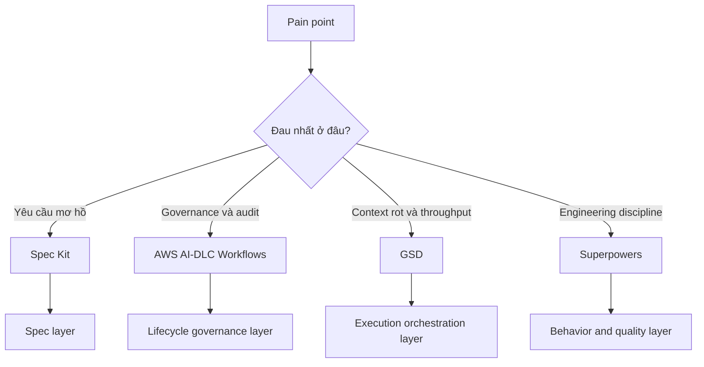

## 2. Bản chất chung: chúng là gì và không phải là gì?

Các framework này không phải là framework runtime như React, Spring, FastAPI. Chúng là **AI engineering operating model**: cách tổ chức yêu cầu, context, plan, tasks, code generation, verification và human review để agent tạo phần mềm ổn định hơn.

### 2.1. Vì sao AI coding cần framework?

AI coding agent có 4 năng lực mạnh:

1. Đọc nhanh nhiều file.
2. Sinh code nhanh.
3. Đề xuất plan và test.
4. Lặp lại nhiều phương án với chi phí thấp hơn con người.

Nhưng agent có 7 điểm yếu hệ thống:

1. **Ambiguity amplification**: input mơ hồ thì agent tự lấp khoảng trống.
2. **Context rot**: hội thoại dài làm context nhiễu, agent quên quyết định cũ.
3. **Spec drift**: code đổi nhưng tài liệu không đổi, hoặc ngược lại.
4. **Verification gap**: agent nói đã xong nhưng test/build/review chưa đủ.
5. **Authority confusion**: không rõ artifact nào là source of truth.
6. **Governance gap**: enterprise cần audit, approval, security, NFR, nhưng agent flow thường quá tự do.
7. **Over-automation risk**: chạy nhanh nhưng sai hướng, tạo technical debt nhanh hơn.

Framework AI workflow tồn tại để giảm 7 điểm yếu đó.

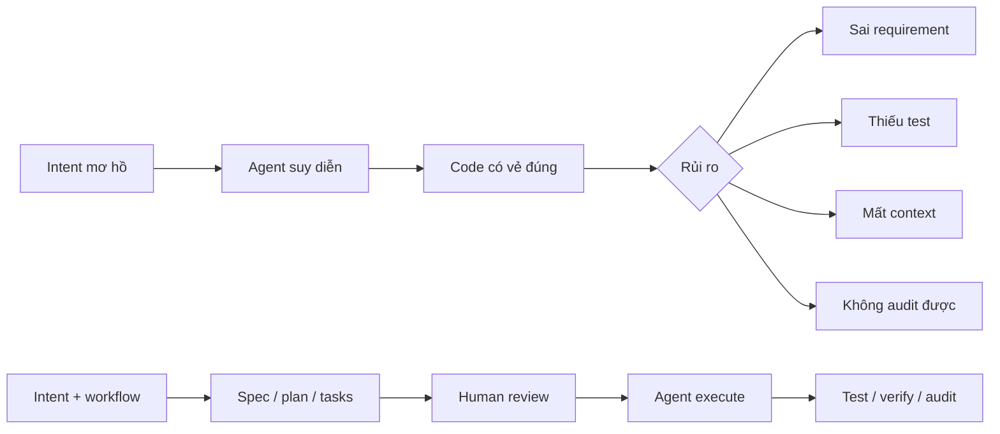

### 2.2. Bốn khái niệm hay bị trộn lẫn

| Khái niệm | Nghĩa đúng | Dễ nhầm với |
|---|---|---|
| SDLC | Software Development Life Cycle truyền thống: requirement, design, build, test, deploy, operate | Một bộ tài liệu cứng nhắc |
| AI-DLC | Vòng đời phát triển phần mềm khi AI là collaborator chính, có human oversight | Chỉ là code generation |
| SDD | Spec-Driven Development: spec là nguồn chân lý, code là implementation của spec | Waterfall hoặc tài liệu dài |
| Context engineering | Thiết kế context, memory, task boundary, prompt/rule để agent làm việc tốt | Prompt engineering đơn lẻ |

### 2.3. Mô hình chung của AI workflow hiện đại

Hầu hết các framework trong báo cáo này đều xoay quanh vòng lặp:

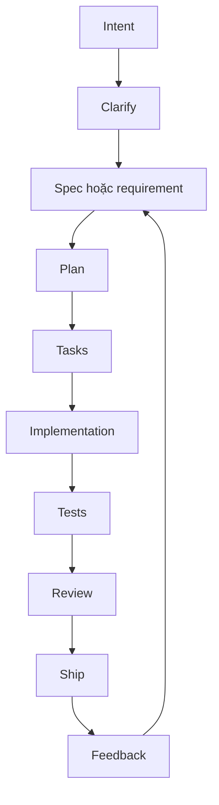

Điểm khác nhau là framework nào nhấn mạnh vào phần nào:

| Phần của vòng lặp | Framework mạnh nhất |
|---|---|
| Intent -> spec | Spec Kit |
| Lifecycle stage + approval + audit | AWS AI-DLC |
| Task execution nhiều phase, nhiều agent | GSD |
| Test-first, review-first, worktree discipline | Superpowers |

## 3. AI-DLC deep dive

### 3.1. AI-DLC là gì?

AI-DLC là **AI-Driven Development Life Cycle**: một cách tổ chức vòng đời phát triển phần mềm khi AI không chỉ là autocomplete, mà là collaborator tham gia requirement analysis, design, planning, code generation, testing và documentation.

Điểm quan trọng: AI-DLC không nói "để AI tự làm hết". Nó nói "đưa AI vào lifecycle nhưng vẫn giữ human accountability".

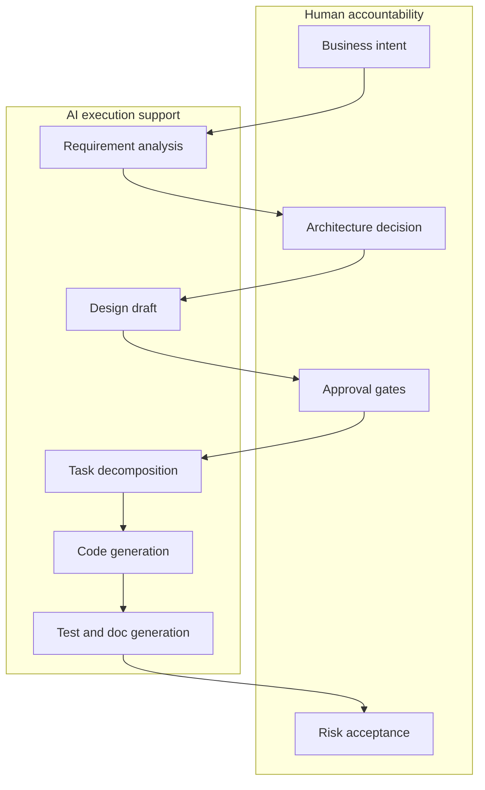

### 3.2. AI-DLC khác SDLC truyền thống ở đâu?

| Trục | SDLC truyền thống | AI-DLC |
|---|---|---|
| Người tạo artifact | Chủ yếu con người | AI tạo draft nhanh, con người review/approve |
| Tốc độ iteration | Chậm hơn, nhiều handoff | Nhanh hơn, AI có thể sinh nhiều phương án |
| Rủi ro chính | Tài liệu lỗi thời, handoff chậm | Agent suy diễn, automation sai hướng |
| Control mechanism | Meeting, document review, ticket workflow | Prompt/rules, generated docs, approval gates, audit |
| Vai trò architect | Thiết kế và review trực tiếp | Thiết kế decision framework, quality gates, guardrails |
| Vai trò developer | Implement theo ticket | Điều phối agent, review, refactor, verify |

### 3.3. Vì sao AI-DLC tồn tại?

AI-DLC tồn tại vì enterprise không thể chỉ dùng "chat với agent rồi merge code". Một tổ chức cần trả lời:

- Ai quyết định requirement cuối cùng?
- Khi AI sinh code sai, audit trail nằm ở đâu?
- NFR như performance, reliability, security được đưa vào lúc nào?
- Infrastructure và deployment có được thiết kế hay chỉ được vá sau?
- Với brownfield, AI có hiểu hệ thống hiện tại trước khi sửa không?
- Có evidence nào chứng minh đã build/test/review chưa?

AI-DLC đưa các câu hỏi đó thành workflow.

### 3.4. Ba pha AI-DLC

| Pha | Mục tiêu | Output | Human gate |
|---|---|---|---|
| Inception | Làm rõ WHAT/WHY, scope, risk, architecture direction | Requirements, user stories, application design, work units | Approve scope/design |
| Construction | Làm rõ HOW và thực thi theo unit | Functional design, NFR, infrastructure design, code plan, tests | Approve plan/code/test |
| Operations | Đưa hệ thống vào vận hành, monitor, feedback | Deployment, monitoring, incident feedback | Production readiness |

AWS AI-DLC Workflows hiện đã thể hiện rõ Inception và Construction; Operations còn thiên về định hướng mở rộng nên khi dùng thật cần bổ sung CI/CD, observability, incident playbook và production readiness checklist.

### 3.5. Use case phù hợp

AI-DLC rất hợp khi:

1. Dự án có nhiều stakeholder: product, architect, security, infra, QA, operations.
2. Có NFR quan trọng: latency, availability, data privacy, cost, scalability.
3. Có brownfield modernization: phải reverse engineer codebase trước khi thay đổi.
4. Có audit/compliance: cần lưu lại quyết định, câu hỏi, approval.
5. Có kiến trúc cloud/infrastructure không tầm thường.
6. Có rủi ro business nếu AI hiểu sai yêu cầu.

AI-DLC không tối ưu khi:

1. Task rất nhỏ: đổi text, fix CSS nhỏ, rename field.
2. Prototype 1 ngày không cần audit.
3. Team chưa có người review artifact nghiêm túc.
4. Bạn chỉ muốn agent sửa bug nhanh trong repo cá nhân.

### 3.6. Failure modes của AI-DLC

| Failure mode | Dấu hiệu | Cách giảm rủi ro |
|---|---|---|
| Ceremony quá nặng | Mỗi bug nhỏ cũng sinh nhiều tài liệu | Dùng adaptive mode, phân loại task theo risk |
| Approval hình thức | Human approve mà không đọc | Đặt checklist ngắn, gate theo risk |
| Artifact drift | `aidlc-docs/` khác code thật | Bắt buộc update docs trong definition of done |
| Over-trust AI design | AI đề xuất architecture nghe hợp lý nhưng sai constraint | Architect review trade-off, threat model, NFR |
| Ops gap | Build xong nhưng thiếu deploy/monitoring | Bổ sung production readiness checklist riêng |

## 4. Spec-Driven Development deep dive

### 4.1. SDD là gì?

Spec-Driven Development là cách phát triển trong đó **specification là nguồn chân lý chính**. Code không phải nơi duy nhất thể hiện hệ thống; code là một implementation của spec.

Nói cách khác:

```text
Intent -> Specification -> Plan -> Tasks -> Code -> Tests -> Feedback -> Specification
```

Trong AI era, SDD trở nên quan trọng vì AI cần input rõ. Nếu input là "làm giúp tôi dashboard đẹp", agent sẽ đoán. Nếu input là spec có user journey, acceptance criteria, data model, error cases và constraints, agent có cơ hội build đúng hơn nhiều.

### 4.2. SDD không phải là waterfall

SDD dễ bị hiểu nhầm là quay lại waterfall. Thực tế, SDD tốt phải iterative:

- Spec có thể thay đổi.
- Plan có thể được regenerate.
- Task có thể được chia lại.
- Code feedback quay lại spec.
- Bug report và analytics làm giàu acceptance criteria.

Điểm khác waterfall là spec không bị "đóng băng" sau requirement phase. Spec là artifact sống.

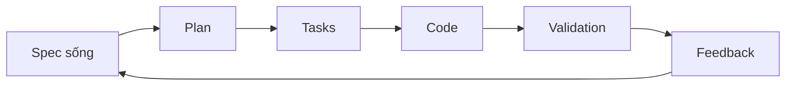

### 4.3. SDD mạnh nhất khi nào?

| Use case | Vì sao hợp SDD |
|---|---|
| Product feature mới | Cần làm rõ user value, acceptance criteria, edge cases |
| API/contract design | Spec giúp trace từ contract tới implementation/tests |
| Multi-agent development | Nhiều agent có cùng source of truth |
| Regenerate/refactor | Có thể kiểm tra code mới vẫn đáp ứng spec |
| Team onboarding | Người mới đọc spec hiểu intent trước khi đọc code |
| Vendor/outsourcing/AI agent | Spec giảm ambiguity khi giao việc |

### 4.4. SDD yếu khi nào?

| Tình huống | Vấn đề |
|---|---|
| Sửa rất nhỏ | Overhead cao hơn lợi ích |
| Research/prototype mơ hồ | Spec ban đầu có thể giả chính xác quá mức |
| Team không cập nhật spec | Spec nhanh chóng thành tài liệu chết |
| Product discovery chưa rõ | Cần discovery/experiment trước, không nên ép spec quá sớm |

### 4.5. Chất lượng spec tốt trông như thế nào?

Một spec tốt cho AI coding agent cần có:

1. Mục tiêu business rõ.
2. User persona hoặc actor.
3. User journey chính.
4. Acceptance criteria đo được.
5. Non-goals.
6. Edge cases.
7. Data/contracts.
8. Error handling.
9. Security/privacy constraints.
10. Performance/reliability constraints nếu có.
11. Open questions.
12. Test expectations.

Spec yếu thường có các dấu hiệu:

- Dùng nhiều từ "đẹp", "nhanh", "thông minh", "dễ dùng" nhưng không đo được.
- Không nói non-goals.
- Không có edge cases.
- Không nêu role/permission.
- Không nói migration/backward compatibility.
- Không có acceptance criteria.

## 5. Framework deep dive: GitHub Spec Kit

### 5.1. Bản chất

GitHub Spec Kit là toolkit để thực hành SDD bằng AI coding agents. Nó đưa một quy trình chuẩn vào repo: constitution, specification, clarification, implementation plan, tasks, analysis và implementation.

Spec Kit không phải một app framework và không phải lifecycle governance đầy đủ. Nó là **SDD workflow scaffold**.

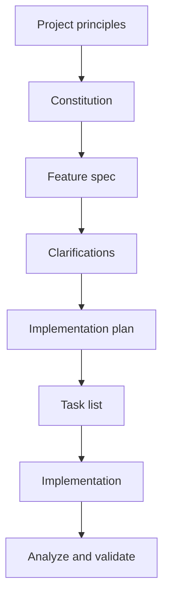

### 5.2. Mental model

Hãy hình dung Spec Kit như một "compiler" từ product intent sang executable work:

```text
Human intent
  -> /speckit.specify
Specification
  -> /speckit.clarify
Resolved ambiguity
  -> /speckit.plan
Technical plan
  -> /speckit.tasks
Executable task list
  -> /speckit.implement
Code and tests
```

### 5.3. Core artifacts

| Artifact | Vai trò | Vì sao quan trọng |
|---|---|---|
| Constitution | Luật nền của project | Đưa nguyên tắc engineering vào mọi feature |
| Feature spec | WHAT/WHY | Chống agent nhảy vào HOW quá sớm |
| Clarification | Câu hỏi còn mơ hồ | Ép ambiguity lộ ra trước khi code |
| Plan | HOW | Kết nối spec với architecture/tech stack |
| Tasks | Work breakdown | Cho agent hoặc human execute theo thứ tự |
| Checklist/analyze | Quality check | Bắt inconsistency trước khi implement |

### 5.4. Workflow chi tiết

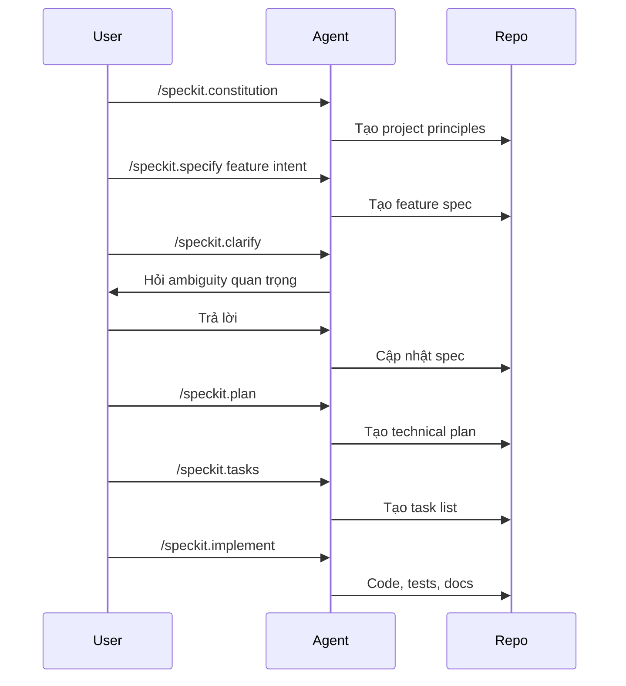

### 5.5. Điểm mạnh cụ thể

1. **Giảm ambiguity ở tầng requirement**  
   Spec Kit ép intent thành spec. Điều này rất có giá trị vì phần lớn lỗi của AI coding không đến từ syntax, mà từ hiểu sai yêu cầu.

2. **Constitution tạo "luật dự án" ổn định**  
   Thay vì mỗi prompt nhắc lại "hãy viết test, dùng accessibility, giữ architecture sạch", constitution làm nền để agent luôn xét đến các nguyên tắc đó.

3. **Tách WHAT/WHY khỏi HOW**  
   Đây là điểm cực quan trọng. Nếu agent lập tức chọn database, framework, API shape trước khi hiểu user flow, implementation có thể rất nhanh nhưng sai.

4. **Artifact dễ review**  
   Product owner có thể review spec. Architect review plan. Engineer review tasks. Mỗi người không cần đọc toàn bộ code ngay.

5. **Tốt cho multi-agent**  
   Khi nhiều agent cùng làm, spec/plan/tasks là shared context tốt hơn chat history.

### 5.6. Điểm yếu cụ thể

1. **Không tự đảm bảo spec đúng**  
   Spec Kit giúp tạo spec, nhưng con người vẫn phải review. Một spec sai được viết đẹp vẫn dẫn tới code sai.

2. **Dễ tạo cảm giác "đã rõ" giả**  
   Agent có thể viết spec nghe rất mạch lạc, nhưng bỏ sót domain constraint quan trọng. Cần domain expert review.

3. **Không giải quyết full enterprise governance**  
   Nó không thay thế audit trail, risk register, approval matrix, security review, production readiness.

4. **Doc drift nếu team thiếu discipline**  
   Nếu developer sửa code trực tiếp mà không update spec/plan, source of truth vỡ.

5. **Task nhỏ có thể bị nặng**  
   Đổi label, fix typo, CSS nhỏ không cần full spec-plan-task.

### 5.7. Use case tốt nhất

| Use case | Vì sao Spec Kit hợp |
|---|---|
| Feature mới trong product | Cần WHAT/WHY và acceptance criteria |
| Greenfield MVP có scope rõ | Tạo nền spec/plan/tasks từ đầu |
| API mới | Spec giúp định nghĩa contract trước |
| Refactor có behavior không đổi | Spec mô tả expected behavior để tránh regression |
| Team học cách làm việc với AI | Command flow rõ, ít "ma thuật" |

### 5.8. Không nên dùng làm primary khi

| Tình huống | Lý do |
|---|---|
| Enterprise cần audit và approval nhiều tầng | AI-DLC phù hợp hơn |
| Dự án dài, nhiều phase, cần nhiều subagent chạy song song | GSD phù hợp hơn |
| Chỉ muốn ép agent TDD/review trong task hằng ngày | Superpowers gọn hơn |
| Task rất nhỏ | Workflow tối thiểu nhanh hơn |

### 5.9. Ví dụ ứng dụng: Forgot Password

Nếu dùng Spec Kit cho feature "forgot password":

| Bước | Output mong muốn |
|---|---|
| Constitution | Security principle: không lộ user existence, token expire, audit login event |
| Specify | User có thể yêu cầu reset password bằng email |
| Clarify | Token expire bao lâu? Có rate limit không? Email template nào? |
| Plan | API endpoint, DB table/token, email service, UI flow |
| Tasks | Backend token model, endpoint, email, frontend form, tests |
| Implement | Code + unit/integration/e2e tests |

Spec Kit giúp bạn không quên các câu hỏi như rate limit, token expiration, user enumeration, email delivery failure.

### 5.10. Mức trưởng thành phù hợp

| Team maturity | Khuyến nghị |
|---|---|
| Cá nhân mới dùng AI | Rất nên dùng để học spec-first |
| Startup nhỏ | Dùng cho feature vừa/lớn, bỏ qua cho task nhỏ |
| Enterprise | Dùng được, nhưng nên kết hợp governance riêng hoặc AI-DLC |
| Regulated domain | Chỉ dùng Spec Kit là chưa đủ |

## 6. Framework deep dive: AWS AI-DLC Workflows

### 6.1. Bản chất

AWS AI-DLC Workflows là bộ steering/rules để coding agent thực hiện AI-DLC theo hướng có kiểm soát. Nó tạo artifact trong `aidlc-docs/`, quản lý state/audit, hỏi human, và chia workflow theo Inception, Construction, Operations.

Nếu Spec Kit là "spec compiler", thì AI-DLC Workflows là "delivery governance cockpit".

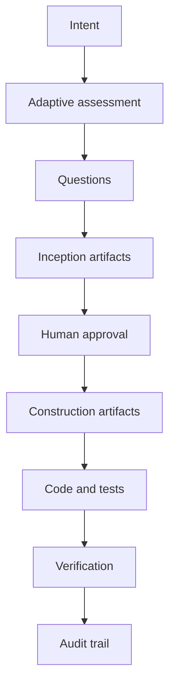

### 6.2. Mental model

AI-DLC Workflows đặt AI vào vai "AI development partner" nhưng buộc nó đi qua gates:

1. Xác định loại dự án và mức độ phức tạp.
2. Hỏi các câu còn thiếu.
3. Sinh tài liệu Inception.
4. Chờ human review.
5. Chia work units.
6. Sinh construction plan cho từng unit.
7. Implement.
8. Build/test.
9. Ghi audit/state.

### 6.3. Artifact model

AWS AI-DLC thường xoay quanh thư mục `aidlc-docs/`.

| Artifact | Vai trò |
|---|---|
| `aidlc-state.md` | Trạng thái hiện tại của workflow |
| `audit.md` | Dấu vết quyết định, approval, stage movement |
| Requirements | Business/functional requirements |
| User stories | Actor, goal, acceptance |
| Application design | Kiến trúc ứng dụng |
| Reverse engineering docs | Hiểu brownfield codebase |
| Units of work | Chia scope thành phần có thể làm |
| Functional design | Thiết kế chi tiết theo unit |
| NFR design | Performance, security, reliability, scalability |
| Infrastructure design | Cloud/resources/deployment architecture |
| Code generation plan | Cách agent sẽ implement |
| Build/test instructions | Cách verify kết quả |

### 6.4. Workflow chi tiết

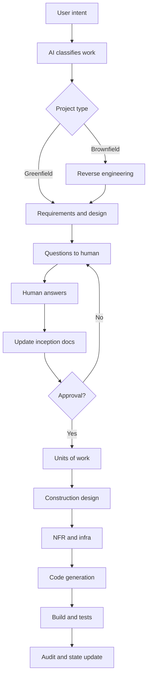

### 6.5. Điểm mạnh cụ thể

1. **Human oversight thật sự được thiết kế vào workflow**  
   AI không chỉ tự chạy. Nó hỏi, chờ, cập nhật, yêu cầu review.

2. **Phù hợp enterprise hơn các framework còn lại**  
   Vì enterprise quan tâm audit, approval, NFR, infrastructure, traceability.

3. **Brownfield support rõ hơn Spec Kit**  
   Việc reverse engineering giúp tránh sửa hệ thống cũ khi chưa hiểu context.

4. **Adaptive workflow**  
   Ý tưởng không phải mọi task đều cần cùng mức ceremony. Đây là điểm quan trọng để tránh biến AI-DLC thành waterfall mới.

5. **Tốt cho solution architecture**  
   Nó buộc phải nghĩ về application design, NFR và infrastructure trước khi code.

### 6.6. Điểm yếu cụ thể

1. **Nặng nếu dùng sai loại việc**  
   Nếu áp dụng full AI-DLC cho mọi bug nhỏ, team sẽ ghét framework.

2. **Operations chưa đủ mạnh nếu dùng nguyên repo**  
   Cần bổ sung CI/CD, observability, rollback, incident response, SLO/SLA, runbook.

3. **Review burden lớn**  
   Sinh nhiều artifact nghĩa là con người phải đọc. Nếu không đọc, audit chỉ là hình thức.

4. **Có thể conflict với tool khác**  
   Nếu repo đã có `specs/`, `.planning/`, ADR, RFC, docs portal, cần map authority rõ.

5. **Rủi ro "AI bureaucracy"**  
   Tài liệu nhiều nhưng quyết định thật không tốt hơn nếu thiếu người chịu trách nhiệm.

### 6.7. Use case tốt nhất

| Use case | Vì sao AI-DLC hợp |
|---|---|
| Enterprise application mới | Cần stage, approval, NFR, infra |
| Modernize hệ thống cũ | Cần reverse engineering và work units |
| Regulated/compliance | Cần audit trail và human approval |
| Multi-team delivery | Cần artifact chung để alignment |
| Cloud architecture | Cần infrastructure design và operational thinking |
| Feature rủi ro cao | Cần risk-based review trước khi code |

### 6.8. Không nên dùng làm primary khi

| Tình huống | Lý do |
|---|---|
| Solo prototype nhanh | Quá nhiều artifact |
| Bug nhỏ | Overhead không đáng |
| Team không có người review | Approval gate mất ý nghĩa |
| Product discovery chưa rõ | Nên discovery/experiment trước |

### 6.9. Ví dụ ứng dụng: Forgot Password

Với AI-DLC, forgot password không chỉ là endpoint. Workflow sẽ hỏi:

| Góc nhìn | Câu hỏi AI-DLC nên ép lộ ra |
|---|---|
| Business | Người dùng nào được reset? Có tenant/org không? |
| Security | Chống user enumeration thế nào? Token expire? Rate limit? |
| Privacy | Email có chứa thông tin nhạy cảm không? |
| Infra | Gửi email qua service nào? Retry/dead-letter ra sao? |
| Operations | Monitor email failure thế nào? Alert khi abuse? |
| Audit | Có ghi event reset requested/succeeded không? |

Spec Kit cũng có thể hỏi các câu này, nhưng AI-DLC có xu hướng đưa chúng vào lifecycle và audit rõ hơn.

### 6.10. Adoption playbook

Nếu dùng AI-DLC thật trong team:

1. Định nghĩa task categories: trivial, small, medium, high-risk.
2. Chỉ bắt full AI-DLC cho medium/high-risk.
3. Chọn artifact authoritative: `aidlc-docs/` hay docs hiện có.
4. Thêm checklist operations nếu deploy production.
5. Định nghĩa approval matrix: ai approve requirement, architecture, security, release.
6. Tích hợp CI test evidence vào artifact hoặc PR.
7. Review sau 2-4 tuần: artifact nào hữu ích, artifact nào noise.

## 7. Framework deep dive: GSD / Get Shit Done

### 7.1. Bản chất

GSD là framework tập trung vào **shipping velocity dưới giới hạn context của AI agent**. Nó dùng `.planning/` làm project memory, chia milestone/phase, dùng subagents để research/plan/execute/verify, và giảm việc nhét mọi thứ vào một cuộc chat.

Lưu ý nguồn: repo bạn đưa `gsd-build/get-shit-done` hiện được README trỏ sang dòng `open-gsd/get-shit-done-redux`. Vì vậy khi đánh giá hiện trạng nên xem `open-gsd/get-shit-done-redux`.

Nếu Spec Kit là spec compiler, AI-DLC là governance cockpit, thì GSD là "delivery factory cho agent".

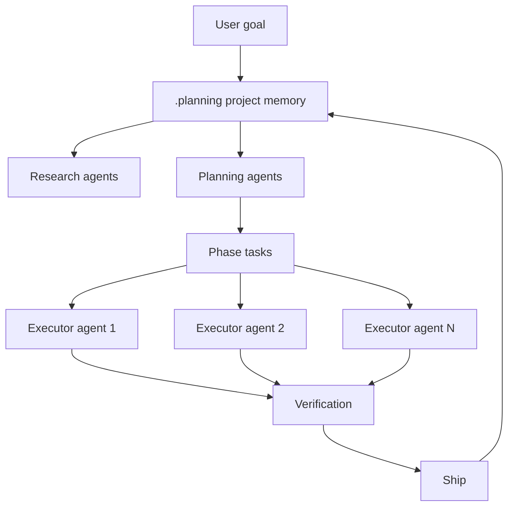

### 7.2. Mental model

GSD nhìn AI coding như một vấn đề điều phối:

- Main chat không nên ôm hết context.
- Project state phải nằm trong file bền vững.
- Research/plan/execute nên được chia vai.
- Task độc lập có thể chạy song song.
- Verification phải có agent/check riêng.
- Ship nên tạo commit/PR rõ ràng.

### 7.3. Artifact model

GSD thường dùng `.planning/` như bộ nhớ dự án.

| Artifact | Vai trò |
|---|---|
| `.planning/PROJECT.md` | Mục tiêu, bối cảnh, định nghĩa dự án |
| `.planning/REQUIREMENTS.md` | Requirements |
| `.planning/ROADMAP.md` | Milestones/phases |
| `.planning/STATE.md` | Trạng thái hiện tại |
| `.planning/config.json` | Mode, agent config, parallelism, quality agents |
| Phase artifacts | Discussion, plan, tasks, verification theo phase |

Điểm khác lớn so với Spec Kit: GSD không chỉ muốn spec tốt; nó muốn cả **execution system** chạy được qua nhiều phase.

### 7.4. Workflow chi tiết

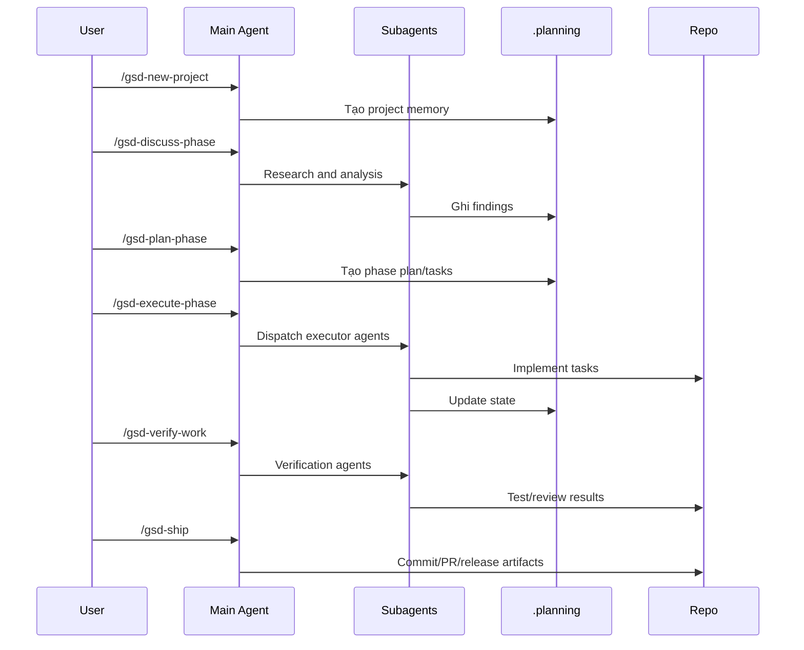

### 7.5. Điểm mạnh cụ thể

1. **Giải quyết context rot rất trực diện**  
   Đây là khác biệt lớn nhất. GSD không tin rằng một chat dài sẽ mãi giữ chất lượng. Nó đưa state vào `.planning/` và dùng fresh context cho subagents.

2. **Tốt cho dự án dài nhiều session**  
   Nếu hôm nay làm phase 1, tuần sau làm phase 2, `.planning/` giúp agent không phải nhớ bằng chat history.

3. **Parallel execution**  
   Khi task độc lập, GSD có thể dùng nhiều executor agents để tăng throughput.

4. **Có vai trò agent rõ**  
   Researcher, planner, checker, executor, verifier giúp giảm việc một agent vừa nghĩ, vừa làm, vừa tự chấm.

5. **Tối ưu cho shipping**  
   Tên framework đã nói rõ: nó quan tâm việc đi từ plan tới ship, không chỉ tạo tài liệu đẹp.

### 7.6. Điểm yếu cụ thể

1. **Có thể quá automation-heavy**  
   Nếu không kiểm soát, nhiều subagent có thể tạo nhiều thay đổi khó review.

2. **Governance enterprise chưa phải trọng tâm**  
   GSD có verify/quality, nhưng không phải framework audit/compliance như AI-DLC.

3. **Command surface lớn**  
   Người dùng phải học loop, config, modes, agent roles.

4. **Rủi ro dependency/tooling**  
   Vì GSD là một hệ sinh thái CLI/package, cần theo dõi version, repo maintained, security.

5. **Source of truth dễ đụng với framework khác**  
   `.planning/` có thể conflict với `specs/` hoặc `aidlc-docs/` nếu không quy định rõ.

### 7.7. Use case tốt nhất

| Use case | Vì sao GSD hợp |
|---|---|
| Solo builder làm app nhiều ngày | `.planning/` giữ project memory |
| Startup cần ship nhanh | Phase loop và parallel tasks giúp throughput |
| Codebase vừa/lớn, nhiều task độc lập | Subagents xử lý song song |
| Migration/refactor chia theo phase | ROADMAP/STATE giúp theo dõi tiến độ |
| Long-running AI project | Giảm phụ thuộc vào chat history |

### 7.8. Không nên dùng làm primary khi

| Tình huống | Lý do |
|---|---|
| Compliance-heavy enterprise | AI-DLC phù hợp hơn |
| Feature yêu cầu spec cực chặt trước code | Spec Kit phù hợp hơn |
| Team chưa kiểm soát được review | Parallel execution có thể tạo chaos |
| Task nhỏ | Quá nặng |

### 7.9. Ví dụ ứng dụng: Forgot Password

Với GSD, feature có thể được chia phase:

| Phase | Nội dung |
|---|---|
| Discuss | Xác định flow, security constraints, email provider |
| Plan | Tách tasks backend, frontend, email, tests |
| Execute | Subagents làm model/API, UI, email template, tests song song |
| Verify | Agent khác chạy tests, review security, kiểm tra UX |
| Ship | Commit/PR, update state, next milestone |

Điểm mạnh ở đây không phải chỉ là spec; mà là orchestration để nhiều phần chạy nhanh mà không mất context.

### 7.10. Adoption playbook

Nếu dùng GSD:

1. Bắt đầu với một repo cá nhân hoặc project ít risk.
2. Chỉ bật parallel execution khi task thật sự độc lập.
3. Định nghĩa rule: mọi phase phải có verify trước ship.
4. Giới hạn scope mỗi phase để review được.
5. Không dùng mode quá tự động trong codebase production trước khi có CI mạnh.
6. Map `.planning/` với docs hiện có để tránh duplicate source of truth.

## 8. Framework deep dive: Superpowers

### 8.1. Bản chất

Superpowers là bộ methodology/skills để ép coding agent làm việc theo kỷ luật engineering. Nó không chỉ sinh spec hay quản lý lifecycle. Nó dạy agent "cách hành xử":

- Trước khi code: brainstorm, hỏi, design.
- Trước khi implement: viết plan.
- Khi implement: TDD, từng bước nhỏ.
- Khi xong: review, fix, finish branch.
- Khi task độc lập: dùng subagents/worktrees.

Nếu Spec Kit là spec compiler, AI-DLC là governance cockpit, GSD là delivery factory, thì Superpowers là "engineering discipline layer".

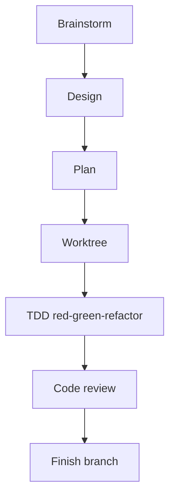

### 8.2. Mental model

Superpowers không cố quản lý toàn bộ project như GSD hay AI-DLC. Nó đặt một bộ kỹ năng vào agent, để khi gặp tình huống phù hợp, agent dùng skill tương ứng.

Ví dụ:

| Tình huống | Skill mindset |
|---|---|
| User đưa idea mơ hồ | Brainstorming |
| Cần thiết kế trước khi code | Writing plans |
| Task có nhiều phần độc lập | Subagent-driven development |
| Implement behavior mới | Test-driven development |
| Xong code | Requesting code review |
| Làm branch riêng | Using git worktrees / finishing branch |

### 8.3. Workflow chi tiết

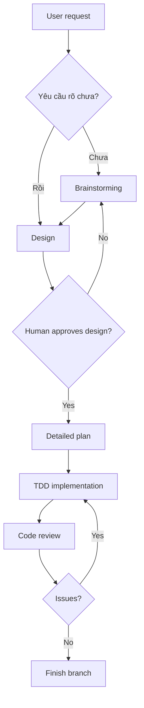

### 8.4. TDD là điểm rất mạnh

Superpowers nhấn mạnh TDD theo chu kỳ red-green-refactor:

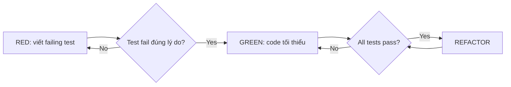

Ý nghĩa với AI coding:

- Agent không chỉ nói "đã implement".
- Mỗi behavior có test chứng minh.
- Refactor an toàn hơn.
- Review dễ hơn vì expected behavior rõ.

### 8.5. Điểm mạnh cụ thể

1. **Chống thói quen code trước nghĩ sau**  
   Agent buộc phải hỏi/design/plan trước khi sửa nhiều file.

2. **TDD giảm hallucinated correctness**  
   AI thường tự tin quá mức. Test-first làm confidence dựa trên evidence hơn là lời nói.

3. **Review discipline tốt**  
   Có bước review riêng giúp giảm việc agent tự chấm bài của chính mình.

4. **Composable**  
   Bạn có thể dùng một skill cho task nhỏ thay vì full workflow nặng.

5. **Phù hợp nhiều coding tools**  
   Superpowers không quá gắn với một vendor hoặc một project structure.

### 8.6. Điểm yếu cụ thể

1. **Không phải spec management system đầy đủ**  
   Nếu bạn cần spec/plan/tasks chuẩn hóa theo organization, Spec Kit rõ hơn.

2. **Không phải governance framework**  
   Nếu cần audit, approval matrix, NFR/infra docs, AI-DLC phù hợp hơn.

3. **TDD có chi phí ban đầu**  
   Với team chưa quen, cảm giác chậm. Nhưng đây là trade-off cố ý.

4. **Phụ thuộc vào agent có thật sự dùng skill đúng lúc không**  
   Cần rules/instructions tốt và người dùng nhắc khi agent đi lệch.

5. **Không tự giải quyết context rot ở project lớn như GSD**  
   Có subagent/worktree nhưng không phải project memory system sâu như `.planning/`.

### 8.7. Use case tốt nhất

| Use case | Vì sao Superpowers hợp |
|---|---|
| Bug fix cần test regression | TDD rất hợp |
| Feature nhỏ/vừa trong codebase có sẵn | Design/plan vừa đủ, không quá nặng |
| Team muốn nâng chất lượng agent | Skills tác động trực tiếp đến hành vi |
| Refactor an toàn | Test-first + review |
| Agent hay đoán mò | Brainstorming/design approval ép hỏi trước |

### 8.8. Không nên dùng làm primary khi

| Tình huống | Lý do |
|---|---|
| Cần full lifecycle enterprise | AI-DLC mạnh hơn |
| Cần SDD artifact chuẩn cho nhiều feature | Spec Kit mạnh hơn |
| Cần parallel project execution nhiều phase | GSD mạnh hơn |
| Prototype cực nhanh không cần test | Superpowers có thể cảm giác chậm |

### 8.9. Ví dụ ứng dụng: Forgot Password

Với Superpowers:

| Bước | Output |
|---|---|
| Brainstorm | Làm rõ UX, security, token, email |
| Design | Chọn flow, API, model, edge cases |
| Plan | Checklist từng file/test cần sửa |
| TDD | Viết test token expire, invalid token, no user enumeration |
| Implement | Code tối thiểu để pass test |
| Review | Agent khác review security và quality |
| Finish | Clean branch, summarize, verify |

Điểm mạnh ở đây là quality discipline chứ không phải lifecycle governance.

### 8.10. Adoption playbook

Nếu dùng Superpowers:

1. Bắt đầu bằng TDD và code review skills trước.
2. Với task lớn, bắt buộc brainstorm/design trước.
3. Dùng worktree cho thay đổi rủi ro.
4. Định nghĩa "done": tests pass + review issues resolved.
5. Không ép TDD cho spike/prototype discovery ngắn.

## 9. So sánh cực sâu theo tiêu chí kiến trúc

### 9.1. So sánh bản chất

| Tiêu chí | Spec Kit | AWS AI-DLC | GSD | Superpowers |
|---|---|---|---|---|
| Loại framework | SDD toolkit | Lifecycle workflow/governance | Context and execution orchestration | Agent skills/methodology |
| Vấn đề gốc | Spec mơ hồ | AI delivery thiếu kiểm soát | Context rot, throughput thấp | Agent thiếu discipline |
| Primary artifact | Spec/plan/tasks | `aidlc-docs/` | `.planning/` | Plans/tests/review/worktree |
| Tư duy chính | Spec là source of truth | Human-guided AI lifecycle | Project memory + subagents | Engineering habits |
| Đơn vị làm việc | Feature | Project/unit of work/stage | Milestone/phase/task | Task/behavior/branch |
| Người hưởng lợi | Product + engineering | Enterprise delivery team | Builder/team cần ship | Developer/team muốn chất lượng |

### 9.2. So sánh theo vòng đời

| Lifecycle activity | Spec Kit | AI-DLC | GSD | Superpowers |
|---|---|---|---|---|
| Requirement clarification | Rất mạnh | Rất mạnh | Trung bình-mạnh | Mạnh nếu dùng brainstorming |
| Architecture design | Mạnh ở plan | Rất mạnh | Trung bình | Mạnh tùy plan |
| NFR | Có thể đưa vào spec/constitution | Rất mạnh | Cần bổ sung | Cần bổ sung qua design |
| Infrastructure | Có trong plan nếu yêu cầu | Mạnh | Không phải trọng tâm | Không phải trọng tâm |
| Task decomposition | Mạnh | Mạnh theo unit | Rất mạnh theo phase | Mạnh theo plan |
| Parallel execution | Không phải trọng tâm | Không phải trọng tâm | Rất mạnh | Có qua subagent-driven dev |
| TDD | Có thể yêu cầu qua constitution | Có thể yêu cầu | Có quality agents | Rất mạnh |
| Audit trail | Trung bình | Rất mạnh | Trung bình | Thấp-trung bình |
| Operations | Không phải trọng tâm | Có định hướng, cần bổ sung | Không phải trọng tâm | Không phải trọng tâm |

### 9.3. So sánh theo human control

| Trục kiểm soát | Spec Kit | AI-DLC | GSD | Superpowers |
|---|---|---|---|---|
| Human approve requirement | Có | Rất rõ | Có thể | Có qua design |
| Human approve architecture | Có ở plan | Rất rõ | Có thể | Có trước implement |
| Human approve từng stage | Không mặc định sâu | Mạnh nhất | Theo phase | Theo task/plan |
| Agent tự chạy nhiều | Trung bình | Thấp-trung bình | Cao | Trung bình |
| Risk nếu user lơ là | Spec sai -> code sai | Approval hình thức | Subagents sửa nhiều khó review | TDD/review bị bỏ qua |

### 9.4. So sánh theo source of truth

| Framework | Source of truth mặc định | Rủi ro |
|---|---|---|
| Spec Kit | Spec + plan + tasks | Code drift nếu không update spec |
| AI-DLC | `aidlc-docs/` + state/audit | Tài liệu nhiều nhưng không ai đọc |
| GSD | `.planning/` | Planning state lệch với issue tracker/docs |
| Superpowers | Plan + tests + review notes | Không đủ project-level source of truth |

Nếu kết hợp nhiều framework, phải chọn một source of truth chính:

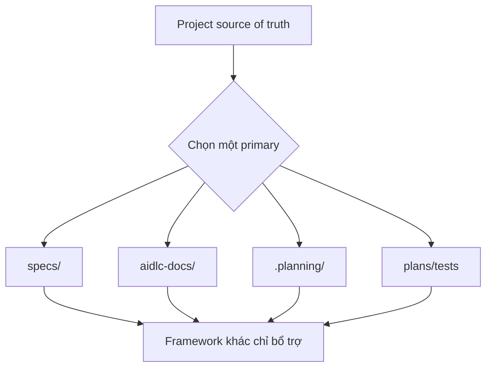

### 9.5. So sánh theo team size

| Team/context | Best fit | Lý do |
|---|---|---|
| Cá nhân học AI coding nghiêm túc | Superpowers hoặc Spec Kit | Dễ học discipline/spec-first |
| Solo founder ship MVP | GSD hoặc Spec Kit | GSD cho velocity, Spec Kit cho clarity |
| Startup 3-10 dev | Spec Kit + Superpowers, hoặc GSD | Cân bằng clarity, quality, speed |
| Enterprise app team | AI-DLC + selected Spec Kit ideas | Cần governance và traceability |
| Regulated domain | AI-DLC primary | Audit/human gate/NFR |
| Open-source project | Spec Kit hoặc Superpowers | Dễ review spec/PR/test |

### 9.6. So sánh theo risk

| Risk của công việc | Nên dùng | Tránh |
|---|---|---|
| Thấp, task nhỏ | Superpowers nhẹ hoặc manual prompt | Full AI-DLC/GSD |
| Trung bình, feature rõ | Spec Kit | Pure vibe coding |
| Cao, ảnh hưởng security/data | AI-DLC + TDD/review | GSD automation không kiểm soát |
| Dài ngày, nhiều task độc lập | GSD + review gate | Một chat dài |
| Refactor nhiều file | Superpowers TDD + Spec Kit spec | Agent tự sửa không test |

## 10. So sánh trực diện từng cặp

### 10.1. Spec Kit vs AI-DLC

| Câu hỏi | Spec Kit | AI-DLC |
|---|---|---|
| Cùng làm gì? | Làm rõ requirement trước code | Làm rõ requirement trước code |
| Khác nhau chính? | Tập trung vào spec -> plan -> tasks | Tập trung lifecycle, stage, approval, audit |
| Khi nào chọn Spec Kit? | Feature/product flow cần source of truth | Không cần governance nặng |
| Khi nào chọn AI-DLC? | Cần stakeholder approval, NFR, infra, audit | Dự án rủi ro/enterprise |
| Có kết hợp được không? | Có | AI-DLC primary, dùng ý tưởng spec quality của Spec Kit |

Tóm lại: Spec Kit sâu về SDD; AI-DLC rộng về lifecycle.

### 10.2. Spec Kit vs GSD

| Câu hỏi | Spec Kit | GSD |
|---|---|---|
| Primary pain | Spec mơ hồ | Context rot và execution velocity |
| Artifact | Spec/plan/tasks | `.planning/`, phase state |
| Execution | Có implement command nhưng không phải factory | Execution orchestration là trọng tâm |
| Parallelism | Không phải core | Core strength |
| Khi chọn | Muốn build đúng | Muốn ship nhanh qua nhiều phase |

Tóm lại: Spec Kit giúp "đúng cái cần build"; GSD giúp "đẩy nhiều việc qua pipeline".

### 10.3. Spec Kit vs Superpowers

| Câu hỏi | Spec Kit | Superpowers |
|---|---|---|
| Primary layer | Artifact/spec workflow | Agent behavior workflow |
| TDD | Có thể cấu hình qua constitution | Là core discipline |
| Design | Spec/plan formal hơn | Design/plan pragmatic hơn |
| Use hằng ngày | Feature vừa/lớn | Task nhỏ/vừa, bug/refactor |
| Kết hợp | Rất hợp | Spec Kit quản spec, Superpowers quản coding discipline |

Tóm lại: Spec Kit nói "viết đúng spec"; Superpowers nói "làm như engineer tốt".

### 10.4. AI-DLC vs GSD

| Câu hỏi | AI-DLC | GSD |
|---|---|---|
| Primary layer | Governance/lifecycle | Execution throughput |
| Enterprise | Mạnh | Cần bổ sung governance |
| Parallel execution | Không phải core | Core |
| Audit | Mạnh nhất | Trung bình |
| Risk | Over-ceremony | Over-automation |

Tóm lại: AI-DLC kiểm soát tốt; GSD chạy nhanh tốt.

### 10.5. AI-DLC vs Superpowers

| Câu hỏi | AI-DLC | Superpowers |
|---|---|---|
| Scope | Project/lifecycle | Task/branch/behavior |
| Human gate | Stage approval | Design/review approval |
| NFR/infra | Rất mạnh | Phải bổ sung |
| TDD | Không phải core mặc định | Core |
| Kết hợp | Có | AI-DLC cho governance, Superpowers cho implementation discipline |

Tóm lại: AI-DLC quản trị delivery; Superpowers quản trị thói quen coding.

### 10.6. GSD vs Superpowers

| Câu hỏi | GSD | Superpowers |
|---|---|---|
| Primary pain | Context rot, throughput | Agent discipline, TDD/review |
| Project memory | Mạnh | Vừa |
| Parallel agents | Mạnh | Có, nhưng không phải toàn bộ hệ |
| Quality | Có verifier/quality agents | TDD/review là core |
| Khi chọn | Project nhiều phase | Task cần chất lượng cao |

Tóm lại: GSD giúp tổ chức nhiều việc; Superpowers giúp làm từng việc đúng cách.

## 11. Decision framework: chọn cái nào?

### 11.1. Cây quyết định

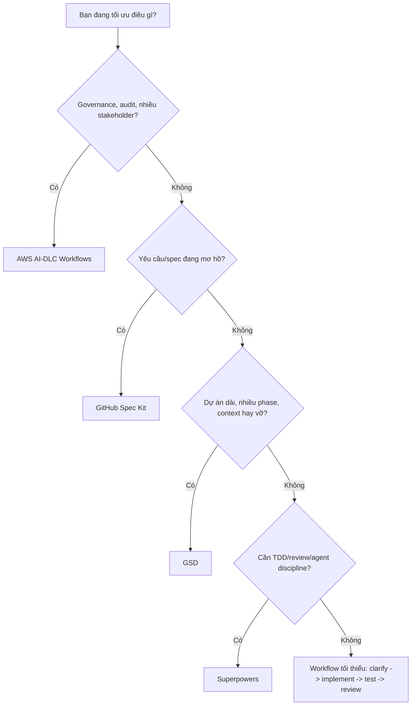

### 11.2. Chọn theo câu "tôi cần..."

| Tôi cần... | Chọn |
|---|---|
| Một cách viết spec để AI code đúng | Spec Kit |
| Một lifecycle có human approval và audit | AI-DLC |
| Một hệ để agent làm nhiều phase qua nhiều ngày | GSD |
| Một bộ skill để agent không code ẩu | Superpowers |
| Build nhanh MVP nhưng vẫn có structure | GSD + lightweight Spec Kit |
| Feature quan trọng có acceptance criteria | Spec Kit + Superpowers TDD |
| Modernize enterprise system | AI-DLC primary |
| Refactor an toàn trong codebase hiện hữu | Superpowers + tests |
| Dự án có security/compliance | AI-DLC + explicit security gates |

### 11.3. Chọn theo độ lớn công việc

| Độ lớn | Framework nên dùng |
|---|---|
| 5-30 phút | Superpowers nhẹ hoặc prompt thủ công có test |
| 0.5-2 ngày | Spec Kit hoặc Superpowers |
| 1-3 tuần | Spec Kit + GSD hoặc AI-DLC tùy risk |
| 1-3 tháng | AI-DLC hoặc GSD có governance bổ sung |
| Enterprise program | AI-DLC primary, framework khác làm layer phụ |

### 11.4. Chọn theo loại codebase

| Codebase | Best fit |
|---|---|
| Greenfield product app | Spec Kit nếu clarity quan trọng; GSD nếu speed quan trọng |
| Brownfield monolith | AI-DLC nếu modernization lớn; Superpowers nếu refactor nhỏ |
| Library/API | Spec Kit rất hợp vì contract rõ |
| Internal tool | GSD hoặc Spec Kit |
| Regulated system | AI-DLC |
| OSS repo | Spec Kit/Superpowers vì dễ review qua PR |

## 12. Cách kết hợp framework mà không tự làm rối

### 12.1. Nguyên tắc số 1: chỉ có một source of truth chính

Không nên để cả 4 cùng quản lý requirement.

Bad pattern:

```text
specs/             # nói A
aidlc-docs/        # nói B
.planning/         # nói C
docs/superpowers/  # nói D
code               # làm E
```

Good pattern:

```text
Primary source of truth: specs/
Supporting:
- Superpowers for TDD/review
- GSD only for phase execution notes
- AI-DLC not used unless project risk increases
```

### 12.2. Các combo hợp lý

| Combo | Khi nào dùng | Cách chia vai |
|---|---|---|
| Spec Kit + Superpowers | Feature cần rõ và code chất lượng | Spec Kit quản spec/plan/tasks; Superpowers quản TDD/review |
| AI-DLC + Superpowers | Enterprise nhưng vẫn muốn implementation discipline | AI-DLC quản gates/audit; Superpowers quản coding loop |
| GSD + Superpowers | Startup ship nhanh nhưng không muốn ẩu | GSD quản phases/subagents; Superpowers quản TDD/review |
| AI-DLC + Spec Kit ideas | Enterprise muốn spec quality cao | AI-DLC primary; dùng constitution/checklist concept |
| Spec Kit + GSD | Product feature lớn cần vừa spec vừa execution | Spec Kit tạo source spec; GSD execute phases, không duplicate requirement |

### 12.3. Các combo dễ gây rối

| Combo | Rủi ro |
|---|---|
| AI-DLC + GSD cùng primary | `aidlc-docs/` và `.planning/` cùng quản lifecycle |
| Spec Kit + AI-DLC không map artifact | Requirement/spec lặp và lệch |
| GSD automation + thiếu review | Tạo nhiều code nhanh nhưng khó kiểm soát |
| Superpowers + không chạy test thật | Chỉ còn methodology trên giấy |

## 13. Implementation playbooks thực tế

### 13.1. Playbook A: Feature mới cho SaaS app

Khuyến nghị: Spec Kit + Superpowers.

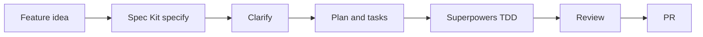

Lý do:

- Spec Kit đảm bảo feature rõ.
- Superpowers đảm bảo code/test/review có kỷ luật.
- Không cần AI-DLC nếu không có risk enterprise.
- Không cần GSD nếu feature không quá nhiều phase.

### 13.2. Playbook B: Enterprise modernization

Khuyến nghị: AI-DLC primary, Superpowers phụ.

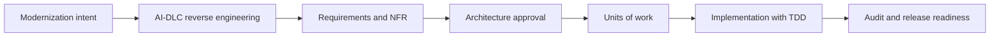

Lý do:

- Brownfield cần reverse engineering.
- Enterprise cần approval/audit.
- Superpowers giúp implementation không ẩu.

### 13.3. Playbook C: Solo founder build MVP

Khuyến nghị: GSD primary, Spec Kit nhẹ cho feature quan trọng.

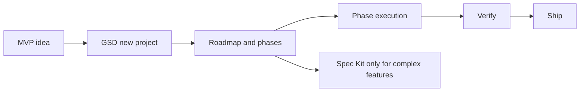

Lý do:

- Solo founder cần project memory và velocity.
- GSD giúp đi qua nhiều session.
- Spec Kit chỉ dùng khi feature mơ hồ/rủi ro.

### 13.4. Playbook D: Bug fix/refactor trong repo hiện có

Khuyến nghị: Superpowers.

Flow:

1. Reproduce bug.
2. Viết failing test.
3. Implement fix tối thiểu.
4. Chạy full relevant tests.
5. Review diff.
6. Update docs/spec nếu bug làm thay đổi expected behavior.

Không nên dùng full AI-DLC hoặc GSD cho bug nhỏ, trừ khi bug liên quan security/compliance hoặc migration lớn.

## 14. Scoring matrix

Chấm theo thang 1-5, 5 là mạnh nhất.

| Tiêu chí | Spec Kit | AI-DLC | GSD | Superpowers |
|---|---:|---:|---:|---:|
| Requirement clarity | 5 | 4 | 3 | 4 |
| Lifecycle governance | 3 | 5 | 3 | 2 |
| Auditability | 3 | 5 | 3 | 2 |
| Context management | 4 | 4 | 5 | 3 |
| Execution throughput | 3 | 3 | 5 | 3 |
| TDD discipline | 3 | 3 | 3 | 5 |
| Enterprise readiness | 4 | 5 | 3 | 3 |
| Solo builder fit | 4 | 2 | 5 | 5 |
| Learning curve | 3 | 4 | 4 | 3 |
| Risk of over-process | 3 | 5 | 4 | 3 |
| Risk of over-automation | 2 | 2 | 5 | 3 |
| Best default for feature work | 5 | 3 | 4 | 4 |

Diễn giải:

- AI-DLC điểm cao về governance nhưng cũng cao về risk over-process.
- GSD điểm cao về throughput nhưng cũng cao về risk over-automation.
- Superpowers điểm cao về discipline nhưng không phải governance system.
- Spec Kit cân bằng tốt cho feature work nhưng không giải quyết mọi thứ.

## 15. Anti-patterns cần tránh

### 15.1. "Cài framework là agent sẽ tự đúng"

Sai. Framework chỉ tăng xác suất đúng nếu:

- Input tốt.
- Human review thật.
- Test chạy thật.
- Artifact được cập nhật.
- Scope được chia hợp lý.

### 15.2. "Dùng tất cả cùng lúc"

Sai trong đa số trường hợp. Bạn sẽ tạo nhiều thư mục source of truth và càng rối hơn.

### 15.3. "Approval mà không đọc"

Đặc biệt nguy hiểm với AI-DLC. Nếu approve hình thức, workflow chỉ tạo cảm giác an toàn giả.

### 15.4. "Parallelize mọi thứ"

Đặc biệt nguy hiểm với GSD. Task không độc lập mà chạy song song sẽ gây conflict, duplicate design, test fail khó debug.

### 15.5. "TDD giả"

Đặc biệt nguy hiểm khi dùng Superpowers. Nếu test được viết sau để pass code hiện có, bạn mất lợi ích lớn nhất.

### 15.6. "Spec quá chung"

Đặc biệt nguy hiểm với Spec Kit. Spec nghe hay nhưng thiếu acceptance criteria sẽ chỉ tạo code nghe có vẻ đúng.

## 16. Checklist chọn framework cho dự án của bạn

Trả lời 12 câu này:

| Câu hỏi | Nếu câu trả lời là Có |
|---|---|
| Có nhiều stakeholder cần approve không? | Nghiêng AI-DLC |
| Có compliance/audit không? | Nghiêng AI-DLC |
| Requirement hiện đang mơ hồ không? | Nghiêng Spec Kit |
| Feature có nhiều edge cases không? | Spec Kit + Superpowers |
| Dự án kéo dài nhiều tuần không? | Nghiêng GSD hoặc AI-DLC |
| Agent hay mất context không? | Nghiêng GSD |
| Cần chạy nhiều task song song không? | Nghiêng GSD |
| Codebase có test tốt không? | Superpowers rất hợp |
| Team muốn TDD nghiêm không? | Superpowers |
| Có NFR/infra quan trọng không? | AI-DLC |
| Có brownfield cần hiểu trước khi sửa không? | AI-DLC hoặc GSD map codebase |
| Task rất nhỏ không? | Không cần framework nặng |

## 17. Kết luận thực dụng

Các framework này giống nhau ở chỗ đều cố đưa AI coding ra khỏi "prompt tự do" và đưa vào quy trình có artifact. Nhưng chúng khác nhau ở tầng tối ưu:

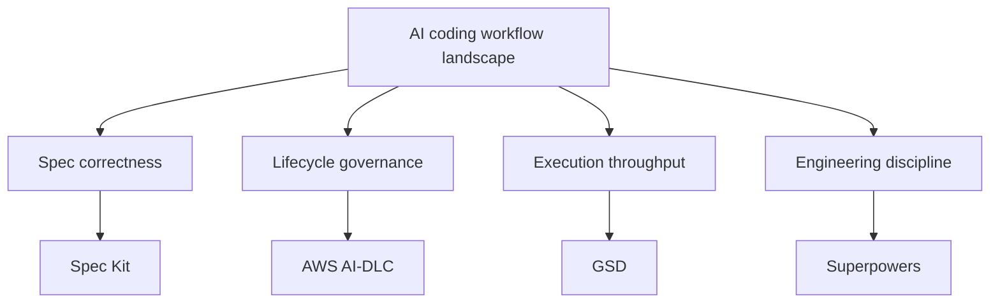

Khuyến nghị mặc định:

1. Nếu bạn đang học và muốn bớt rối: bắt đầu với **Spec Kit** để hiểu SDD.
2. Nếu bạn làm production code hằng ngày: thêm **Superpowers** để có TDD/review discipline.
3. Nếu project dài, nhiều phase, agent hay mất context: thử **GSD**.
4. Nếu bạn ở enterprise hoặc dự án rủi ro cao: dùng **AI-DLC** làm primary workflow.

Một câu chốt:

> Spec Kit giúp bạn định nghĩa đúng thứ cần build. AI-DLC giúp tổ chức kiểm soát quá trình build. GSD giúp agent build được nhiều việc qua nhiều phase. Superpowers giúp từng thay đổi được build như một engineer có kỷ luật.

