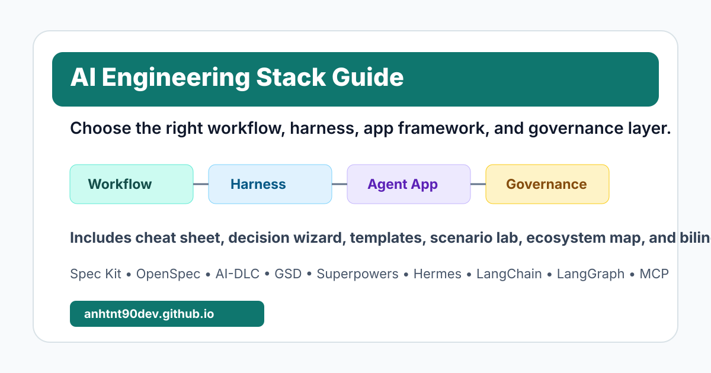

# AI Engineering Stack Guide

[](https://anhtnt90dev.github.io/ai-engineering-stack-guide/)
[](https://vitepress.dev/)
[](https://anhtnt90dev.github.io/ai-engineering-stack-guide/en/)
[](https://anhtnt90dev.github.io/ai-engineering-stack-guide/vi/)
[](https://mermaid.js.org/)
[](./LICENSE)



A bilingual field guide and practical toolkit for understanding the modern AI engineering stack: AI-DLC, Spec-Driven Development, workflow frameworks, agent harnesses/runtimes, agent app frameworks, model serving, RAG/data, MCP/tools, evals, observability, security, and governance.

Live site: https://anhtnt90dev.github.io/ai-engineering-stack-guide/

## Why This Guide Exists

AI engineering tools are increasingly hard to compare because many of them use the same verbs:

```text
plan -> implement -> review -> iterate
```

That similarity creates confusion. Spec Kit, OpenSpec, AWS AI-DLC, GSD, Superpowers, Hermes, Codex CLI, Claude Code, LangChain, LangGraph, and MCP can all appear in an AI-assisted engineering workflow, but they do not solve the same problem.

This guide explains the difference by layer:

```text
Model / Serving
  -> Data / RAG
  -> Tools / MCP
  -> Agent App Frameworks
  -> Agent Harnesses / Runtimes
  -> Workflow / Methodology
  -> Artifacts / Source of Truth
  -> Evals / Observability / Governance
```

The goal is to help readers choose the right tool for the right layer instead of comparing unrelated frameworks as if they were direct competitors.

## What You Will Learn

- Why AI-DLC exists and how it changes traditional software delivery.
- What Spec-Driven Development means in AI-assisted coding.
- How GitHub Spec Kit, OpenSpec, AWS AI-DLC Workflows, GSD, and Superpowers differ.
- Where Hermes, Codex CLI, and Claude Code fit as agent harness/runtime tools.
- Where LangChain and LangGraph fit as agent app frameworks.
- Why RAG, MCP/tools, evals, observability, security, and governance are separate production layers.
- How to combine frameworks without creating multiple sources of truth.
- Which stack fits common use cases such as SaaS features, RAG products, enterprise modernization, internal agent platforms, and long-running agent services.
- How to use a one-page cheat sheet, interactive decision wizard, templates, and scenario lab to apply the concepts in real projects.

## Start Reading

| Language | Entry point |
|---|---|
| English | https://anhtnt90dev.github.io/ai-engineering-stack-guide/en/ |
| Tieng Viet | https://anhtnt90dev.github.io/ai-engineering-stack-guide/vi/ |

Recommended path:

1. Start with the Stack Map.
2. Use the Cheat Sheet and Decision Wizard.
3. Download the Templates and Starter Artifacts.
4. Read AI-DLC and Spec-Driven Development foundations.
5. Understand Agent Harness vs Workflow Framework.
6. Read the deep dives for each workflow framework.
7. Read LangChain, LangGraph, and Hermes positioning.
8. Use the comparison matrix, scenario lab, and decision guide.
9. Apply the reference architectures and adoption playbook.

## Topics Covered

| Area | Pages |
|---|---|
| Foundations | AI-DLC, Spec-Driven Development, Harness vs Workflow |
| Decision Tools | One-page cheat sheet, interactive decision wizard, templates, scenario lab, ecosystem map |
| AI Engineering Stack | Model serving, RAG/data, MCP/tools, evals, observability, security, governance |
| Workflow Frameworks | GitHub Spec Kit, OpenSpec, AWS AI-DLC Workflows, GSD, Superpowers |
| Agent Harnesses | Hermes Agent, Codex CLI vs Claude Code vs Hermes |
| Agent App Frameworks | LangChain, LangGraph, LangChain/LangGraph vs Hermes |
| Adoption | Decision guide, combinations, real-world use cases, maturity model, anti-patterns |

## Practical Toolkit

| Tool | Link |
|---|---|
| One-page cheat sheet | https://anhtnt90dev.github.io/ai-engineering-stack-guide/en/tools/cheat-sheet |
| Interactive decision wizard | https://anhtnt90dev.github.io/ai-engineering-stack-guide/en/tools/decision-wizard |
| Templates and starter artifacts | https://anhtnt90dev.github.io/ai-engineering-stack-guide/en/tools/templates |
| Scenario lab | https://anhtnt90dev.github.io/ai-engineering-stack-guide/en/tools/scenario-lab |
| Adjacent agent ecosystem map | https://anhtnt90dev.github.io/ai-engineering-stack-guide/en/tools/ecosystem-map |

## Featured Frameworks And References

- GitHub Spec Kit: https://github.com/github/spec-kit
- OpenSpec: https://github.com/Fission-AI/OpenSpec
- AWS AI-DLC Workflows: https://github.com/awslabs/aidlc-workflows
- GSD Core: https://github.com/open-gsd/gsd-core
- Superpowers: https://github.com/obra/superpowers
- Hermes Agent: https://github.com/NousResearch/hermes-agent
- LangChain: https://docs.langchain.com/oss/python/langchain/overview
- LangGraph: https://docs.langchain.com/oss/python/langgraph/overview
- OpenAI Agents SDK: https://platform.openai.com/docs/guides/agents-sdk/
- Microsoft AutoGen: https://microsoft.github.io/autogen/
- CrewAI: https://docs.crewai.com/
- Google Agent Development Kit: https://google.github.io/adk-docs/
- Azure AI Foundry Agent Service: https://learn.microsoft.com/azure/ai-foundry/agents/overview
- Amazon Bedrock Agents: https://docs.aws.amazon.com/bedrock/latest/userguide/agents.html
- Dify: https://docs.dify.ai/
- n8n AI Agent node: https://docs.n8n.io/integrations/builtin/cluster-nodes/root-nodes/n8n-nodes-langchain.agent/
- Model Context Protocol: https://modelcontextprotocol.io/
- OpenTelemetry: https://opentelemetry.io/

## Local Development

Requirements:

- Node.js 22 or newer is recommended.
- npm.

Install dependencies:

```bash
npm install
```

Run the local documentation server:

```bash
npm run docs:dev
```

Build the static site:

```bash
npm run docs:build
```

Preview the production build:

```bash
npm run docs:preview
```

The English site is under `/en/`. The Vietnamese site is under `/vi/`.

## Deployment

This repository uses GitHub Actions to deploy VitePress to GitHub Pages.

Workflow file:

```text
.github/workflows/deploy.yml
```

The workflow sets:

```text
BASE_PATH=/${{ github.event.repository.name }}/
```

That makes the site work as a GitHub project page:

```text
https://anhtnt90dev.github.io/ai-engineering-stack-guide/
```

## Repository Structure

```text
docs/
  .vitepress/
    config.mts
    theme/
  en/
    foundations/
    tools/
    stack/
    frameworks/
    app-frameworks/
    harnesses/
    compare/
  vi/
    foundations/
    tools/
    stack/
    frameworks/
    app-frameworks/
    harnesses/
    compare/
  public/
    templates/
```

## Project Status

This is an evolving learning guide and practical toolkit. It currently includes:

- Bilingual English and Vietnamese documentation.
- Layer-first taxonomy for AI workflows, harnesses, app frameworks, RAG, tools, evals, observability, security, and governance.
- Deep dives for Spec Kit, OpenSpec, AWS AI-DLC Workflows, GSD, Superpowers, Hermes, LangChain, and LangGraph.
- A one-page cheat sheet and interactive decision wizard.
- Downloadable templates for specs, AI-DLC records, GSD plans, TDD prompts, LangGraph state design, RAG evals, tool permissions, and adoption scoring.
- A scenario lab showing the same RAG support assistant through multiple workflow lenses.
- An adjacent ecosystem map for OpenAI Agents SDK, AutoGen, CrewAI, Google ADK, Azure AI Foundry Agents, Amazon Bedrock Agents, Dify, n8n, LlamaIndex, Haystack, and Semantic Kernel.

## License

MIT. See [LICENSE](./LICENSE).
