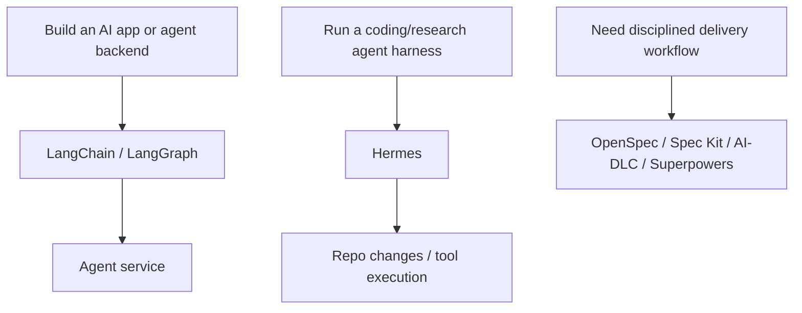
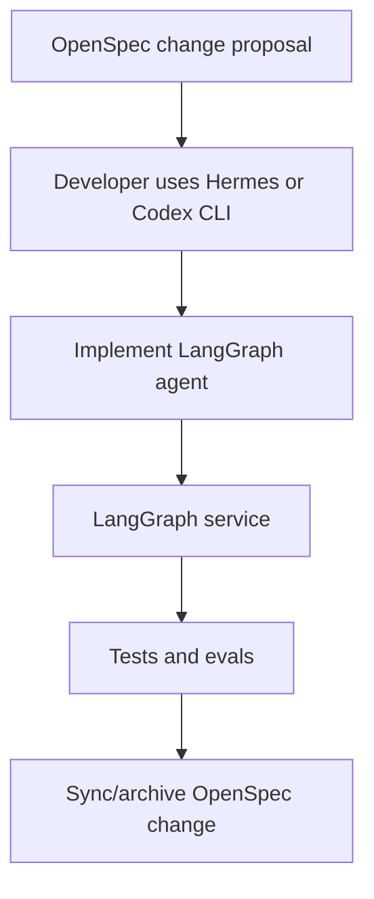

# LangChain/LangGraph vs Hermes

LangChain, LangGraph, and Hermes are related, but they do not occupy the same role.

| Tool | Layer | Main output |
|---|---|---|
| LangChain | Agent app framework | AI application or agent logic |
| LangGraph | Stateful agent orchestration framework/runtime | Long-running graph-based agent service |
| Hermes | Agent harness/runtime CLI | Running/customizable agent with tools, memory, skills, subagents |

## Simple distinction



## LangGraph vs Hermes

| Question | LangGraph | Hermes |
|---|---|---|
| What is it? | Framework/runtime to build stateful agent apps | Open-source agent CLI/runtime |
| Who uses it? | Developers building agent backends | Developers/platform teams running/customizing agents |
| What do you write? | Graph state, nodes, edges, tools | Runtime configuration, tools, skills, workflow instructions |
| Output | Agent service/application | Running agent harness |
| Best for | Long-running stateful app workflows | Hackable coding/research agent execution |

## Can they combine?

Yes. Common combinations:

| Combination | Meaning |
|---|---|
| LangGraph + OpenSpec | OpenSpec governs changes to a LangGraph app |
| LangGraph + AI-DLC | AI-DLC governs high-risk agent app delivery |
| Hermes + LangGraph | Hermes is coding/runtime harness; LangGraph is the app framework being built |
| LangChain + Superpowers | LangChain app implementation with TDD/review discipline |

## What not to confuse

Do not use LangGraph as a replacement for delivery governance.

```text
LangGraph orchestrates runtime behavior.
AI-DLC governs delivery decisions.
OpenSpec/Spec Kit manage specs.
Superpowers enforces coding discipline.
Hermes runs/customizes agent execution.
```

## Example stack



