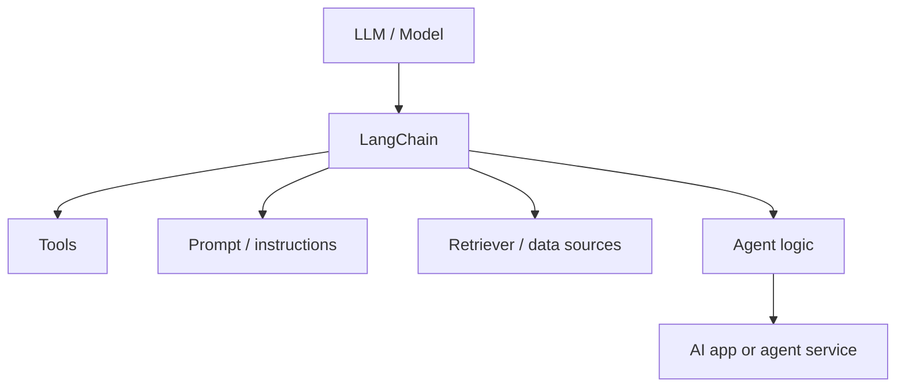
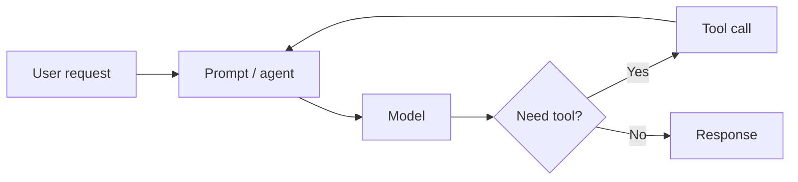
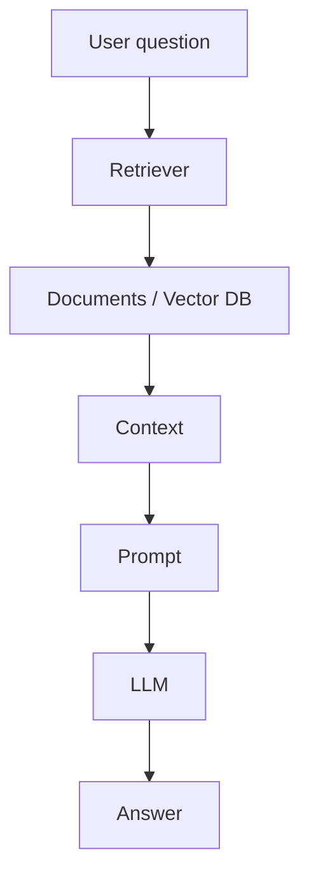
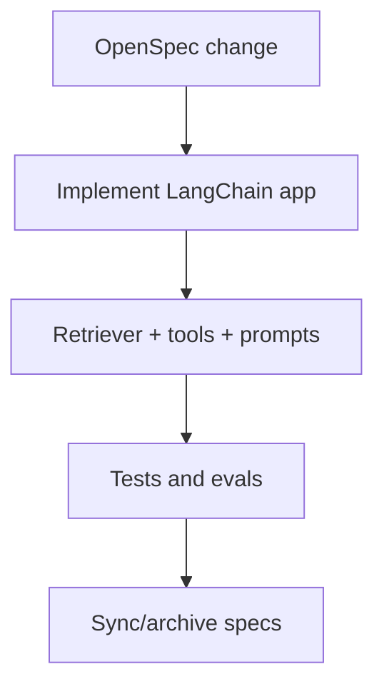

# LangChain

LangChain is an open-source framework for building LLM-powered applications and agents. It belongs to the **Agent App / Orchestration Framework** layer, not the software delivery workflow layer.

Primary reference: <https://docs.langchain.com/oss/python/langchain/overview>

## Where LangChain fits

LangChain answers:

> How do I build an AI app or agent that connects models, prompts, tools, data, and application logic?

It does not primarily answer:

> How should an AI coding agent manage specs, plans, approvals, and delivery artifacts?

## Core concepts

| Concept | Role |
|---|---|
| Model | The LLM or chat model used by the app |
| Prompt/instructions | How the app guides model behavior |
| Tools | Functions the model/agent can call |
| Retriever | Component that fetches relevant external knowledge |
| Agent | Model-driven loop that decides whether to respond or use tools |
| Middleware | Custom control around agent behavior |
| Messages/state | Conversation and execution context |

## Simple agent flow

## RAG app flow

## When to use LangChain

Use LangChain when:

- You are building an AI application or backend service.
- You need tools, model calls, prompts, retrievers, or structured outputs.
- You want a fast way to build agents that call functions.
- You need integrations with model providers, vector stores, tools, and observability.
- Your workflow is application runtime behavior, not software delivery governance.

## When not to use LangChain

Do not use LangChain as a replacement for:

| Need | Better layer |
|---|---|
| Spec-first software delivery | Spec Kit or OpenSpec |
| Enterprise approval/audit lifecycle | AWS AI-DLC |
| Agent CLI/harness for coding in a repo | Codex CLI, Claude Code, Hermes |
| TDD/review discipline | Superpowers |
| Multi-phase coding project memory | GSD |

## LangChain and workflow frameworks

LangChain can be the app framework inside a repo whose development is governed by another workflow.

Example:

In that stack:

- OpenSpec owns change artifacts.
- LangChain implements the AI app behavior.
- Superpowers can enforce TDD/review.
- CI/evals prove correctness.

## Step-by-step: build a RAG chatbot

1. Define the feature with OpenSpec or Spec Kit.
2. Identify knowledge sources.
3. Create retriever/vector store.
4. Write prompt/instructions.
5. Create LangChain chain or agent.
6. Add citations or source references.
7. Add tests/evals for answer quality.
8. Add latency and cost monitoring.
9. Review and ship.

## Definition of done

An AI app built with LangChain is done when:

1. Inputs/outputs are defined.
2. Tool permissions are explicit.
3. Retrieval behavior is tested.
4. Prompt behavior is evaluated.
5. Errors and fallbacks are handled.
6. Cost and latency are measured.
7. Observability exists for production use.

