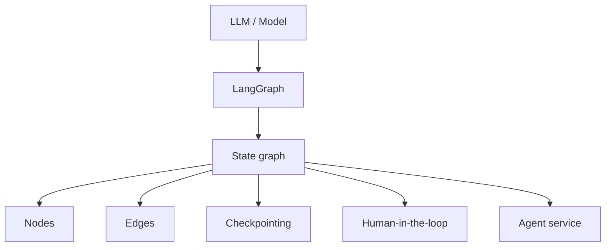
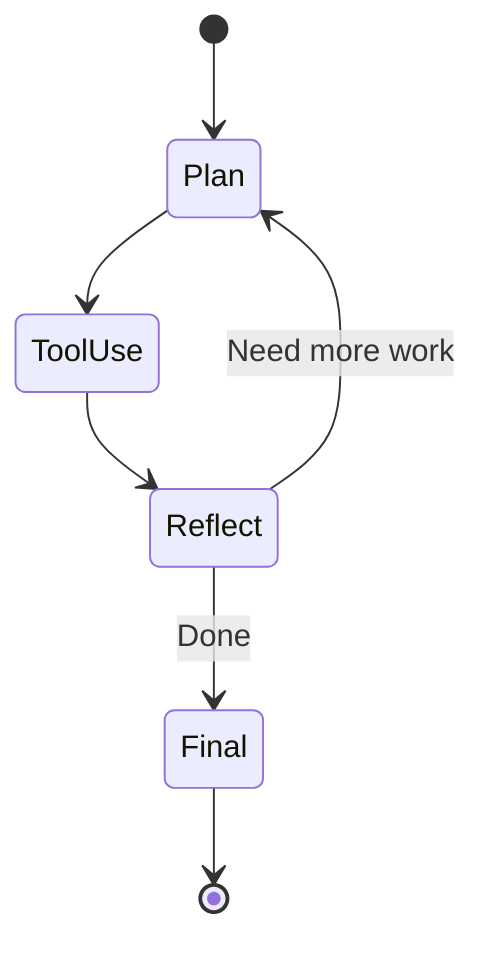
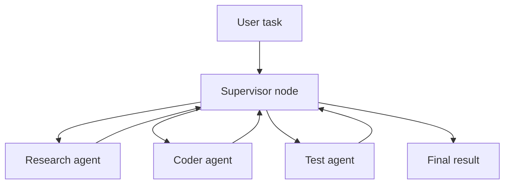

# LangGraph

LangGraph is a low-level orchestration framework and runtime for building, managing, and deploying long-running, stateful agents. It is especially useful when an agent workflow needs durable execution, state, memory, checkpoints, human-in-the-loop, or multi-agent orchestration.

Primary reference: <https://docs.langchain.com/oss/python/langgraph/overview>

## Where LangGraph fits

LangGraph answers:

> How do I orchestrate stateful, long-running, controllable agent behavior?

It does not primarily answer:

> How should my software team approve specs, track delivery, or run code review?

## Core concepts

| Concept | Role |
|---|---|
| State | Shared data that moves through the graph |
| Node | A unit of work, often a model/tool/function step |
| Edge | Routing from one node to another |
| Checkpoint | Durable saved execution state |
| Human-in-the-loop | Human review or input during execution |
| Memory | Persistent context across interactions |
| Multi-agent graph | Multiple specialized agents coordinated by a graph |

## Basic state graph

## Multi-agent orchestration

## When to use LangGraph

Use LangGraph when:

- A simple chain is not enough.
- You need stateful multi-step workflows.
- Agent execution may be long-running.
- You need human-in-the-loop review.
- You need durable checkpoints.
- You need multi-agent coordination.
- You need runtime control and observability for an agent app.

## When not to use LangGraph

Avoid LangGraph when:

- a simple prompt/tool call is enough;
- a basic LangChain agent is enough;
- your problem is software delivery process, not app runtime orchestration;
- your team does not need state, checkpoints, or graph control.

## LangGraph vs LangChain

| Dimension | LangChain | LangGraph |
|---|---|---|
| Best for | Simple-to-medium AI apps and agents | Stateful, long-running, controllable agents |
| Abstraction | Higher-level app/agent building blocks | Lower-level graph orchestration |
| State | Available but not the main mental model | Central concept |
| Human-in-loop | Possible | First-class pattern |
| Durable execution | Not the main focus | Core strength |
| Multi-agent | Possible | Stronger fit |

## Step-by-step: support agent

1. Define support workflow states:
   - classify request;
   - retrieve customer context;
   - propose answer;
   - escalate if needed;
   - human approval for risky replies.
2. Model state schema.
3. Create nodes.
4. Add edges and routing logic.
5. Add checkpointing.
6. Add human-in-the-loop nodes.
7. Add tool permissions.
8. Add tests/evals per node and full graph.
9. Add monitoring and tracing.
10. Deploy as an agent service.

## Definition of done

A LangGraph agent is production-ready when:

1. State schema is explicit.
2. Node responsibilities are clear.
3. Edges and fallback paths are tested.
4. Checkpoints are configured.
5. Human-in-the-loop gates are defined.
6. Tool permissions are safe.
7. Observability exists.
8. Evals cover important scenarios.

