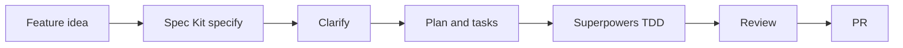
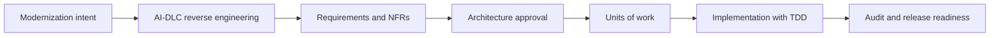
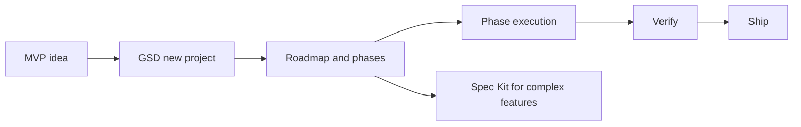

# Adoption Playbook

The safest way to adopt these frameworks is to choose one primary workflow and use others only as supporting layers.

For detailed combination patterns, read [Framework Combinations](./combinations). For concrete end-to-end scenarios, read [Real-World Use Cases](./use-cases).

## Principle 1: one source of truth

Bad pattern:

```text
specs/             # says A
aidlc-docs/        # says B
.planning/         # says C
docs/superpowers/  # says D
code               # implements E
```

Good pattern:

```text
Primary source of truth: specs/
Supporting:
- Superpowers for TDD and review
- GSD only for phase execution notes
- AI-DLC only for high-risk work
```

## Good combinations

| Combination | When to use | Division of responsibility |
|---|---|---|
| Spec Kit + Superpowers | Feature must be clear and code quality matters | Spec Kit owns spec/plan/tasks; Superpowers owns TDD/review |
| AWS AI-DLC + Superpowers | Enterprise delivery with strict implementation discipline | AI-DLC owns gates/audit; Superpowers owns coding loop |
| GSD + Superpowers | Startup shipping fast without losing quality | GSD owns phases/subagents; Superpowers owns tests/review |
| AWS AI-DLC + Spec Kit ideas | Enterprise wants better spec quality | AI-DLC primary; borrow constitution/checklist thinking |
| Spec Kit + GSD | Large feature needs both clarity and execution | Spec Kit owns source spec; GSD executes phases |

## Risk-based rollout

| Phase | Action |
|---|---|
| Week 1 | Pick one pilot feature and one primary framework |
| Week 2 | Run the workflow end-to-end and track friction |
| Week 3 | Add quality gate: tests, review, or approval |
| Week 4 | Decide what artifacts are authoritative |
| Month 2 | Scale to more teams only after templates stabilize |

## Playbook A: product feature

Recommended: Spec Kit + Superpowers.



## Playbook B: enterprise modernization

Recommended: AWS AI-DLC primary, Superpowers as implementation discipline.



## Playbook C: solo MVP

Recommended: GSD primary, Spec Kit only for complex features.



## Definition of done

Whatever workflow you choose, define done with evidence:

1. Requirement or intent is clear.
2. Important questions are answered.
3. Implementation is scoped.
4. Relevant tests pass.
5. Review issues are resolved.
6. Source-of-truth artifact is updated.
7. Release or next-step state is recorded.

## 30/60/90 day rollout

Use this when introducing these workflows to a real team.

### First 30 days: prove the loop

Goal: make one workflow work end-to-end.

1. Choose one primary framework.
2. Pick one medium-sized feature.
3. Define the source-of-truth location.
4. Require test evidence.
5. Run one retrospective after shipping.

Recommended pilots:

| Team context | Pilot |
|---|---|
| Product team with vague requirements | Spec Kit |
| Brownfield product team needing lightweight change specs | OpenSpec |
| Enterprise architecture team | AWS AI-DLC |
| Solo builder or startup team | GSD |
| Existing repo with bugs/refactors | Superpowers |

### Days 31-60: standardize useful artifacts

Goal: keep what helped, remove ceremony.

1. Create templates from the best pilot artifacts.
2. Define when to skip the workflow.
3. Add review checklists.
4. Add CI verification to the process.
5. Decide how artifacts map to issue tracker and PRs.

### Days 61-90: scale carefully

Goal: expand without creating process debt.

1. Train another engineer or team.
2. Create examples of good specs, plans, reviews, and audit entries.
3. Add automation only where review is reliable.
4. Track cycle time, rework rate, escaped defects, and review effort.
5. Revisit the source-of-truth decision.

## Role-based responsibilities

| Role | Responsibilities |
|---|---|
| Product owner | Own user outcome, acceptance criteria, non-goals |
| Tech lead | Own implementation plan, task slicing, code review |
| Solution architect | Own architecture trade-offs, NFRs, integration boundaries |
| Security owner | Own threat model, abuse cases, privacy, secrets, permissions |
| QA/quality engineer | Own test strategy, regression risk, evidence |
| Operations owner | Own deployment, monitoring, runbooks, incident feedback |

## Production readiness checklist

Use this checklist before merging AI-generated work into production systems:

| Area | Required evidence |
|---|---|
| Requirement | Source-of-truth artifact exists and matches implementation |
| Tests | Relevant automated tests pass |
| Review | Human review is complete |
| Security | Auth, authorization, secrets, privacy, and abuse cases checked |
| Data | Migration, rollback, retention, and compatibility reviewed |
| Operations | Logs, metrics, alerts, and rollback path are clear |
| Documentation | User-facing or operator-facing docs updated when needed |

## Metrics to track

| Metric | Why it matters |
|---|---|
| Rework rate | Shows whether specs/plans are clear enough |
| Review findings per PR | Shows quality of agent output |
| Escaped defects | Shows verification quality |
| Cycle time | Shows whether the workflow is too heavy |
| Artifact drift incidents | Shows whether source of truth is maintained |
| Human approval latency | Shows whether gates are practical |
