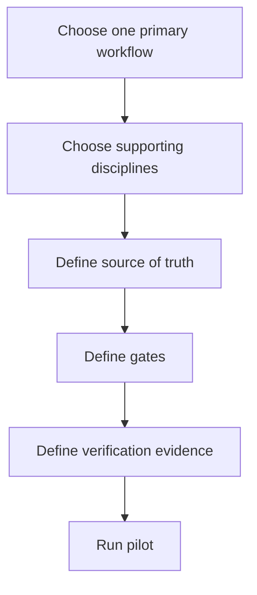
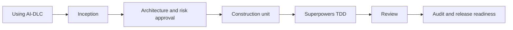
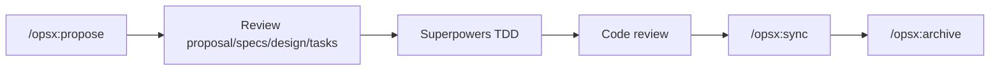
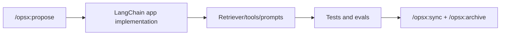

# Framework Combinations

The frameworks can be combined, but only if you assign clear ownership. The biggest mistake is letting every framework create its own competing source of truth.

## Combination principle



## Recommended combinations

| Combination | Primary | Supporting layer | Best for | Risk |
|---|---|---|---|---|
| LangChain + OpenSpec | OpenSpec | LangChain as app framework | RAG/tool-agent feature with lightweight change specs | App evals can be under-specified |
| LangGraph + AI-DLC | AI-DLC | LangGraph as app framework | Long-running agent app with enterprise risk | Runtime orchestration confused with delivery governance |
| LangGraph + Hermes | Depends | Hermes as harness, LangGraph as app code | Internal agent platform | Layer ownership can be unclear |
| Hermes + OpenSpec | OpenSpec | Hermes as runtime | Custom/self-hosted agent executing lightweight change specs | Runtime complexity |
| Hermes + AI-DLC | AI-DLC | Hermes as runtime | Internal agent platform with enterprise governance | Requires strong safety controls |
| Hermes + Superpowers | Superpowers | Hermes skills/runtime | Custom agent with TDD/review discipline | Skills must be enforced |
| Spec Kit + Superpowers | Spec Kit | Superpowers | Product features that need both clarity and code quality | TDD may feel slower if the team is not used to it |
| OpenSpec + Superpowers | OpenSpec | Superpowers | Lightweight brownfield changes with test discipline | Too light if security/governance is high |
| OpenSpec + GSD | OpenSpec | GSD | Iterative change specs plus multi-phase execution | Duplicate change state if boundaries are unclear |
| AWS AI-DLC + Superpowers | AWS AI-DLC | Superpowers | Enterprise delivery with strict implementation discipline | Too many gates if not risk-based |
| GSD + Superpowers | GSD | Superpowers | Startup/solo shipping without losing test/review quality | Parallel execution can outrun review |
| Spec Kit + GSD | Spec Kit | GSD | Large feature with clear spec and multi-phase execution | Duplicate planning if `.planning/` repeats specs |
| AWS AI-DLC + Spec Kit ideas | AWS AI-DLC | Spec Kit constitution/checklist concepts | Enterprise teams that want stronger spec quality | Two document systems can drift |
| AWS AI-DLC + GSD | AWS AI-DLC | GSD for execution only | Large modernization where governance and throughput both matter | Highest complexity; requires strict boundaries |

## Combination 1: Spec Kit + Superpowers

Use this as the default high-quality product feature workflow.


### Ownership map

| Concern | Owner |
|---|---|
| Source of truth | Spec Kit `specs/` |
| Test discipline | Superpowers TDD |
| Review discipline | Superpowers code review |
| Project management | Your issue tracker |
| CI evidence | CI system |

### Step-by-step

1. Install and initialize Spec Kit. Reference: [github/spec-kit](https://github.com/github/spec-kit).
2. Install Superpowers in your agent. Reference: [obra/superpowers](https://github.com/obra/superpowers).
3. Create or update the Spec Kit constitution.
4. Create the feature spec.
5. Run clarification until important unknowns are closed.
6. Generate implementation plan and tasks.
7. Start Superpowers TDD on the first task.
8. Request code review after implementation.
9. Fix review findings.
10. Update the spec if behavior changed.

### Prompt pattern

```text
Use Spec Kit to create the feature spec and tasks first.
After tasks are approved, use Superpowers test-driven development for implementation.
Do not edit code until the spec, plan, and first task are approved.
```

## Combination 2: AWS AI-DLC + Superpowers

Use this for enterprise or high-risk work where governance and implementation quality both matter.



### Ownership map

| Concern | Owner |
|---|---|
| Lifecycle state | AI-DLC `aidlc-docs/` |
| Approval gates | AI-DLC governance map |
| Tests | Superpowers TDD + CI |
| Code review | Superpowers review |
| Operations readiness | AI-DLC operations extension or internal checklist |

### Step-by-step

1. Install AI-DLC rules for your agent. Reference: [awslabs/aidlc-workflows](https://github.com/awslabs/aidlc-workflows).
2. Install Superpowers. Reference: [obra/superpowers](https://github.com/obra/superpowers).
3. Define named approvers for product, architecture, security, and operations.
4. Start with `Using AI-DLC, ...`.
5. Let AI-DLC produce questions and inception artifacts.
6. Approve inception only after business, architecture, and risk are clear.
7. For each construction unit, instruct the agent to use Superpowers TDD.
8. Require code review findings to be resolved before AI-DLC audit completion.
9. Record material decisions in `audit.md`.
10. Complete production readiness before release.

### Prompt pattern

```text
Using AI-DLC, run inception for this change and create units of work.
For each approved construction unit, use Superpowers TDD and request code review.
Record approval decisions and test evidence in the AI-DLC audit trail.
```

## Combination 3: GSD + Superpowers

Use this when velocity matters but you do not want agent-generated chaos.


### Ownership map

| Concern | Owner |
|---|---|
| Project memory | GSD `.planning/` |
| Phase execution | GSD |
| Test-first implementation | Superpowers |
| Review before ship | Superpowers + GSD verifier |
| Final state | `.planning/STATE.md` and PR |

### Step-by-step

1. Install GSD. Reference: [open-gsd/gsd-core](https://github.com/open-gsd/gsd-core).
2. Install Superpowers. Reference: [obra/superpowers](https://github.com/obra/superpowers).
3. Run codebase mapping if the repo already exists.
4. Create `.planning/` project memory.
5. Discuss and plan a narrow phase.
6. Split only truly independent tasks for parallel execution.
7. For each behavior-changing task, use Superpowers TDD.
8. Run GSD verification.
9. Run Superpowers code review or equivalent reviewer agent.
10. Ship and update `.planning/STATE.md`.

## Combination 4: Spec Kit + GSD

Use this when a feature needs strong spec clarity and also multi-phase execution.

| Boundary | Rule |
|---|---|
| Feature intent | Spec Kit owns it |
| Roadmap and phase execution | GSD owns it |
| Task details | Spec Kit tasks may be imported into GSD phase plans |
| Changes to behavior | Update Spec Kit spec first |

### Step-by-step

1. Create Spec Kit spec, clarification, plan, and tasks.
2. Convert approved tasks into GSD phase plan.
3. Run GSD execution phase.
4. Verify work with GSD.
5. If implementation reveals a requirement change, update Spec Kit spec before continuing.
6. Ship phase and update both PR summary and `.planning/STATE.md`.

## Combination 5: AWS AI-DLC + GSD

This is powerful but heavy. Use only when the project is both high-risk and execution-heavy.

Recommended boundary:

| Concern | Owner |
|---|---|
| Governance, approvals, audit | AI-DLC |
| Execution memory and phase orchestration | GSD |
| Risk gates | AI-DLC |
| Parallel execution | GSD, only after AI-DLC approval |

Rule:

> AI-DLC decides whether work is approved. GSD decides how approved work is executed.

## Combination 6: OpenSpec + Superpowers

Use this when you want lightweight change specs and strong implementation discipline.



### Step-by-step

1. Initialize OpenSpec. Reference: [Fission-AI/OpenSpec](https://github.com/Fission-AI/OpenSpec).
2. Install Superpowers. Reference: [obra/superpowers](https://github.com/obra/superpowers).
3. Run `/opsx:explore` if the idea is fuzzy.
4. Run `/opsx:propose <change>`.
5. Review `proposal.md`, `specs/`, `design.md`, and `tasks.md`.
6. Use Superpowers TDD for each behavior-changing task.
7. Request code review.
8. Run `/opsx:sync` after behavior is verified.
9. Run `/opsx:archive`.

### Boundary rule

> OpenSpec owns change artifacts. Superpowers owns implementation discipline.

## Combination 7: OpenSpec + GSD

Use this when a change needs lightweight spec control but execution spans multiple phases or agents.

| Concern | Owner |
|---|---|
| Current/proposed behavior | OpenSpec |
| Multi-phase execution | GSD |
| Context memory | GSD `.planning/` |
| Change archive | OpenSpec |

Rule:

> OpenSpec defines the change. GSD executes the work. Do not duplicate OpenSpec requirements inside `.planning/`; link to them.

## Bad combinations

| Pattern | Why it fails |
|---|---|
| Spec Kit and AI-DLC both owning requirements | Specs drift and reviewers lose trust |
| OpenSpec and Spec Kit both owning the same feature spec | Two SDD systems compete |
| GSD yolo mode on high-risk AI-DLC work | Execution outruns governance |
| Superpowers TDD without real test execution | Discipline becomes theater |
| All four frameworks installed with no source-of-truth rule | The team spends more time reconciling docs than building |

## Runtime combinations with Hermes

Hermes should usually be treated as the execution harness, not the workflow source of truth.

### Hermes + OpenSpec


Boundary:

| Concern | Owner |
|---|---|
| Runtime, tools, memory, subagents | Hermes |
| Current/proposed behavior | OpenSpec |
| Test discipline | CI or Superpowers-like skills |

### Hermes + AI-DLC

Use this when you want a custom runtime but enterprise governance.

| Concern | Owner |
|---|---|
| Agent runtime | Hermes |
| Lifecycle state and audit | AI-DLC |
| Human approvals | AI-DLC governance map |
| Tool safety | Platform team |

Rule:

> Hermes executes. AI-DLC governs.

### Hermes + Superpowers

Use this when building an internal agent runtime that must follow TDD/review discipline.

| Concern | Owner |
|---|---|
| Runtime | Hermes |
| Skills | Superpowers-like methodology |
| Test evidence | Repo CI |
| Review evidence | PR review or reviewer agent |

## App framework combinations

### LangChain + OpenSpec

Use this for RAG or tool-agent features where you want lightweight change specs.



### LangGraph + AI-DLC

Use this when building a high-risk stateful agent system.

| Concern | Owner |
|---|---|
| Runtime orchestration | LangGraph |
| Lifecycle governance | AI-DLC |
| TDD/review discipline | Superpowers or CI/review policy |
| Production readiness | AI-DLC operations checklist |

### LangGraph + Hermes

Use this when Hermes is the harness used by developers or the platform, while LangGraph is the framework used inside the app being built.

Rule:

> LangGraph builds the agent app. Hermes runs the coding/research agent or platform harness.

## Setup link reference

| Framework | Primary reference |
|---|---|
| GitHub Spec Kit | <https://github.com/github/spec-kit> |
| OpenSpec | <https://github.com/Fission-AI/OpenSpec> |
| AWS AI-DLC Workflows | <https://github.com/awslabs/aidlc-workflows> |
| GSD Core | <https://github.com/open-gsd/gsd-core> |
| Superpowers | <https://github.com/obra/superpowers> |
| Hermes Agent | <https://github.com/NousResearch/hermes-agent> |
