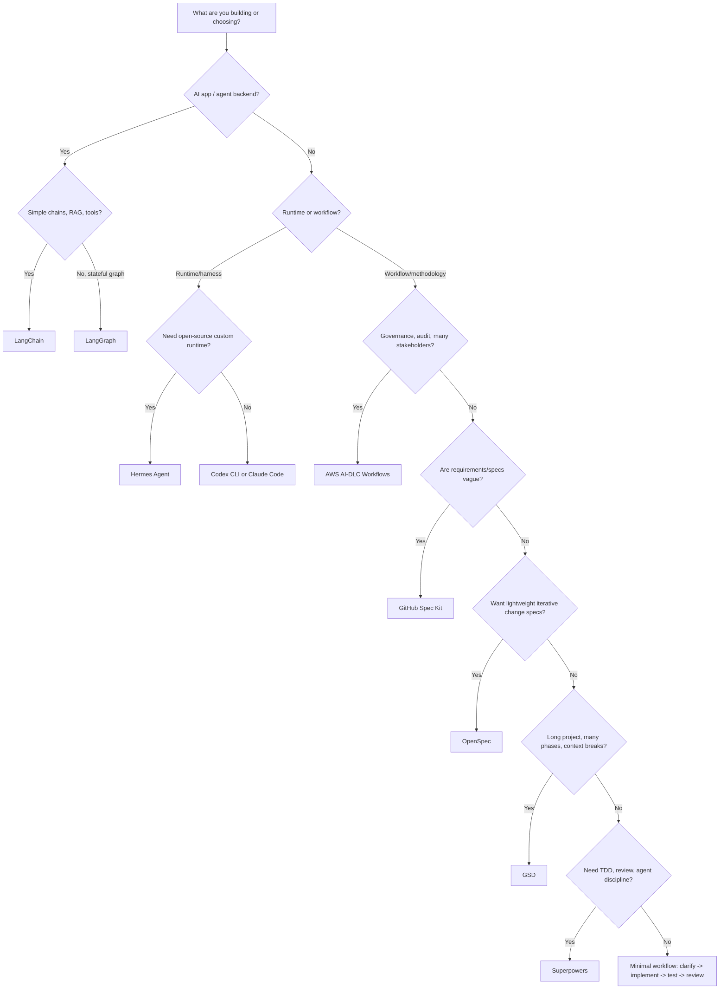

# Decision Guide

The wrong question is "Which framework is best?" The useful question is "Which layer of AI engineering is failing in my context?"

| First question | Go to |
|---|---|
| Are you building an AI app? | [LangChain](../app-frameworks/langchain), [LangGraph](../app-frameworks/langgraph), [Data/RAG](../stack/data-rag), [Tools/MCP](../stack/tools-mcp) |
| Are you improving software delivery with agents? | Spec Kit, OpenSpec, AI-DLC, GSD, Superpowers |
| Are you running/customizing an agent harness? | [Hermes](../harnesses/hermes), [Codex vs Claude vs Hermes](../harnesses/codex-claude-hermes) |
| Are you preparing for production? | [Evals & Observability](../stack/evals-observability), [Security & Governance](../stack/security-governance) |
| Are you choosing models or serving strategy? | [Model & Serving Layer](../stack/model-serving) |

## Choose by need

| I need... | Choose |
|---|---|
| Full AI engineering stack context | [AI Engineering Stack Map](../stack/) |
| Model routing, local LLMs, or serving strategy | [Model & Serving Layer](../stack/model-serving) |
| RAG data pipeline and retrieval quality | [Data, RAG & Retrieval](../stack/data-rag) |
| Safe tool use, MCP, or tool gateways | [Tools, MCP & Gateways](../stack/tools-mcp) |
| Evals, tracing, and production feedback | [Evals & Observability](../stack/evals-observability) |
| Security, governance, and risk tiers | [Security & Governance](../stack/security-governance) |
| Build AI app, RAG, or tool-calling agent | LangChain |
| Build stateful long-running agent backend | LangGraph |
| A polished coding agent CLI | Codex CLI or Claude Code |
| An open-source/customizable agent runtime | Hermes Agent |
| A way to describe features so AI builds the right thing | Spec Kit |
| A lightweight spec layer for iterative brownfield changes | OpenSpec |
| A lifecycle with approval and audit | AWS AI-DLC Workflows |
| A system for many phases across many sessions | GSD |
| A skill layer that stops the agent from coding recklessly | Superpowers |
| MVP speed with some structure | GSD + lightweight Spec Kit |
| Important product feature with acceptance criteria | Spec Kit + Superpowers |
| Enterprise modernization | AWS AI-DLC primary |
| Safer refactoring | Superpowers + tests |
| Compliance or security-sensitive delivery | AWS AI-DLC + explicit security gates |

## Choose by work size

| Work size | Recommended workflow |
|---|---|
| 5-30 minutes | Superpowers light or manual prompt with tests |
| Half day to 2 days | Spec Kit or Superpowers |
| 1-5 day iterative brownfield change | OpenSpec |
| 1-3 weeks | Spec Kit + GSD, or AWS AI-DLC if risk is high |
| 1-3 months | AWS AI-DLC or GSD with added governance |
| Enterprise program | AWS AI-DLC primary; others as supporting layers |

## Choose by codebase

| Codebase | Best fit |
|---|---|
| Greenfield product app | Spec Kit for clarity; GSD for speed |
| Brownfield monolith | AWS AI-DLC for modernization; Superpowers for targeted refactors |
| Brownfield feature change with low-medium risk | OpenSpec |
| API/library | Spec Kit because contract clarity matters |
| Internal tool | GSD or Spec Kit |
| Regulated system | AWS AI-DLC |
| Open source project | Spec Kit or Superpowers for PR reviewability |

## Red flags

| Red flag | What to avoid |
|---|---|
| You want to install all frameworks at once | You will create multiple sources of truth |
| You cannot review generated docs | Do not use a heavy governance flow |
| Your CI is weak | Do not allow broad automated execution |
| The feature is security-sensitive | Do not use a purely speed-optimized workflow |
| The task is tiny | Do not create full lifecycle artifacts |
| You need formal audit | Do not rely on OpenSpec alone |
| You only need a workflow process | Do not add Hermes unless runtime customization matters |
