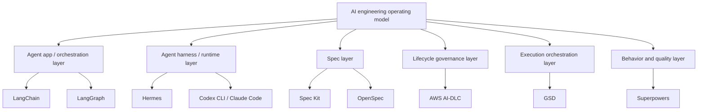

# Comparison Matrix

After understanding each framework individually, the key insight is that they optimize different layers of AI-assisted software delivery.

## Cross-layer comparison

| Layer | Tools | Source of truth | Main output |
|---|---|---|---|
| Agent app/orchestration | LangChain, LangGraph | App code, state graph, prompts, tools | AI app or agent service |
| Agent harness/runtime | Hermes, Codex CLI, Claude Code | Runtime/session state, instructions, memory | Agent execution in repo/tools |
| Workflow/methodology | Spec Kit, OpenSpec, AI-DLC, GSD, Superpowers | Specs, changes, audit, `.planning/`, tests | Delivery process and evidence |
| Repo/CI/deployment | Git, tests, CI/CD | Code, tests, build logs, release artifacts | Verified software delivery |

## Core comparison

| Criteria | Spec Kit | OpenSpec | AWS AI-DLC Workflows | GSD / Get Shit Done | Superpowers |
|---|---|---|---|---|---|
| Primary purpose | SDD toolkit | Lightweight change-spec workflow | AI-native lifecycle governance | Context and execution orchestration | Agent discipline methodology |
| Root problem | Vague feature specs | Proposed changes trapped in chat | Delivery without control | Context rot and slow throughput | Agent codes without discipline |
| Main artifact | Specs, plans, tasks | `openspec/specs`, `openspec/changes` | `aidlc-docs/`, state, audit | `.planning/` | Plans, tests, reviews, worktrees |
| Unit of work | Feature | Change | Project, stage, unit of work | Milestone, phase, task | Task, behavior, branch |
| Best audience | Product + engineering | Solo/small teams and brownfield product teams | Enterprise delivery team | Builders and teams optimizing shipping | Developers improving AI code quality |

## Lifecycle coverage

| Activity | Spec Kit | OpenSpec | AWS AI-DLC | GSD | Superpowers |
|---|---|---|---|---|---|
| Requirement clarification | Excellent | Strong | Excellent | Medium-strong | Strong with brainstorming |
| Architecture design | Strong in plan | Medium-strong in `design.md` | Excellent | Medium | Strong when design skill is used |
| NFRs | Via spec/constitution | Needs explicit template/gate | Excellent | Needs extra process | Needs explicit design |
| Infrastructure | In plan if requested | Not primary | Strong | Not primary | Not primary |
| Task decomposition | Strong | Strong via `tasks.md` | Strong | Excellent | Strong |
| Parallel execution | Not primary | Change isolation helps, but not primary | Not primary | Excellent | Possible via subagents |
| TDD | Configurable | Configurable | Configurable | Quality-agent dependent | Excellent |
| Audit trail | Medium | Medium via change archives | Excellent | Medium | Low-medium |
| Operations | Not primary | Not primary | Partial; should be extended | Not primary | Not primary |

## Human control

| Control point | Spec Kit | OpenSpec | AWS AI-DLC | GSD | Superpowers |
|---|---|---|---|---|---|
| Approve requirements | Yes | Review proposal/specs before apply | Very explicit | Possible | Via design |
| Approve architecture | In plan | In `design.md` | Very explicit | Possible | Before implementation |
| Approve each stage | Limited | Fluid, action-based | Strongest | Per phase | Per task/branch |
| Agent autonomy | Medium | Medium | Low-medium | High | Medium |
| Main risk if humans disengage | Wrong spec -> wrong code | Changes sync without real review | Rubber-stamp governance | Too many unreviewed changes | Skills skipped or tests weakened |

## Scoring matrix

Scores are relative, from 1 to 5.

| Criteria | Spec Kit | OpenSpec | AWS AI-DLC | GSD | Superpowers |
|---|---:|---:|---:|---:|---:|
| Requirement clarity | 5 | 4 | 4 | 3 | 4 |
| Lifecycle governance | 3 | 2 | 5 | 3 | 2 |
| Auditability | 3 | 3 | 5 | 3 | 2 |
| Context management | 4 | 4 | 4 | 5 | 3 |
| Execution throughput | 3 | 4 | 3 | 5 | 3 |
| TDD discipline | 3 | 2 | 3 | 3 | 5 |
| Enterprise readiness | 4 | 3 | 5 | 3 | 3 |
| Solo builder fit | 4 | 5 | 2 | 5 | 5 |
| Risk of over-process | 3 | 2 | 5 | 4 | 3 |
| Risk of over-automation | 2 | 3 | 2 | 5 | 3 |

## Pairwise comparison

| Pair | Short conclusion |
|---|---|
| Spec Kit vs AI-DLC | Spec Kit is deeper on SDD; AI-DLC is broader on lifecycle governance. |
| Spec Kit vs OpenSpec | Spec Kit is more structured; OpenSpec is lighter and more fluid. |
| OpenSpec vs AI-DLC | OpenSpec manages change specs; AI-DLC manages lifecycle accountability. |
| OpenSpec vs GSD | OpenSpec isolates proposed changes; GSD orchestrates execution across phases and agents. |
| OpenSpec vs Superpowers | OpenSpec manages artifacts; Superpowers manages engineering behavior. |
| Spec Kit vs GSD | Spec Kit helps define the right thing; GSD helps push many tasks through delivery. |
| Spec Kit vs Superpowers | Spec Kit manages spec artifacts; Superpowers manages engineering behavior. |
| AI-DLC vs GSD | AI-DLC controls risk; GSD increases throughput. |
| AI-DLC vs Superpowers | AI-DLC governs delivery; Superpowers improves implementation discipline. |
| GSD vs Superpowers | GSD organizes many tasks; Superpowers makes each task cleaner. |
