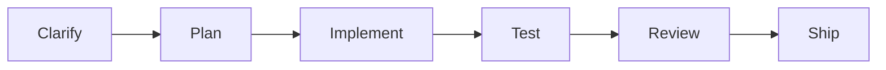
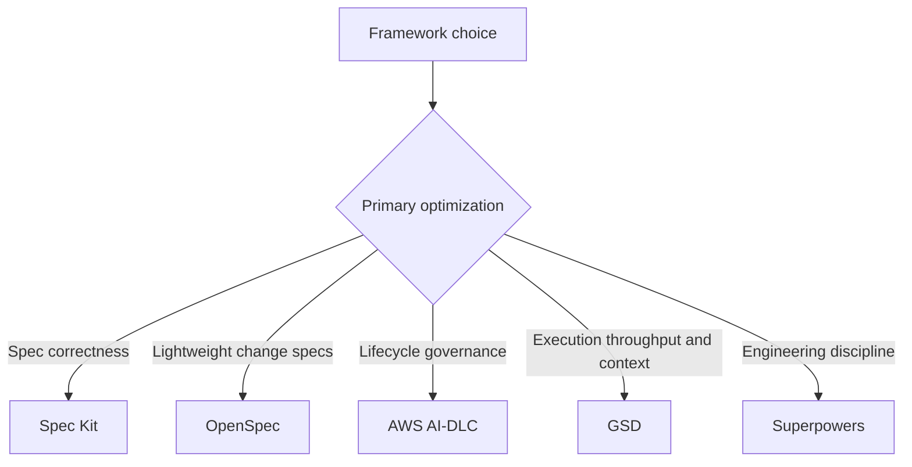
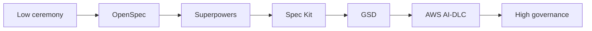
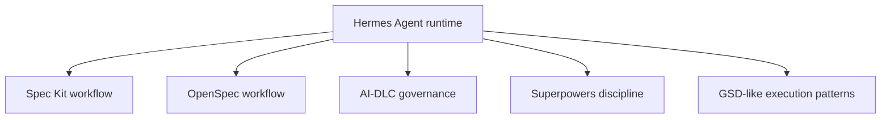
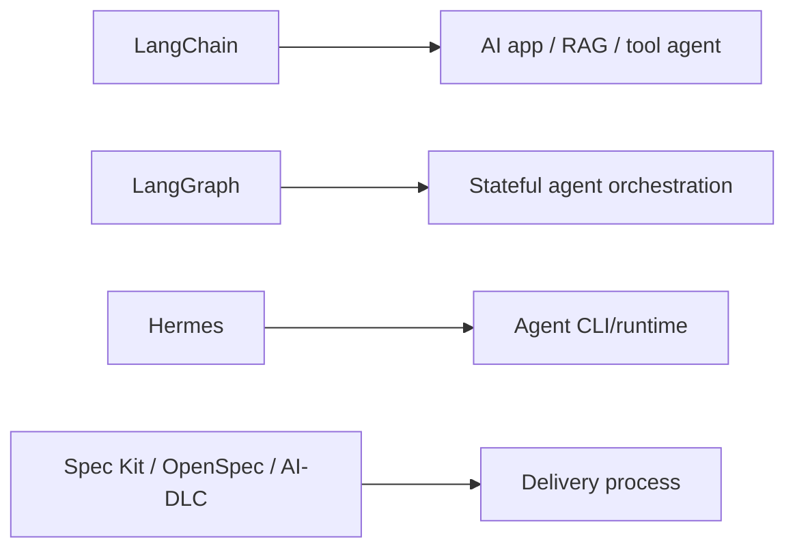

# Same Flow, Different Purpose

Many AI workflow frameworks look similar because almost all serious software delivery has the same backbone:



That similarity is real. The difference is **what each framework treats as the main problem** and **what artifact it makes authoritative**.

## The core confusion

When users see:

```text
plan -> implement -> review
```

in every framework, they assume the frameworks are interchangeable.

They are not.

The common flow is the skeleton. The distinguishing factor is the operating model.

| Question | Why it matters |
|---|---|
| What is the source of truth? | Determines what the agent must obey |
| What failure is the framework optimized against? | Determines when it is useful |
| Who approves decisions? | Determines governance model |
| How is context preserved? | Determines long-running reliability |
| How is correctness proven? | Determines verification strength |
| How much ceremony is expected? | Determines team fit |

## Same verbs, different ownership

`Plan`, `implement`, and `review` also appear outside workflow frameworks. A harness may plan file edits, an app framework may plan a tool path, an eval loop may review outputs, and a governance workflow may review evidence.

| Layer | What `plan` means | What `review` means |
|---|---|---|
| Workflow/methodology | plan delivery artifacts and task order | review specs, plans, code evidence, approvals |
| Agent harness/runtime | plan terminal commands, file edits, tool calls | inspect diffs, command output, tests |
| Agent app framework | plan runtime path through chains, tools, or graph nodes | evaluate output, state transitions, tool trajectory |
| Evals/observability | plan test coverage and datasets | compare traces, scores, regressions |
| Security/governance | plan risk controls and approval boundaries | approve evidence and audit trail |

This is why the [AI Engineering Stack Map](../stack/) matters. The same verb has different artifacts and different accountability at each layer.

## Same verbs, different meaning

| Verb | Spec Kit | OpenSpec | AWS AI-DLC | GSD | Superpowers |
|---|---|---|---|---|---|
| Plan | Turn spec into implementation plan | Create/adjust change artifacts | Gate lifecycle decisions and construction plans | Prepare executable phase plan | Write detailed implementation plan |
| Implement | Build tasks from spec | Apply change tasks | Execute approved construction units | Dispatch tasks, often via subagents | Implement test-first |
| Review | Check spec/plan/task consistency | Review change artifacts before sync/archive | Human approval and audit | Verify phase output | Code review and TDD evidence |
| Ship | Complete feature against spec | Sync/archive change into current specs | Update state/audit and release readiness | Ship phase/PR/milestone | Finish branch |

The verbs overlap. The contract behind them differs.

## What each framework is really optimizing



| Framework | Primary optimization | Best mental model |
|---|---|---|
| Spec Kit | Feature specification correctness | Spec compiler |
| OpenSpec | Lightweight iterative change control | Change proposal and delta-spec workspace |
| AWS AI-DLC | Governed AI delivery lifecycle | Delivery governance cockpit |
| GSD | Multi-session, multi-agent execution | Agent delivery factory |
| Superpowers | Test-first engineering behavior | Engineering discipline layer |

## Source of truth difference

| Framework | Source of truth |
|---|---|
| Spec Kit | Feature specs, plans, and tasks |
| OpenSpec | `openspec/specs/` for current behavior; `openspec/changes/` for proposed behavior |
| AWS AI-DLC | `aidlc-docs/`, state, audit, lifecycle artifacts |
| GSD | `.planning/` project memory and phase state |
| Superpowers | Approved plan, tests, review findings, branch state |

This is the most important difference. If you know the source of truth, you know how the framework thinks.

## Failure mode difference

| Framework | It prevents... | But can fail by... |
|---|---|---|
| Spec Kit | Building the wrong feature from vague requirements | Creating polished but incorrect specs |
| OpenSpec | Losing track of proposed changes in chat history | Being too light for high-risk governance |
| AWS AI-DLC | AI delivery without accountability | Becoming paperwork if approvals are rubber-stamped |
| GSD | Context collapse and slow multi-task execution | Automating too much before review catches up |
| Superpowers | Code-first agent behavior without tests/review | Becoming ritual if tests are weak or skipped |

## Ceremony spectrum



This is not a quality ranking. It is a ceremony/governance ranking. Low ceremony can be excellent for speed. High governance can be necessary for risk.

## When two frameworks look identical, ask these questions

1. Does this framework own requirements, execution, governance, or behavior?
2. Where does it store memory?
3. What does it do when code and spec disagree?
4. Does it optimize for clarity, speed, control, or quality?
5. Does it assume one agent, many agents, or human review boards?
6. Can I skip steps safely for low-risk work?
7. What evidence proves "done"?

## Quick distinction table

| User says... | Likely framework |
|---|---|
| "I need AI to understand the feature correctly before coding." | Spec Kit |
| "I want a lighter spec system that fits existing code and iterative changes." | OpenSpec |
| "I need approvals, audit, NFRs, and human accountability." | AWS AI-DLC |
| "I need AI to keep working across many sessions and parallel tasks." | GSD |
| "I need the agent to stop coding recklessly and use tests/review." | Superpowers |

## The one-sentence distinction

> They all contain planning, implementation, and review because all good software delivery does. They differ in what they make authoritative: Spec Kit makes feature specs authoritative, OpenSpec makes current specs and proposed changes authoritative, AI-DLC makes lifecycle approvals authoritative, GSD makes project memory and phase execution authoritative, and Superpowers makes engineering discipline and test evidence authoritative.

## Where Hermes fits

Hermes is different again: it is not mainly another plan/implement/review workflow. It is an agent harness/runtime that can execute those workflows.



Hermes should not be compared as "Hermes vs Spec Kit" in most cases. The more useful question is:

```text
Should Hermes be the runtime that runs Spec Kit/OpenSpec/AI-DLC/Superpowers?
```

| Question | Answer |
|---|---|
| Does Hermes define a source-of-truth artifact model like OpenSpec? | Not primarily |
| Does Hermes define enterprise lifecycle governance like AI-DLC? | No |
| Does Hermes define TDD/review discipline like Superpowers? | Not by itself |
| Does Hermes provide tools, memory, skills, subagents, runtime control? | Yes |

If workflow frameworks are the operating process, Hermes is the programmable agent machine that can run the process.

## Where LangChain and LangGraph fit

LangChain and LangGraph are different from both workflow frameworks and coding agent CLIs. They are used to build AI applications or agent systems.



| Tool | It mainly defines |
|---|---|
| LangChain | App-level model/tool/retriever/agent composition |
| LangGraph | Stateful graph orchestration for agent apps |
| Hermes | Runtime/harness for running an agent |
| Spec Kit/OpenSpec/AI-DLC | Delivery workflow and artifacts |

Do not use LangGraph as a replacement for AI-DLC. LangGraph orchestrates runtime behavior; AI-DLC governs delivery decisions.
