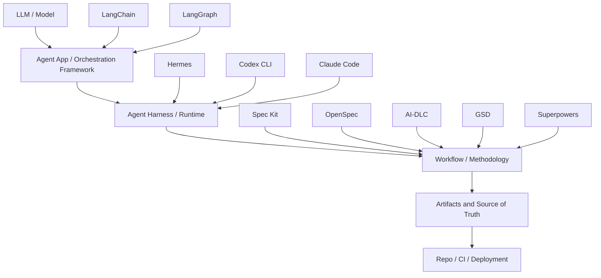
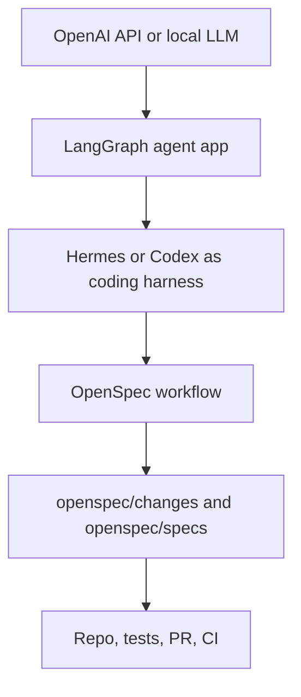

# Agent Harness vs Workflow Framework

The most common confusion in AI engineering is mixing up **where the agent runs** with **how the agent should work**.

For the larger architecture context, read the [AI Engineering Stack Map](../stack/) first. Harness vs workflow is only one distinction inside the full stack.



## The layers

| Layer | Examples | It answers |
|---|---|---|
| Model | GPT, Claude, Hermes models, local LLMs | What reasoning engine generates responses? |
| Agent app/orchestration framework | LangChain, LangGraph, LlamaIndex, Semantic Kernel | How do I build an AI app or stateful agent system? |
| Agent harness/runtime | Codex CLI, Claude Code, Hermes Agent, OpenCode, Cursor Agent | Where does the agent run and how does it use tools? |
| Workflow/methodology | Spec Kit, OpenSpec, AI-DLC, GSD, Superpowers | What process should the agent follow? |
| Artifact/source-of-truth | `specs/`, `openspec/`, `aidlc-docs/`, `.planning/`, tests | What must the agent obey? |
| Repo/CI/deployment | Git, test runner, CI, GitHub Pages, production | Where does evidence and delivery happen? |

## Why this distinction matters

If you confuse the layers, you ask the wrong comparison:

```text
Wrong: Hermes vs OpenSpec
Better: Hermes + OpenSpec

Wrong: Codex CLI vs Spec Kit
Better: Codex CLI running a Spec Kit workflow
```

LangChain and LangGraph are app/orchestration frameworks. Hermes, Codex CLI, and Claude Code are harnesses. Spec Kit, OpenSpec, AI-DLC, GSD, and Superpowers are workflows or methods.

```text
Wrong: LangGraph vs AI-DLC
Better: LangGraph builds the agent app; AI-DLC governs delivery of that app.
```

## What a harness does

An agent harness/runtime typically provides:

- model/provider connection;
- prompt and instruction loading;
- tool execution;
- file read/write;
- shell commands;
- memory;
- skills;
- subagents;
- approvals or safety controls;
- session/task lifecycle.

## What a workflow framework does

A workflow framework typically defines:

- what artifact comes first;
- what counts as source of truth;
- when to ask questions;
- how to write a plan;
- how to split tasks;
- when to implement;
- how to review;
- what evidence proves done;
- how to archive or update docs.

## What an agent app framework does

An agent app/orchestration framework typically provides:

- model abstraction;
- prompts and structured outputs;
- tool calling;
- retrievers and data integrations;
- state management;
- graph orchestration;
- checkpoints;
- human-in-the-loop;
- deployment/runtime hooks for AI apps.

## Example stack



The harness can change without changing the workflow. The workflow can change without changing the model.

## Practical rule

Use this rule:

> Choose a harness when you need execution capabilities. Choose a workflow when you need process discipline.

| Need | Choose |
|---|---|
| Build AI app, RAG, or tool-calling agent | LangChain |
| Build long-running stateful agent system | LangGraph |
| Better CLI coding experience | Codex CLI or Claude Code |
| Open-source/customizable runtime | Hermes Agent |
| Strong spec-first feature workflow | Spec Kit |
| Lightweight change specs | OpenSpec |
| Enterprise approval/audit lifecycle | AWS AI-DLC |
| Multi-agent phase execution | GSD |
| TDD and review discipline | Superpowers |
