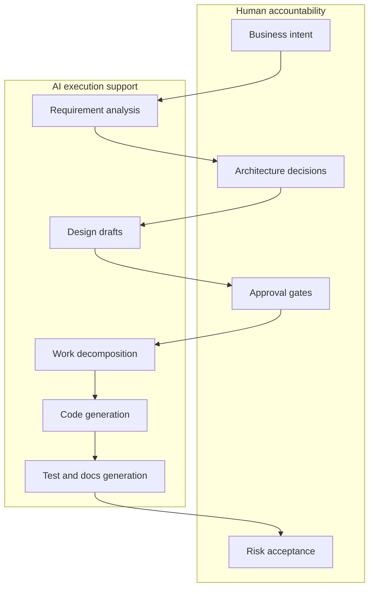

# AI-DLC

AI-DLC means **AI-Driven Development Life Cycle**. It describes a software delivery model where AI is not just autocomplete, but an active collaborator across requirements, design, planning, coding, testing, documentation, and operational feedback.

The important idea is not "let AI do everything." The important idea is **AI-assisted execution with human accountability**.

## Why AI-DLC exists

Traditional AI coding flows often start with a prompt and jump straight into code. That works for small changes, but breaks down in enterprise delivery because the team still needs:

| Need | Why it matters |
|---|---|
| Ownership | Someone must decide what the system should do and what risk is acceptable. |
| Traceability | Requirements, design decisions, code, tests, and releases must connect. |
| Non-functional requirements | Security, privacy, reliability, cost, latency, and scalability are rarely solved by code generation alone. |
| Brownfield understanding | Existing systems need reverse engineering before safe modification. |
| Audit evidence | Regulated or high-risk work needs a record of questions, approvals, and verification. |

AI-DLC turns those needs into a workflow.

## AI-DLC vs traditional SDLC

| Dimension | Traditional SDLC | AI-DLC |
|---|---|---|
| Artifact creation | Mostly human-authored | AI drafts, humans review and approve |
| Iteration speed | Slower handoffs | Faster draft/review cycles |
| Main risk | Documents become stale | AI infers wrong intent or automates the wrong thing |
| Control mechanism | Meetings, tickets, review boards | Rules, generated artifacts, approval gates, audit logs |
| Developer role | Implement assigned work | Orchestrate, verify, refactor, and guardrail AI work |
| Architect role | Design directly | Define decisions, constraints, reviews, and quality gates |

## Lifecycle phases

| Phase | Main question | Typical outputs | Human gate |
|---|---|---|---|
| Inception | What and why? | Requirements, user stories, application design, work units | Scope/design approval |
| Construction | How will it be built? | Functional design, NFR design, infrastructure design, code plan, tests | Plan/code/test approval |
| Operations | How will it run? | Deployment, monitoring, incident feedback, production readiness | Release and risk acceptance |

The AWS AI-DLC workflow repository currently makes Inception and Construction very explicit. Operations should be strengthened by adding CI/CD, observability, rollback, SLOs, runbooks, and incident feedback loops.

## When AI-DLC is the right model

Use AI-DLC when:

- Multiple stakeholders must review the work.
- Security, privacy, availability, performance, or cost are material requirements.
- The system is brownfield and needs reverse engineering.
- Architecture and infrastructure matter as much as application code.
- The organization needs auditability or evidence of review.
- A wrong implementation could create business, compliance, or operational risk.

Avoid full AI-DLC for:

- Tiny changes such as copy edits or styling fixes.
- One-day prototypes where learning speed matters more than traceability.
- Teams that will not actually read and approve the generated artifacts.

## Common failure modes

| Failure mode | Symptom | Mitigation |
|---|---|---|
| Too much ceremony | Every small bug creates many docs | Classify work by risk and apply a lighter path for low-risk tasks |
| Rubber-stamp approval | Humans approve artifacts they did not read | Use short review checklists and explicit approvers |
| Artifact drift | Generated docs disagree with code | Make doc updates part of definition of done |
| Over-trusting AI design | Architecture sounds plausible but misses constraints | Require architect review of trade-offs, NFRs, and threat model |
| Weak operations | Code is generated but release readiness is unclear | Add production readiness gates outside the default workflow |

