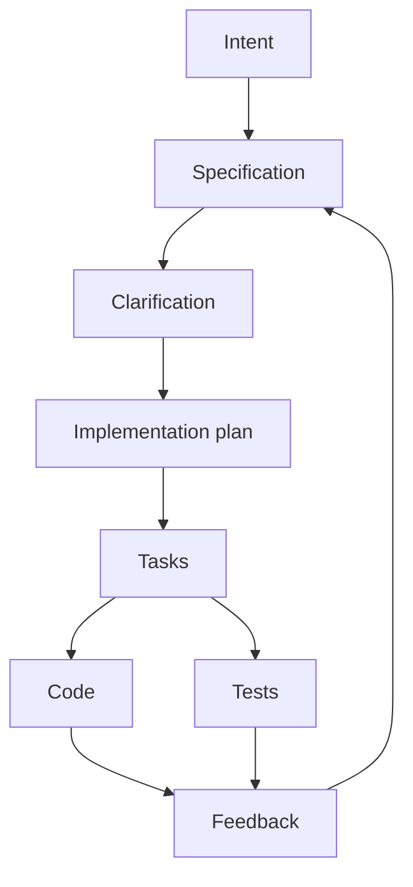
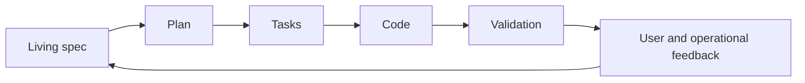

# Spec-Driven Development

Spec-Driven Development, or SDD, is a development model where **the specification is the primary source of truth** and code is treated as one implementation of that specification.

In AI-assisted development, SDD matters because agents are very sensitive to ambiguity. A vague prompt creates plausible but unreliable code. A precise spec gives the agent a stable target.

## What changes in SDD

| Traditional habit | SDD habit |
|---|---|
| Code becomes the only real truth | Spec remains the authoritative intent |
| Requirements are written once | Specs evolve with implementation and feedback |
| Technical work starts quickly | Ambiguity is resolved before implementation |
| Tests are added after code | Acceptance criteria and tests are derived from the spec |
| AI gets a prompt | AI gets structured context |

## A strong AI-ready spec

An AI-ready spec should include:

1. Business goal.
2. Users or actors.
3. Main user journeys.
4. Acceptance criteria.
5. Non-goals.
6. Edge cases.
7. Data model or API contracts.
8. Error handling.
9. Security and privacy constraints.
10. Performance or reliability constraints when relevant.
11. Open questions.
12. Test expectations.

Weak specs tend to use words like "nice", "fast", "smart", or "simple" without measurable criteria.

## SDD is not waterfall

SDD does not mean freezing requirements upfront. Good SDD is iterative:

The key is that when the intent changes, the spec changes first or at least changes together with the code.

## Best use cases

| Use case | Why SDD helps |
|---|---|
| New product feature | Clarifies user value, acceptance, and edge cases |
| API or contract design | Connects requirements to implementation and tests |
| Multi-agent development | Gives every agent the same source of truth |
| Refactor with preserved behavior | Defines the expected behavior before changing internals |
| Team onboarding | Explains why the code exists, not just how it works |

## Where SDD can be wasteful

| Situation | Risk |
|---|---|
| Very small edits | The process can cost more than the change |
| Research spikes | The spec may pretend certainty before discovery |
| Teams that do not update docs | The spec becomes stale and misleading |
| Product discovery is still unclear | Discovery should happen before formalization |

