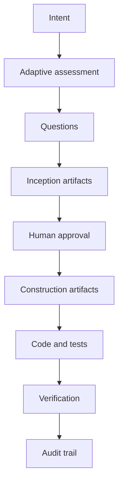
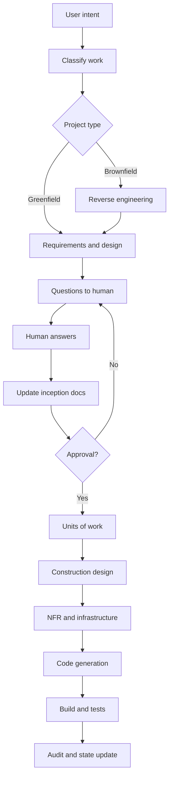
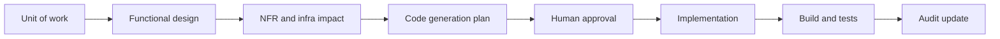

# AWS AI-DLC Workflows

AWS AI-DLC Workflows is a set of steering/rules files that apply the AI-Driven Development Life Cycle inside AI coding tools. It creates generated documents, tracks state, asks humans for decisions, and moves work through Inception, Construction, and eventually Operations.

If Spec Kit is a spec compiler, AWS AI-DLC Workflows is a **delivery governance cockpit**.



## Mental model

The workflow treats AI as a development partner that must move through gates:

1. Understand project type and complexity.
2. Ask missing questions.
3. Generate Inception artifacts.
4. Wait for human review.
5. Split scope into units of work.
6. Generate construction plans.
7. Implement.
8. Build and test.
9. Update state and audit records.

## Artifact model

AWS AI-DLC Workflows typically generate content under `aidlc-docs/`.

| Artifact | Role |
|---|---|
| `aidlc-state.md` | Current workflow state |
| `audit.md` | Decisions, approvals, and stage movement |
| Requirements | Business and functional requirements |
| User stories | Actor, goal, and acceptance |
| Application design | High-level solution structure |
| Reverse engineering docs | Brownfield codebase understanding |
| Units of work | Scope split into executable chunks |
| Functional design | Detailed design per unit |
| NFR design | Security, performance, reliability, scalability |
| Infrastructure design | Cloud resources and deployment architecture |
| Code generation plan | How the agent will implement |
| Build/test instructions | How the result should be verified |

## Detailed workflow



## Strengths

1. **Human oversight is built into the workflow.** AI asks, waits, updates, and requests review.
2. **It is more enterprise-ready than the other frameworks.** Approval, traceability, NFRs, infrastructure, and audit are first-class concerns.
3. **It supports brownfield work explicitly.** Reverse engineering reduces the risk of changing systems the agent does not understand.
4. **It is adaptive.** The right idea is not to run the same ceremony for every task, but to scale depth with risk.
5. **It fits solution architecture work.** It forces application design, non-functional requirements, and infrastructure thinking before implementation.

## Weaknesses

| Weakness | Practical consequence |
|---|---|
| Heavy for small work | Teams may reject it if every bug fix gets full ceremony |
| Operations need strengthening | Add CI/CD, observability, rollback, SLOs, and runbooks |
| Review burden is real | Generated documents are only useful if humans read them |
| Can conflict with existing docs | Map authority between `aidlc-docs/`, ADRs, specs, and issue trackers |
| Can become AI bureaucracy | More documents do not automatically mean better decisions |

## Best use cases

| Use case | Why AWS AI-DLC fits |
|---|---|
| Enterprise application delivery | Needs gates, approval, NFRs, and architecture |
| Brownfield modernization | Needs reverse engineering before changes |
| Regulated or high-risk systems | Needs audit trail and human decision records |
| Multi-team delivery | Shared artifacts align product, engineering, security, and ops |
| Cloud-heavy architecture | Infrastructure design is part of the workflow |
| Security-sensitive features | Risk-based review must happen before code |

## Example: forgot password

AWS AI-DLC would broaden the feature beyond "add an endpoint":

| Perspective | Questions surfaced |
|---|---|
| Business | Which user types can reset passwords? Is this tenant-scoped? |
| Security | How do we avoid user enumeration? What is token lifetime? |
| Privacy | What appears in reset emails? Is any sensitive data exposed? |
| Infrastructure | Which email provider? Retry behavior? Dead-letter handling? |
| Operations | How do we monitor abuse and delivery failure? |
| Audit | Which events are recorded for compliance or investigation? |

The benefit is lifecycle control, not just code generation.

## Adoption guidance

Start by classifying work:

| Category | Suggested path |
|---|---|
| Trivial | No full AI-DLC; use normal code review |
| Small | Lightweight questions and test evidence |
| Medium | Inception + construction artifacts |
| High-risk | Full AI-DLC with explicit architecture/security/ops approval |

## Expert implementation guide

Use AWS AI-DLC Workflows when you need more than code generation: you need a controlled delivery lifecycle with explicit human ownership.

### Step 1: Choose the integration style

The upstream project supports several coding environments through project-level rules or steering files. The common pattern is:

1. Download or copy the AI-DLC rules.
2. Put core workflow rules where your agent reads project rules.
3. Put rule details beside them so the core workflow can reference inception, construction, extension, and operations guidance.
4. Verify the agent can see the rules.
5. Start the conversation with `Using AI-DLC, ...`.

For Cursor-like tools, a project rule is usually better than a global rule because the workflow is repo-specific. For generic agents, placing the rule content in `AGENTS.md` can be the simplest fallback.

### Step 2: Define the governance map before the first run

AI-DLC becomes effective only when the approval model is explicit.

| Decision | Owner |
|---|---|
| Business scope | Product owner |
| Architecture direction | Solution architect or tech lead |
| Security/privacy risk | Security owner |
| NFR acceptance | Architect + operations |
| Release readiness | Engineering lead + operations |
| Residual risk | Accountable business/technical owner |

Write this ownership model in the repo before running a high-risk workflow.

### Step 3: Start with the right activation prompt

Bad prompt:

```text
Using AI-DLC, build forgot password.
```

Better prompt:

```text
Using AI-DLC, implement a forgot password flow for our multi-tenant SaaS app.
The feature must avoid user enumeration, support token expiry, rate-limit requests,
send email through our existing provider, and produce test evidence for API and UI flows.
Ask questions before creating the execution plan.
```

The goal is not to answer everything upfront. The goal is to give enough context for AI-DLC to ask the right questions.

### Step 4: Run Inception like a design review

Inception should produce:

| Inception output | Acceptance check |
|---|---|
| Requirements | Are they testable and scoped? |
| User stories | Are actors and outcomes clear? |
| Application design | Does it respect current architecture? |
| Units of work | Can units be implemented and reviewed independently? |
| Risk assessment | Are security, data, migration, and operational risks visible? |

Do not approve Inception until the team could explain the solution without reading generated code.

### Step 5: Run Construction per unit of work

For each unit:

1. Review functional design.
2. Review NFR impact.
3. Review infrastructure changes.
4. Review code generation plan.
5. Approve implementation scope.
6. Let the agent implement.
7. Require build/test evidence.
8. Update audit and state.



### Step 6: Extend Operations deliberately

The default workflow gives the direction, but production teams should add an explicit operations checklist:

| Operations concern | Required evidence |
|---|---|
| Deployment | CI/CD job, environment config, rollback path |
| Observability | Logs, metrics, traces, dashboards |
| Reliability | Health checks, retry behavior, failure modes |
| Security | Secrets, IAM, audit events, abuse monitoring |
| Support | Runbook, alert owner, incident triage steps |
| Cost | Expected resource usage and budget guardrails |

### Step 7: Keep the audit trail useful

Audit entries should capture decisions, not noise.

Good audit entry:

```text
Decision: Token lifetime set to 15 minutes.
Reason: Reduces account takeover window while preserving normal email delivery latency.
Approver: Security owner.
Evidence: API tests cover expired token and reused token.
```

Weak audit entry:

```text
Approved plan.
```

## Optimization playbook

### For low-risk work

Use AI-DLC lightly:

- Questions.
- Small plan.
- Test evidence.
- Short approval.

Do not require full generated docs for every typo fix.

### For high-risk work

Require:

- Inception approval.
- Architecture approval.
- Security review.
- NFR checklist.
- Operations checklist.
- Audit trail with named approvers.

### For brownfield modernization

Add a mandatory reverse-engineering stage:

1. Map system boundaries.
2. Identify integration points.
3. Identify data ownership.
4. Identify test coverage.
5. Identify deployment constraints.
6. Only then generate units of work.

## Definition of done for AI-DLC

Work is done when:

1. `aidlc-docs/` state matches actual work.
2. Inception artifacts are approved for the chosen risk level.
3. Construction artifacts exist for each unit of work.
4. Code and tests are linked to units of work.
5. Security/NFR/infra concerns are either addressed or explicitly accepted.
6. Build/test evidence is recorded.
7. Operations readiness is complete for production work.
8. Audit entries explain material decisions.
