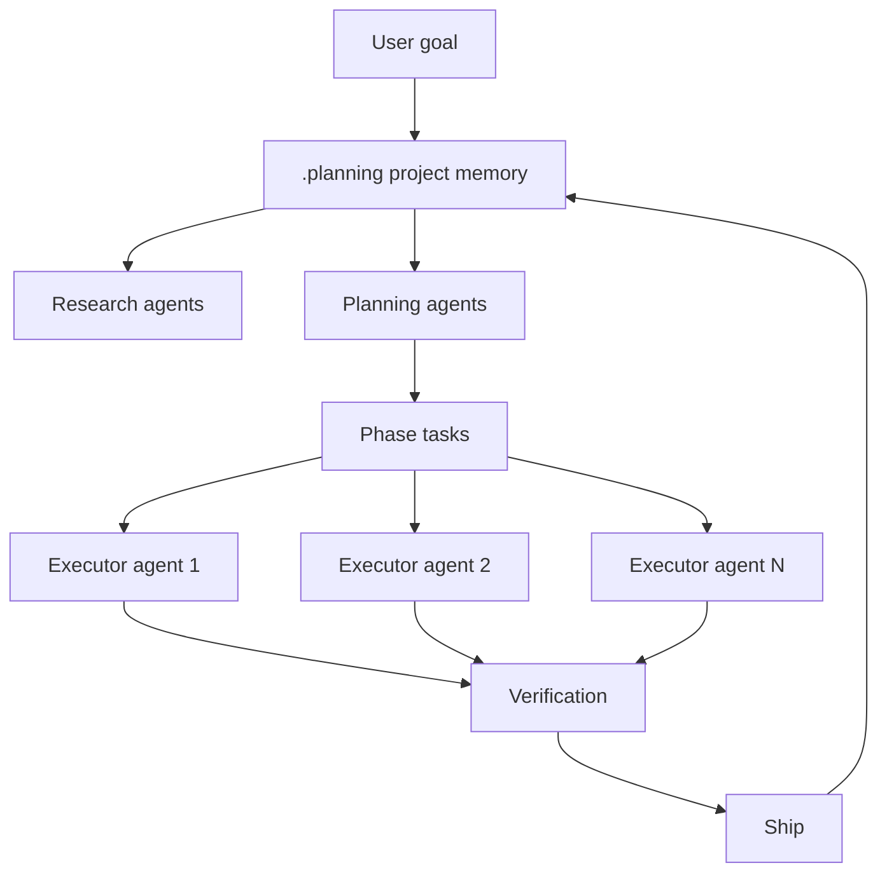
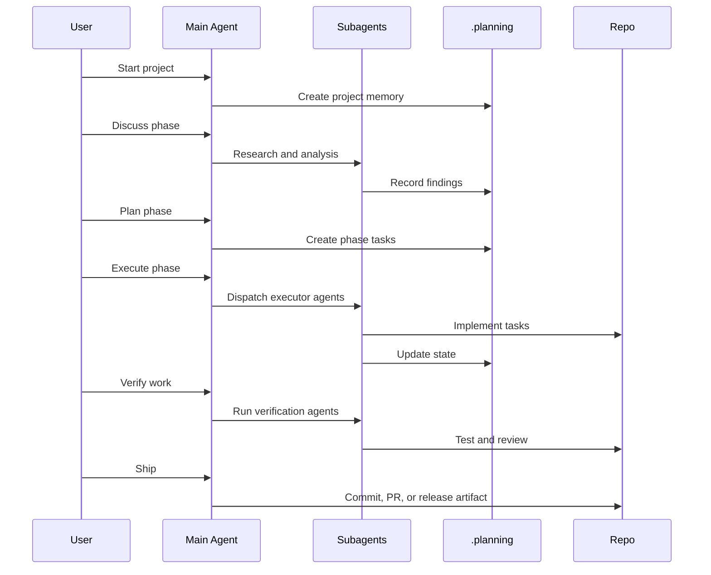
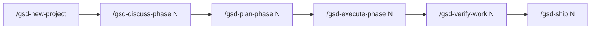

# GSD / Get Shit Done

GSD is a context-engineering and multi-agent execution framework focused on shipping velocity under the practical limits of AI context windows.

The original repository provided by many references now points to the maintained continuation under `open-gsd/gsd-core`. When evaluating it today, use the maintained repository and architecture docs.

If Spec Kit is a spec compiler and AWS AI-DLC is a governance cockpit, GSD is a **delivery factory for agents**.



## Mental model

GSD assumes a long chat is not a reliable project brain. Instead:

- Project state should live in files.
- Main context should stay light.
- Research, planning, execution, and verification should use separate agents.
- Independent tasks can run in parallel.
- Shipping should update project memory and produce clear commits or PRs.

## Artifact model

GSD typically uses `.planning/` as durable project memory.

| Artifact | Role |
|---|---|
| `.planning/PROJECT.md` | Project purpose and context |
| `.planning/REQUIREMENTS.md` | Requirements |
| `.planning/ROADMAP.md` | Milestones and phases |
| `.planning/STATE.md` | Current status |
| `.planning/config.json` | Mode, model profile, parallelism, quality agents |
| Phase artifacts | Discussion, plan, tasks, and verification for a phase |

## Workflow



## Strengths

1. **It directly attacks context rot.** State is externalized to `.planning/`, and subagents get fresh context.
2. **It supports long-running projects.** Work can continue across many sessions without relying on chat memory.
3. **It enables parallel execution.** Independent tasks can be split across executor agents.
4. **It separates roles.** Researcher, planner, executor, checker, and verifier are different mental roles.
5. **It is optimized for shipping.** The workflow does not stop at documentation; it moves toward verified output.

## Weaknesses

| Weakness | Practical consequence |
|---|---|
| Automation-heavy | Too many subagents can create broad changes that are hard to review |
| Not governance-first | It needs extra process for compliance, security, and formal approval |
| Command surface is large | Users must learn the workflow and configuration |
| Tooling/version risk | Track the maintained repo and package security |
| Source-of-truth conflicts | `.planning/` can conflict with specs, ADRs, or `aidlc-docs/` |

## Best use cases

| Use case | Why GSD fits |
|---|---|
| Solo founder building an app over days or weeks | `.planning/` preserves memory and roadmap |
| Startup team optimizing shipping speed | Phase execution and parallel agents improve throughput |
| Many independent tasks | Subagents can execute in parallel |
| Migration split into phases | Roadmap and state files track progress |
| Long-running AI project | Less dependence on one long conversation |

## When to avoid it as primary

Prefer another primary workflow when:

- Compliance and audit are the main concern: use AWS AI-DLC.
- Specification correctness is the main concern: use Spec Kit.
- The task is small and quality discipline is the main need: use Superpowers.
- The team cannot review parallel changes safely.

## Example: forgot password

GSD would structure the work as a phase:

| Phase step | Output |
|---|---|
| Discuss | Flow, security constraints, email provider, success criteria |
| Plan | Backend, frontend, email, tests, and verification tasks |
| Execute | Subagents implement model/API, UI, email template, tests |
| Verify | Separate review for security, tests, and UX |
| Ship | Commit/PR and update `.planning/STATE.md` |

The value is not the spec alone. The value is orchestration and context stability.

## Expert implementation guide

Use GSD when your delivery problem is not just "what should we build?" but "how do we keep AI productive over many sessions and tasks without context collapse?"

### Step 1: Decide whether GSD should be primary

GSD should be primary when:

- The project has multiple phases.
- The work spans several days or weeks.
- Many tasks are independent.
- You want subagents to research, plan, execute, and verify.
- You can review generated changes safely.

Do not make GSD primary if compliance approval, not execution throughput, is the central problem.

### Step 2: Map existing code first

For brownfield projects, run codebase mapping before creating a new GSD project context. The maintained GSD README recommends this pattern for returning or existing codebases.

```text
/gsd-map-codebase
/gsd-new-project
```

Mapping should capture:

| Area | What to extract |
|---|---|
| Stack | Frameworks, languages, package managers |
| Architecture | Modules, boundaries, data flow |
| Conventions | Naming, testing, linting, PR style |
| Risk areas | Auth, billing, migrations, shared components |
| Test commands | Fast tests, full tests, e2e tests |

### Step 3: Create project memory

`/gsd-new-project` should create or update `.planning/` artifacts:

- Project goal.
- Requirements.
- Roadmap.
- Current state.
- Configuration.

Treat `.planning/` as operational memory, not marketing documentation. It should be concise enough for agents to reload and accurate enough for humans to trust.

### Step 4: Run the six-command loop



The loop works best when each phase has a single delivery outcome. Avoid phases like "improve the app"; prefer "add password reset email request and token verification flow".

### Step 5: Tune `.planning/config.json`

The maintained GSD docs describe several important dials. Use them intentionally.

| Dial | Conservative setting | Aggressive setting | When to use |
|---|---|---|---|
| `mode` | `interactive` | `yolo` | Use interactive for production; yolo only for low-risk prototypes |
| Model profile | `quality` | `budget` | Use quality for design/risk; budget for repetitive tasks |
| Research agent | On | Off | Turn on for unfamiliar domains/code |
| Plan checker | On | Off | Turn on before parallel execution |
| Verifier | On | Off | Keep on unless tests are trivial |
| Parallelization | Off | On | Turn on only for independent tasks |

### Step 6: Parallelize only with hard boundaries

Good parallel tasks:

- Backend endpoint and frontend copy updates.
- Independent test suites.
- Documentation and isolated UI component.
- Migration script and read-only analysis.

Bad parallel tasks:

- Two agents editing the same component.
- Database schema and API contract without a shared plan.
- Auth changes across shared middleware.
- Cross-cutting refactor with unclear ownership.

Use this rule:

> If two tasks may edit the same file or depend on the same design decision, do not run them in parallel.

### Step 7: Verification is not optional

`/gsd-verify-work` should include:

1. Automated test commands.
2. Manual acceptance checklist.
3. Diff review.
4. Security/regression review for risky areas.
5. Update to `.planning/STATE.md`.

Skipping verification turns GSD into an acceleration tool for technical debt.

## Optimization playbook

### For solo builders

Use GSD to maintain momentum:

- Keep phases short.
- Use interactive mode until trust improves.
- Use parallelism for docs/tests/UI polish, not core architecture.
- Ship after each verified phase.

### For teams

Add team controls:

- Require PR review before `/gsd-ship`.
- Keep `.planning/ROADMAP.md` aligned with issue tracker.
- Limit phase size to reviewable diffs.
- Record test evidence in PR descriptions.

### For enterprise contexts

GSD can still help, but add governance:

- AI-DLC or internal review for high-risk phases.
- Security review for auth/data/infra changes.
- Architecture approval before parallel work.
- CI gating before merge.

## Definition of done for GSD

A phase is done when:

1. Phase decisions are captured.
2. Plan has been checked.
3. Parallel tasks did not conflict.
4. Verification passed.
5. Manual acceptance checklist is complete.
6. `.planning/STATE.md` is updated.
7. PR/commit scope is understandable.
8. Next phase is clear.
