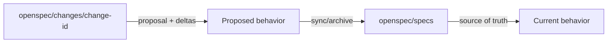

# OpenSpec

OpenSpec is a lightweight spec framework for AI coding assistants. Its philosophy is explicitly **fluid, iterative, easy, and brownfield-first**. It adds a spec layer without forcing a rigid phase-gate process.

The easiest way to position it:

> OpenSpec is for teams that want spec discipline, but not the ceremony of a heavy lifecycle framework.

Primary reference: [Fission-AI/OpenSpec](https://github.com/Fission-AI/OpenSpec)

## Mental model

OpenSpec separates the current truth from proposed changes:



| Area | Meaning |
|---|---|
| `openspec/specs/` | Source of truth for how the system currently behaves |
| `openspec/changes/<change>/` | Proposed modification with artifacts and delta specs |
| `proposal.md` | Why the change exists and what changes |
| `specs/` inside a change | Requirements and scenarios for the changed behavior |
| `design.md` | Technical approach |
| `tasks.md` | Implementation checklist |

## Why OpenSpec exists

OpenSpec exists because many teams want the benefits of SDD, but find heavyweight processes too rigid. The project emphasizes:

| Principle | Practical meaning |
|---|---|
| Fluid not rigid | Commands are actions you can take, not phase locks |
| Iterative not waterfall | Artifacts can change as understanding improves |
| Easy not complex | Initialize quickly and customize later |
| Brownfield-first | Designed for changes to existing behavior, not only greenfield systems |

## Setup

OpenSpec requires Node.js 20.19.0 or higher.

```bash
npm install -g @fission-ai/openspec@latest
cd your-project
openspec init
```

Then start from your AI coding assistant:

```text
/opsx:propose add-dark-mode
```

Reference docs:

- Installation: <https://github.com/Fission-AI/OpenSpec/blob/main/docs/installation.md>
- Commands: <https://github.com/Fission-AI/OpenSpec/blob/main/docs/commands.md>
- Concepts: <https://github.com/Fission-AI/OpenSpec/blob/main/docs/concepts.md>
- Workflows: <https://github.com/Fission-AI/OpenSpec/blob/main/docs/workflows.md>

## Core workflow

The default OPSX core profile provides:

| Command | Purpose |
|---|---|
| `/opsx:propose` | Create a change and generate planning artifacts |
| `/opsx:explore` | Explore ideas before committing to a change |
| `/opsx:apply` | Implement tasks from the change |
| `/opsx:sync` | Merge delta specs into main specs |
| `/opsx:archive` | Archive completed change |


The expanded workflow can be enabled with:

```bash
openspec config profile
openspec update
```

Expanded commands include `/opsx:new`, `/opsx:continue`, `/opsx:ff`, `/opsx:verify`, `/opsx:bulk-archive`, and `/opsx:onboard`.

## Strengths

1. **Lower ceremony than Spec Kit and AI-DLC.** It gives structure without heavy gates.
2. **Brownfield-friendly.** The change/delta model fits existing systems.
3. **Tool-flexible.** It supports many AI coding assistants through generated instructions and slash commands.
4. **Fluid workflow.** You can revisit proposal, design, specs, and tasks as learning changes.
5. **Clear change isolation.** Each change gets its own folder before merging into current specs.

## Weaknesses

| Weakness | Practical consequence |
|---|---|
| Less governance than AI-DLC | High-risk enterprise work needs extra approval/audit process |
| Less opinionated than Spec Kit | Teams must decide how strict their reviews are |
| Can be too light for regulated work | Add security, NFR, and operations gates yourself |
| Requires artifact discipline | If `/opsx:sync` or archive is skipped, specs can drift |
| Newer ecosystem compared to older practices | Verify supported tools and workflow profile for your team |

## Best use cases

| Use case | Why OpenSpec fits |
|---|---|
| Brownfield feature change | Proposed deltas are isolated before becoming source of truth |
| Solo or small-team AI coding | Lightweight setup and low ceremony |
| Iterative product work | Artifacts can evolve as you learn |
| Teams overwhelmed by heavier SDD | Keeps specs without rigid phase gates |
| Multi-tool AI environments | Works through generated agent instructions |

## When not to use as primary

Choose something else when:

- You need enterprise audit and approval: use AWS AI-DLC.
- You need high-throughput multi-agent execution: use GSD.
- You need strict TDD/review behavior: combine with Superpowers.
- You need very formal organization-level SDD standards: Spec Kit may be easier to standardize.

## OpenSpec vs Spec Kit

| Dimension | OpenSpec | Spec Kit |
|---|---|---|
| Philosophy | Fluid, iterative, lightweight | Structured SDD with clearer phase progression |
| Setup | Node/npm CLI | Specify CLI, templates, integrations |
| Artifact shape | `openspec/specs` and `openspec/changes` | specs/plans/tasks driven by templates |
| Change model | Change folders and delta specs | Feature specs and implementation plans |
| Best fit | Brownfield iterative changes | Feature-level spec-first delivery |
| Risk | Too light if team needs strict gates | Too heavy if team wants fluid iteration |

## Step-by-step: feature change

Example: add a customer export feature.

1. Install and initialize OpenSpec.
2. Run:

```text
/opsx:explore customer export requirements
```

3. Once scope is clear:

```text
/opsx:propose add-customer-export
```

4. Review generated artifacts:
   - `proposal.md`
   - change `specs/`
   - `design.md`
   - `tasks.md`
5. Edit artifacts manually if they are wrong.
6. Run:

```text
/opsx:apply
```

7. Verify implementation manually or with expanded `/opsx:verify`.
8. Run:

```text
/opsx:sync
/opsx:archive
```

9. Confirm `openspec/specs/` now reflects current behavior.

## Definition of done

A change is done when:

1. The change folder explains why the change exists.
2. Specs describe the behavior clearly.
3. Design explains material technical choices.
4. Tasks are complete.
5. Implementation has test evidence.
6. Delta specs are synced into current specs.
7. The change is archived for traceability.

