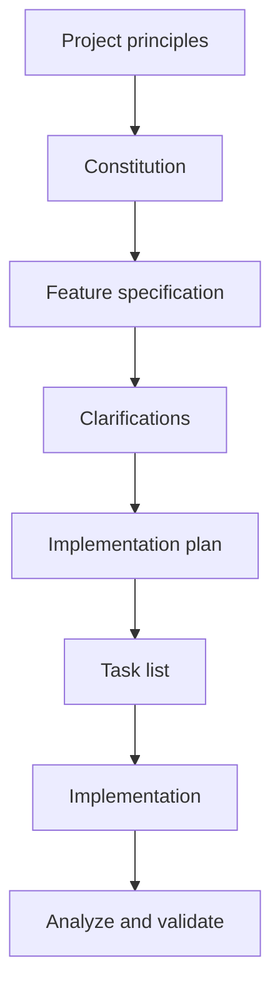
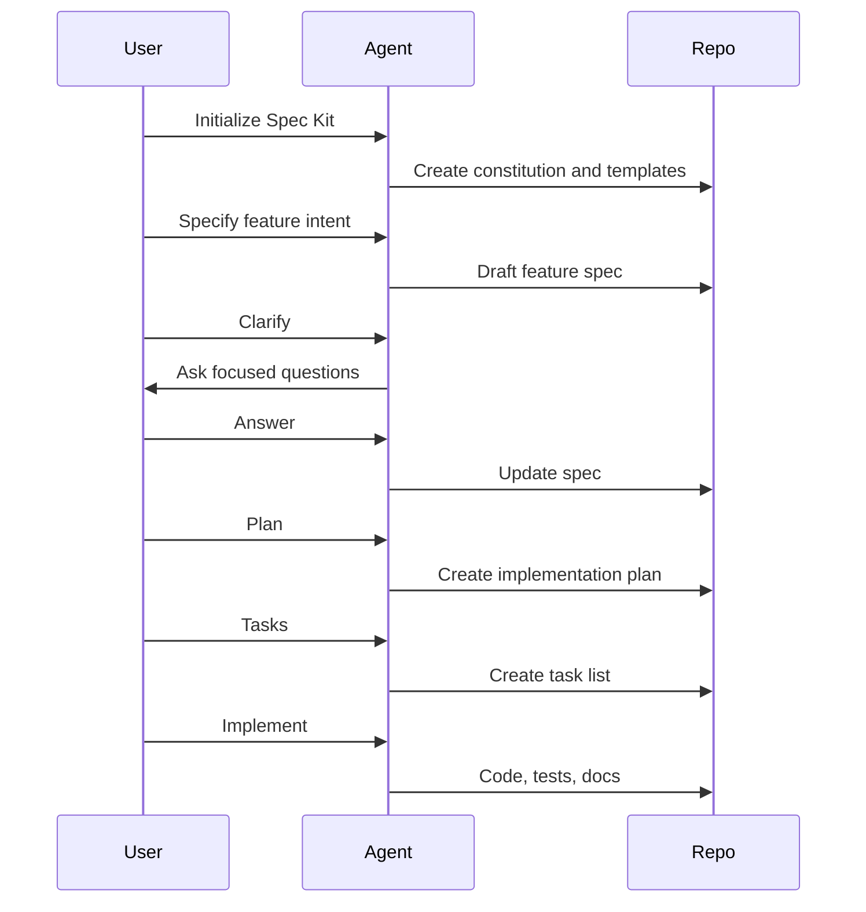
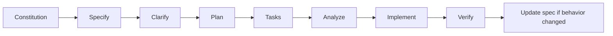

# GitHub Spec Kit

GitHub Spec Kit is an open-source toolkit for practicing Spec-Driven Development with AI coding agents. It provides a CLI, templates, and slash-command style workflows that move from constitution to specification, clarification, plan, tasks, analysis, and implementation.

It is best understood as an **SDD workflow scaffold**, not as an app framework and not as a full enterprise governance system.



## Mental model

Spec Kit acts like a compiler from product intent to executable work:

```text
Human intent
  -> /speckit.specify
Specification
  -> /speckit.clarify
Resolved ambiguity
  -> /speckit.plan
Technical plan
  -> /speckit.tasks
Executable work
  -> /speckit.implement
Code and tests
```

## Core artifacts

| Artifact | Role | Why it matters |
|---|---|---|
| Constitution | Project-level principles | Keeps quality, testing, architecture, UX, and performance rules stable |
| Feature spec | What and why | Prevents the agent from jumping into implementation too early |
| Clarification | Open questions | Forces ambiguity to surface before code |
| Plan | How | Connects the spec to architecture and technical choices |
| Tasks | Work breakdown | Gives the agent or humans executable units |
| Analyze/checklist | Consistency check | Finds gaps before implementation |

## Detailed workflow



## Strengths

1. **It reduces requirement ambiguity.** Most AI coding failures are not syntax failures; they are intent failures. Spec Kit attacks that early.
2. **It separates what/why from how.** This prevents premature database, framework, or architecture decisions.
3. **The constitution creates durable project rules.** You do not need to repeat "write tests", "respect accessibility", or "follow architecture boundaries" in every prompt.
4. **Artifacts are reviewable by different roles.** Product can review spec, architects can review plan, engineers can review tasks.
5. **It works well with multiple agents.** Shared specs are more reliable than chat history.

## Weaknesses

| Weakness | Practical consequence |
|---|---|
| It cannot know whether the spec is truly correct | Domain experts still need to review |
| A polished spec can create false confidence | The document may sound complete while missing hidden constraints |
| It is not full governance | Approval matrix, audit trail, security review, and production readiness need extra process |
| Spec drift is possible | If engineers change code without updating specs, source of truth breaks |
| Small tasks can feel heavy | Copy edits and tiny bugs do not need full SDD |

## Best use cases

| Use case | Why Spec Kit fits |
|---|---|
| New product feature | Clarifies user journeys and acceptance criteria |
| Greenfield MVP with defined scope | Creates a clean spec/plan/task foundation |
| API design | Makes contracts explicit before code |
| Behavior-preserving refactor | Defines expected behavior before internal changes |
| Team learning AI workflows | The command flow is understandable and structured |

## When not to use it as the primary workflow

Use another primary workflow when:

- Enterprise approval and audit are the main concern: prefer AWS AI-DLC Workflows.
- Long-running multi-phase execution is the main problem: prefer GSD.
- The main issue is agent discipline during coding: prefer Superpowers.
- The change is too small to justify a full spec-plan-task cycle.

## Example: forgot password

Spec Kit would force important questions before implementation:

| Step | Output |
|---|---|
| Constitution | Security rules: token expiration, no user enumeration, audit reset events |
| Specify | User can request a password reset by email |
| Clarify | Token lifetime? Rate limit? Email copy? Tenant boundaries? |
| Plan | Endpoints, token model, email service, UI flow |
| Tasks | Backend model, API route, email integration, UI, tests |
| Implement | Code and verification |

The value is not just documentation. The value is stopping the agent before it makes silent security and UX assumptions.

## Expert implementation guide

Use this section when you want to operate Spec Kit as a repeatable team workflow rather than a one-off prompt helper.

### Step 1: Decide the source of truth boundary

Before installing anything, decide what Spec Kit owns.

| Decision | Recommended choice |
|---|---|
| Feature intent | Owned by Spec Kit specs |
| Architecture decisions | Referenced from the plan, but long-lived ADRs may still live separately |
| Implementation tasks | Owned by Spec Kit task artifacts until converted to issues |
| Sprint/project management | Owned by your tracker; Spec Kit can feed it |
| Test evidence | Owned by CI, linked back from the implementation summary |

The anti-pattern is letting Jira, README docs, PR descriptions, and Spec Kit specs all describe the same requirement differently.

### Step 2: Install and initialize

The upstream project recommends installing the Specify CLI and then initializing the project with an agent integration. The exact integration depends on your coding tool.

```bash
uv tool install specify-cli --from git+https://github.com/github/spec-kit.git@vX.Y.Z
specify init my-project --integration copilot
cd my-project
```

For existing repositories, initialize inside the repository and inspect generated files before committing them. The initial commit should contain only Spec Kit scaffolding and project principles.

### Step 3: Write the constitution like an engineering contract

The constitution is not a slogan page. Treat it as a compact engineering contract.

Include:

| Constitution area | Example rule |
|---|---|
| Testing | Behavior-changing tasks must include automated tests before implementation is considered done |
| Architecture | New dependencies require explicit justification in the plan |
| UX | User-facing flows must include loading, empty, error, and success states |
| Security | Authentication, authorization, and privacy assumptions must be explicit in specs |
| Performance | Any new endpoint must define expected latency or explain why it is not material |
| Accessibility | Interactive UI must be keyboard reachable and screen-reader understandable |

Avoid vague rules such as "write good code". Make the constitution enforceable by review.

### Step 4: Run the feature loop

The professional loop is:



Use the optional clarification and analysis steps aggressively for features with security, data, migration, or UX risk.

### Step 5: Review each artifact with the right role

| Artifact | Primary reviewer | Review question |
|---|---|---|
| Spec | Product/domain owner | Does this describe the right user outcome? |
| Clarifications | Product + engineering | Are the unknowns now answered or intentionally deferred? |
| Plan | Tech lead/architect | Is the approach simple, compatible, and maintainable? |
| Tasks | Senior engineer | Are tasks independently executable and testable? |
| Implementation | Engineer/reviewer | Does the code satisfy spec and tests? |

Spec Kit fails when the same person blindly approves every layer.

### Step 6: Convert tasks into delivery units

Good Spec Kit tasks should be:

- Small enough for one PR or one agent session.
- Ordered by dependency.
- Explicit about files or modules when possible.
- Paired with tests or verification.
- Linked to acceptance criteria.

If tasks are too broad, ask the agent to split by vertical slice: data, API, UI, tests, migration, docs.

### Step 7: Use presets and extensions only after the base flow works

Spec Kit supports presets for customizing templates and extensions for adding capabilities. Use them deliberately:

| Need | Use |
|---|---|
| Enforce company-specific spec sections | Preset |
| Add a new workflow command | Extension |
| Require regulatory traceability | Preset |
| Integrate Jira or another external tool | Extension |
| Localize terminology | Preset |

Do not start with heavy customization. First run three real features with the default workflow, then identify repeated gaps.

## Optimization playbook

### For startups

Use Spec Kit only for features that affect product behavior. Skip it for small UI polish. Keep specs short, but require acceptance criteria and non-goals.

### For enterprise teams

Add organization presets for:

- Security and privacy sections.
- Data classification.
- NFR checklist.
- Architecture decision references.
- Test evidence links.
- Release readiness.

### For AI agent reliability

Give the agent a strict rule:

> If the spec and implementation conflict, stop and ask whether to update the spec or change the code.

This prevents silent spec drift.

## Definition of done for Spec Kit

A feature is done only when:

1. Spec contains acceptance criteria and non-goals.
2. Clarifications are answered or explicitly deferred.
3. Plan explains key technical choices.
4. Tasks map to acceptance criteria.
5. Tests verify important behavior.
6. Implementation summary links back to spec.
7. Any behavior change is reflected in the spec.

## Maturity levels

| Level | Behavior |
|---|---|
| Level 1: Prompt discipline | Use `/speckit.specify` for large features |
| Level 2: Artifact discipline | Use clarify, plan, tasks, and analysis consistently |
| Level 3: Team workflow | Product reviews spec, tech lead reviews plan, engineers execute tasks |
| Level 4: Organizational workflow | Presets enforce security, NFRs, domain language, and compliance |
| Level 5: Continuous specification | Bugs, incidents, and analytics feed back into specs |
