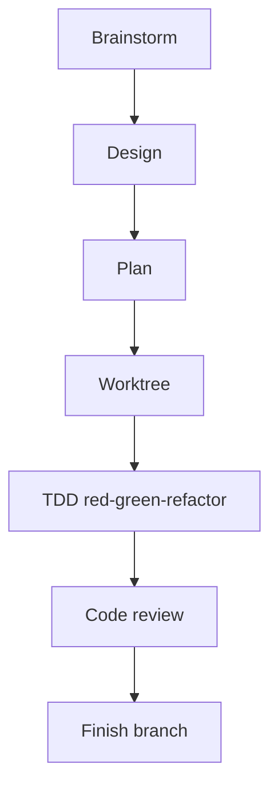
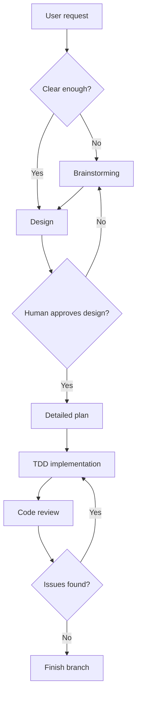
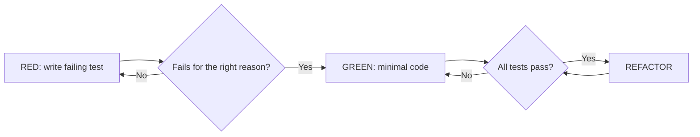
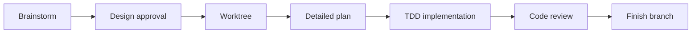
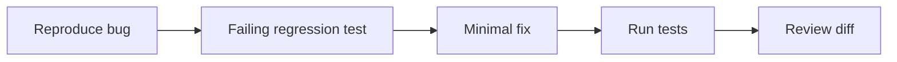

# Superpowers

Superpowers is a methodology and skill library for making AI coding agents behave more like disciplined software engineers. It emphasizes brainstorming, design approval, detailed planning, test-driven development, subagent execution, code review, worktrees, and branch finishing.

If Spec Kit is a spec compiler, AWS AI-DLC is a governance cockpit, and GSD is a delivery factory, Superpowers is an **engineering discipline layer**.



## Mental model

Superpowers does not try to own the entire project lifecycle. It gives the agent situational skills:

| Situation | Skill mindset |
|---|---|
| The request is vague | Brainstorm before committing to a solution |
| A change is non-trivial | Produce and approve a design |
| Implementation is complex | Write a detailed plan |
| Behavior changes | Use test-driven development |
| Work can be parallelized | Use subagent-driven development |
| Code is complete | Request code review |
| Branch work is done | Finish the development branch cleanly |

## Workflow



## TDD as a core strength

Superpowers strongly emphasizes red-green-refactor:



This matters because AI agents often sound confident without evidence. TDD shifts confidence from language to executable proof.

## Strengths

1. **It prevents "code first, think later."** The agent is pushed to brainstorm, design, and plan before editing many files.
2. **TDD reduces hallucinated correctness.** Behavior is proven through failing and passing tests.
3. **Review is explicit.** A separate review step catches issues the implementer missed.
4. **It is composable.** You can use one skill for a small bug or several skills for a larger change.
5. **It is tool-agnostic in spirit.** The method can be adapted across multiple coding agents.

## Weaknesses

| Weakness | Practical consequence |
|---|---|
| Not a full spec management system | Use Spec Kit if organization-wide SDD artifacts are needed |
| Not a governance framework | Use AWS AI-DLC if audit, NFRs, and approval matrix matter |
| TDD has upfront cost | Teams not used to TDD may feel slowed down |
| Depends on correct skill use | The agent may need reminders or rules to activate the right skill |
| Not a deep project memory system | GSD is stronger for long-running, multi-phase memory |

## Best use cases

| Use case | Why Superpowers fits |
|---|---|
| Bug fix requiring regression tests | TDD is the natural workflow |
| Feature in an existing codebase | Design, plan, test, and review without full ceremony |
| Refactor | Tests and review reduce regression risk |
| Team wants higher AI quality | Skills directly shape agent behavior |
| Agent tends to guess | Brainstorming and design approval force clarification |

## Example: forgot password

With Superpowers:

| Step | Output |
|---|---|
| Brainstorm | Clarify UX, security, token, email, and abuse cases |
| Design | API, model, flow, and edge cases |
| Plan | Files, tests, and implementation order |
| TDD | Failing tests for expiration, invalid token, rate limit, no enumeration |
| Implement | Minimal code to pass tests |
| Review | Security and quality review |
| Finish | Clean branch summary and verification |

The core benefit is disciplined execution, not lifecycle governance.

## Expert implementation guide

Use Superpowers when you want to change the agent's working habits: ask before coding, design before changing architecture, test before implementation, review before declaring done.

### Step 1: Install only in the agents you actually use

Superpowers supports several agent harnesses and plugin systems. Install it where your team works daily, not everywhere at once.

| Environment style | Practical guidance |
|---|---|
| Claude-style plugin marketplace | Install the Superpowers plugin and verify skills are listed |
| Cursor-style agent | Add the plugin/rules and test with a small design task |
| CLI agent | Follow the agent-specific install path, then ask it to list available skills |
| Mixed team | Standardize on one primary harness before scaling |

After installation, run a tiny task and verify the agent uses the expected skill instead of jumping into code.

### Step 2: Make skill activation explicit

For the first few weeks, do not rely on the agent to infer everything. Use direct prompts:

```text
Use brainstorming first. Do not edit files until we approve the design.
```

```text
Use test-driven development. Start by writing the failing test for the behavior.
```

```text
Request a code review after implementation and fix all review findings before finalizing.
```

This trains the collaboration pattern for both humans and agents.

### Step 3: Use the full workflow for non-trivial changes



For small changes, use a subset. For high-risk changes, use the full chain.

### Step 4: Apply TDD correctly

Correct TDD:

1. Describe the next behavior.
2. Write a failing test.
3. Confirm it fails for the right reason.
4. Write minimal implementation.
5. Run the test.
6. Refactor only after green.
7. Repeat for the next behavior.

Incorrect TDD:

- Write implementation first, then tests.
- Write tests that mirror implementation details.
- Accept a failing test without checking the failure reason.
- Skip refactor because "AI code looks fine".

### Step 5: Use worktrees for risk isolation

Use worktrees when:

- The change may touch many files.
- You want a clean baseline.
- Multiple agents may work in parallel.
- You need to abandon an experiment safely.

Before implementation:

| Check | Reason |
|---|---|
| Clean git status | Avoid mixing unrelated work |
| Baseline tests pass | Know whether failures are new |
| Branch name reflects task | Easier review and cleanup |
| Setup commands documented | Subagents can reproduce environment |

### Step 6: Treat review as a separate phase

Review should check:

| Review layer | Question |
|---|---|
| Spec compliance | Did we build what was agreed? |
| Test quality | Do tests prove behavior, not implementation details? |
| Code quality | Is the change simple and maintainable? |
| Architecture | Did boundaries remain intact? |
| Risk | Did auth, data, migration, or operations risks change? |

The strongest pattern is two-stage review: first compliance with plan/spec, then code quality.

## Optimization playbook

### For bug fixes

Use the shortest high-quality loop:



### For feature work

Use brainstorming, design, plan, TDD, review. If the feature is large, combine with Spec Kit for stronger artifact management.

### For refactoring

Require:

- Baseline tests pass before refactor.
- Characterization tests for risky behavior.
- Small commits or reviewable diff chunks.
- No behavior change unless explicitly approved.

### For teams

Create a team rule:

> Any AI-generated behavior change must either start with a failing test or include a documented reason why TDD is not appropriate.

## Definition of done for Superpowers

A task is done when:

1. Design was clarified for non-trivial work.
2. Plan was approved or the change was small enough to skip formal planning.
3. Tests were written before or alongside implementation.
4. All relevant tests pass.
5. Code review was requested.
6. Review findings were fixed or explicitly rejected with rationale.
7. Branch/worktree is clean and ready to merge.
