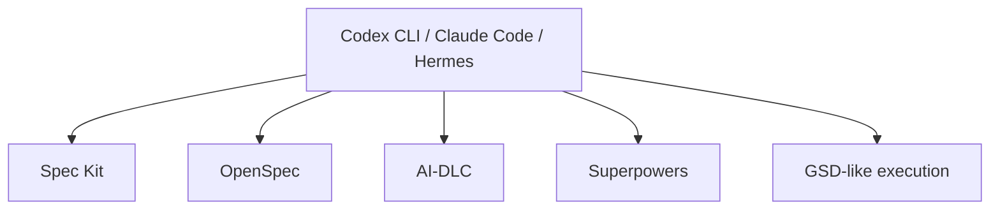

# Codex CLI vs Claude Code vs Hermes

Codex CLI, Claude Code, and Hermes Agent all sit near the same architectural layer: **agent harness / coding agent runtime**. They can read repos, use tools, run commands, and execute coding tasks. The differences are product focus, openness, runtime customization, and operational model.

## Quick comparison

| Tool | Category | Best for |
|---|---|---|
| Codex CLI | Polished coding agent CLI | Day-to-day coding workflows in a repo |
| Claude Code | Polished coding agent CLI | Agentic coding in the Claude ecosystem |
| Hermes Agent | Open-source, hackable agent runtime | Custom/self-hosted/internal agent platforms |

## Similarities

All three can be used as the execution layer for workflow frameworks:



They all answer:

> How does an AI agent interact with my repo and tools?

They do not, by themselves, fully answer:

> What artifact is source of truth? What governance model should the team follow?

## Key differences

| Dimension | Codex CLI | Claude Code | Hermes Agent |
|---|---|---|---|
| Product style | Polished developer CLI | Polished developer CLI | Open-source runtime/CLI |
| Best default use | Coding and repo tasks | Coding and repo tasks | Custom agent platform or research |
| Runtime hackability | Lower | Lower | Higher |
| Self-host/local model fit | Depends on product support | Depends on product support | Stronger fit conceptually |
| Memory/skills/subagents | Product-dependent | Product-dependent | Central emphasis |
| Enterprise governance | Needs workflow/process | Needs workflow/process | Needs workflow/process |
| Best paired with | Spec Kit, OpenSpec, Superpowers | Spec Kit, OpenSpec, Superpowers | OpenSpec, AI-DLC, Superpowers, custom tools |

## Decision guide

| Situation | Choose |
|---|---|
| You want the fastest path to high-quality repo coding | Codex CLI or Claude Code |
| You are already productive with Codex/Claude | Do not add Hermes unless you have a runtime requirement |
| You need local/self-hosted models or custom routing | Consider Hermes |
| You need custom internal tools and memory | Consider Hermes |
| You need spec/change workflow | Add OpenSpec or Spec Kit to any harness |
| You need enterprise governance | Add AI-DLC to any harness |
| You need TDD/review discipline | Add Superpowers to any harness |

## Typical stacks

### Developer productivity stack

```text
Codex CLI or Claude Code
  + OpenSpec or Spec Kit
  + Superpowers
  + repo tests/CI
```

### Internal agent platform stack

```text
Hermes Agent
  + model router or local LLM
  + internal tools
  + OpenSpec for change specs
  + AI-DLC for high-risk governance
  + CI/test evidence
```

## Practical conclusion

If you already use Codex CLI or Claude Code successfully, Hermes is not automatically an upgrade. It is a different trade-off:

> Codex CLI and Claude Code optimize for polished day-to-day developer productivity. Hermes optimizes for open, customizable agent runtime control.

