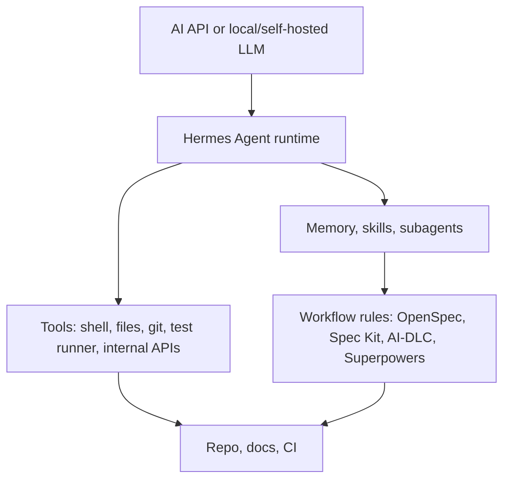
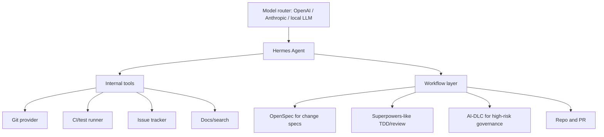

# Hermes Agent

Hermes Agent is best understood as an **open-source, hackable agent runtime/CLI**. It belongs to the same architectural layer as tools like Codex CLI, Claude Code, OpenCode, or other coding agent harnesses, not the same layer as Spec Kit or OpenSpec.

Primary references:

- GitHub: <https://github.com/NousResearch/hermes-agent>
- Hugging Face integration docs: <https://huggingface.co/docs/inference-providers/main/en/integrations/hermes-agent>

## Where Hermes fits

Hermes answers:

> How do I run, customize, and extend an AI agent?

Workflow frameworks answer:

> What process should the agent follow?

## What Hermes is good for

Hermes is especially relevant when you want:

| Need | Why Hermes may help |
|---|---|
| Open-source agent runtime | You can inspect, modify, and self-host the harness |
| API or local/self-hosted model usage | The harness layer can be adapted around your model strategy |
| Custom tools | You can integrate internal APIs, shell tools, repo tools, or research tools |
| Memory and skills | Hermes emphasizes memory, skills, and learning from previous work |
| Subagents | Useful for parallel or specialized workstreams |
| Internal agent platform | Better fit than a polished but closed coding assistant |
| Agent research | Useful playground for runtime, memory, and orchestration experiments |

## What Hermes is not

Hermes is not primarily:

- a spec framework like Spec Kit;
- a change-spec system like OpenSpec;
- an enterprise lifecycle governance framework like AWS AI-DLC;
- a project execution workflow like GSD;
- a TDD/review methodology like Superpowers.

It can run or support those workflows, but it does not replace their artifact model.

## Hermes vs workflow frameworks

| Question | Hermes | Spec Kit / OpenSpec / AI-DLC / GSD / Superpowers |
|---|---|---|
| What layer? | Agent runtime/harness | Workflow/methodology/artifact layer |
| Main concern | Tools, memory, skills, subagents, execution | Specs, plans, approvals, tasks, tests, review |
| Source of truth | Not the main concept | Central concept |
| Governance | Needs extra process | AI-DLC especially defines it |
| Best use | Build/customize an agent platform | Shape how the agent works |

## When to use Hermes

Use Hermes when:

1. You want to self-host or deeply customize an agent.
2. You need local/self-hosted LLM support or flexible model routing.
3. You want memory/skills/subagents as runtime capabilities.
4. You are building an internal AI agent platform.
5. You want to research or modify the agent loop itself.

Do not add Hermes just because it exists. If Codex CLI or Claude Code already solves your day-to-day coding workflow, Hermes may add complexity without a clear benefit.

## When not to use Hermes

Avoid Hermes as an extra layer when:

- you only need a polished coding CLI;
- your workflow problem is unclear requirements, not runtime customization;
- you need enterprise governance but do not have AI-DLC-like controls;
- your team cannot operate or maintain a custom agent runtime;
- you do not need custom tools, memory, skills, or self-hosting.

## Combining Hermes with workflow frameworks

| Combination | Meaning |
|---|---|
| Hermes + OpenSpec | Hermes executes; OpenSpec owns change specs |
| Hermes + Spec Kit | Hermes executes tasks generated from specs/plans |
| Hermes + AI-DLC | Hermes executes; AI-DLC owns governance, state, and audit |
| Hermes + Superpowers | Hermes uses TDD/review/brainstorming skills as discipline |
| Hermes + GSD | Potential overlap; decide who owns memory and multi-agent execution |

## Example architecture: internal AI coding platform

## Step-by-step adoption

1. Start with one low-risk repository.
2. Decide model strategy: hosted API, local LLM, or router.
3. Install and run Hermes in a controlled environment.
4. Add only the minimum tools first: file read/write, git, shell, tests.
5. Add one workflow layer: OpenSpec or Superpowers is a good first choice.
6. Define what Hermes is allowed to do without approval.
7. Add logging and audit for tool calls.
8. Run a pilot task.
9. Compare output against Codex CLI or Claude Code.
10. Adopt only if Hermes gives a clear advantage.

## Production concerns

If you use Hermes as an internal platform, treat it like infrastructure:

| Concern | Required decision |
|---|---|
| Secrets | How are credentials scoped and rotated? |
| Tool permissions | Which commands/APIs can the agent run? |
| Memory retention | What is stored, for how long, and who can access it? |
| Model routing | Which tasks can use which models? |
| Audit logs | Are tool calls and decisions recorded? |
| Kill switch | Can humans stop runaway execution? |
| Evaluation | How do you measure agent quality over time? |

