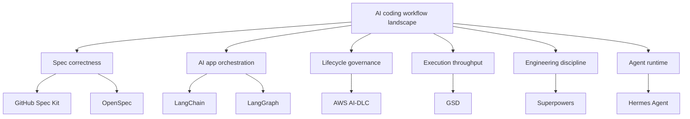

# AI Engineering Stack Guide

This guide explains the modern AI engineering stack from the perspective of an AI solution architect and engineering lead: workflow frameworks, agent harnesses/runtimes, agent app frameworks, model serving, RAG/data, tools/MCP, evals, observability, security, and governance.

The site is intentionally ordered in this sequence:

1. Foundations: understand AI-DLC and Spec-Driven Development.
2. Stack map: understand model serving, RAG/data, tools/MCP, evals, security, and governance.
3. Agent layers: understand where LangChain, LangGraph, Hermes, Codex CLI, and Claude Code fit.
4. Deep dives: understand each framework on its own terms.
5. Comparison: compare only after the core context is clear.
6. Adoption: choose a stack for a real team, risk level, and codebase.

## Start with the full stack

If you are confused because many frameworks look like `plan -> implement -> review`, start with the [AI Engineering Stack Map](./stack/). It explains which layer each framework owns before comparing individual tools.

  <a class="framework-card" href="./stack/">
    <h3>AI Engineering Stack</h3>
    
Full map of workflow, harness, app framework, model, RAG, tools, evals, and governance layers.

  </a>
  <a class="framework-card" href="./app-frameworks/langchain">
    <h3>LangChain</h3>
    
Framework for building LLM apps and tool-calling agents.

  </a>
  <a class="framework-card" href="./app-frameworks/langgraph">
    <h3>LangGraph</h3>
    
Stateful orchestration framework for long-running agent systems.

  </a>
  <a class="framework-card" href="./frameworks/spec-kit">
    <h3>GitHub Spec Kit</h3>
    
Spec-first delivery: intent becomes spec, plan, tasks, and implementation.

  </a>
  <a class="framework-card" href="./frameworks/openspec">
    <h3>OpenSpec</h3>
    
Lightweight artifact-guided SDD with change folders, delta specs, and fluid iteration.

  </a>
  <a class="framework-card" href="./frameworks/aws-ai-dlc">
    <h3>AWS AI-DLC Workflows</h3>
    
Lifecycle governance for AI-driven development with human approval and audit trail.

  </a>
  <a class="framework-card" href="./frameworks/gsd">
    <h3>GSD / Get Shit Done</h3>
    
Context engineering and multi-agent execution for long-running delivery.

  </a>
  <a class="framework-card" href="./frameworks/superpowers">
    <h3>Superpowers</h3>
    
Engineering discipline skills: brainstorm, design, TDD, review, finish.

  </a>
  <a class="framework-card" href="./harnesses/hermes">
    <h3>Hermes Agent</h3>
    
Open-source, hackable agent runtime/CLI for memory, tools, skills, and subagents.

  </a>

## Quick orientation

| If your biggest pain is... | Start with |
|---|---|
| You need the full AI engineering architecture map | [Stack Map](./stack/) |
| You need production AI app quality | [Evals & Observability](./stack/evals-observability) |
| You need safe tool use and agent governance | [Tools/MCP](./stack/tools-mcp) and [Security/Governance](./stack/security-governance) |
| Requirements are vague and the agent guesses too much | [GitHub Spec Kit](./frameworks/spec-kit) |
| You want lightweight SDD without heavy gates | [OpenSpec](./frameworks/openspec) |
| Enterprise delivery needs approval, traceability, NFRs, and audit | [AWS AI-DLC Workflows](./frameworks/aws-ai-dlc) |
| The project spans many sessions and the agent loses context | [GSD / Get Shit Done](./frameworks/gsd) |
| The agent codes too quickly without tests, design, or review | [Superpowers](./frameworks/superpowers) |
| You want to self-host or customize an agent runtime | [Hermes Agent](./harnesses/hermes) |

## Suggested reading path

Read these pages in order if you are new to this space:

1. [AI-DLC](./foundations/ai-dlc)
2. [Spec-Driven Development](./foundations/sdd)
3. [AI Engineering Stack Map](./stack/)
4. [Model & Serving Layer](./stack/model-serving)
5. [Data, RAG & Retrieval](./stack/data-rag)
6. [Tools, MCP & Gateways](./stack/tools-mcp)
7. [Evals & Observability](./stack/evals-observability)
8. [Security & Governance](./stack/security-governance)
9. [Agent Harness vs Workflow](./foundations/agent-harness-vs-workflow)
10. [LangChain](./app-frameworks/langchain)
11. [LangGraph](./app-frameworks/langgraph)
12. [LangChain/LangGraph vs Hermes](./app-frameworks/langchain-langgraph-hermes)
13. [GitHub Spec Kit](./frameworks/spec-kit)
14. [OpenSpec](./frameworks/openspec)
15. [AWS AI-DLC Workflows](./frameworks/aws-ai-dlc)
16. [GSD / Get Shit Done](./frameworks/gsd)
17. [Superpowers](./frameworks/superpowers)
18. [Hermes Agent](./harnesses/hermes)
19. [Codex CLI vs Claude Code vs Hermes](./harnesses/codex-claude-hermes)
20. [Comparison Matrix](./compare/)
21. [Same Flow, Different Purpose](./compare/same-flow-different-purpose)
22. [Decision Guide](./compare/decision-guide)
23. [Framework Combinations](./compare/combinations)
24. [Real-World Use Cases](./compare/use-cases)
25. [Adoption Playbook](./compare/adoption)
26. [Expert Review](./compare/expert-review)
