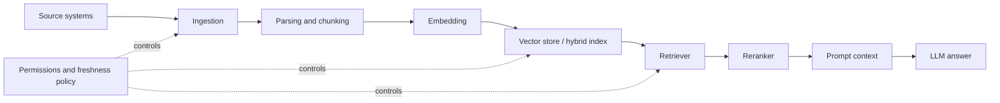

# Data, RAG & Retrieval Layer

The Data/RAG layer turns organizational knowledge into controlled context for the model. It is where documents, databases, tickets, policies, code, and product knowledge become retrievable evidence.

RAG is not just a vector database. It is the full pipeline that makes enterprise data usable, permission-aware, fresh, grounded, and measurable.

## What this layer owns

| Concern | Ownership |
|---|---|
| Source selection | Which systems and documents are allowed into the AI context |
| Ingestion | How content enters the index |
| Parsing | How PDFs, HTML, code, tables, docs, and tickets become text/metadata |
| Chunking | How content is split for retrieval |
| Embedding and indexing | How meaning and keywords become searchable |
| Retrieval | How the right chunks are selected |
| Reranking | How candidates are ordered by relevance |
| Grounding | How answers cite and use retrieved context |
| Freshness | How stale content is detected or removed |
| Permissions | How user access is enforced at retrieval time |

## RAG pipeline

## Permission-aware retrieval

Permission-aware retrieval means the system retrieves only what the current user, tenant, role, or service is allowed to see.

Do not rely on the model to ignore forbidden content. The retriever must filter before context reaches the model.

| Pattern | When to use |
|---|---|
| Metadata filter | Tenant, department, role, document type |
| ACL sync | Enterprise documents with existing access rules |
| Query-time policy check | Sensitive systems or mixed data classes |
| Separate indexes | Hard isolation across tenants or regulated domains |
| Redaction pipeline | PII, secrets, or contractual data |

## RAG quality levers

| Lever | What can go wrong | How to improve |
|---|---|---|
| Source quality | old, duplicated, contradictory documents | source curation and freshness rules |
| Parsing quality | tables/code/images are lost | document-aware parsing |
| Chunk size and overlap | context is too small or too noisy | evaluate chunk settings by query type |
| Embedding model | semantic matches are weak | compare embeddings on real queries |
| Vector vs hybrid retrieval | keyword-heavy queries fail | combine vector and keyword retrieval |
| Reranking | good candidates are buried | rerank top-k candidates |
| Citation and grounding | model answers without evidence | require citations and context checks |
| Freshness | stale policies answer current questions | version and expiry metadata |
| Access control | data leakage | filter before prompt construction |
| Eval datasets | no measurable quality | create golden queries and expected evidence |

## Where LangChain and LlamaIndex fit

LangChain can orchestrate RAG flows inside an AI application: loaders, retrievers, tools, prompts, and chains. LlamaIndex is often used when the data/indexing layer is the central concern, especially document ingestion, indexing abstractions, retrieval strategies, and knowledge workflows.

These frameworks do not replace governance. Use OpenSpec or Spec Kit to define the RAG feature, AI-DLC for high-risk delivery, and eval/observability tools to prove behavior.

## Step-by-step RAG implementation guide

1. Define the user question class: support, policy, product docs, code search, analytics.
2. Define allowed sources and data owners.
3. Define permissions before indexing.
4. Build a small golden dataset: 30-100 representative questions with expected source evidence.
5. Ingest a narrow source set first.
6. Parse and chunk with metadata: source, owner, freshness, tenant, ACL, version.
7. Compare retrieval strategies: vector, keyword, hybrid, rerank.
8. Build answer generation with citations.
9. Add refusal behavior when evidence is missing.
10. Run evals in CI before changing chunking, prompts, retrievers, or models.

## Failure modes

| Failure mode | Symptom | Fix |
|---|---|---|
| Vector DB treated as the whole RAG system | answers are inconsistent and hard to debug | design the full pipeline |
| No golden dataset | every prompt change feels subjective | create query/evidence evals |
| No permission filter | confidential chunks leak into prompts | enforce ACL before retrieval output |
| Stale index | old policies are cited | freshness metadata and re-index jobs |
| Too much retrieved context | model ignores key facts | reranking and context compression |
| No citation requirement | hallucinations look confident | grounded answer format |

## References

- [LangChain overview](https://docs.langchain.com/oss/python/langchain/overview)
- [LlamaIndex docs](https://docs.llamaindex.ai/)
- [LangSmith docs](https://docs.smith.langchain.com/)
- [Langfuse docs](https://langfuse.com/docs)
- [Arize Phoenix docs](https://docs.arize.com/phoenix)
