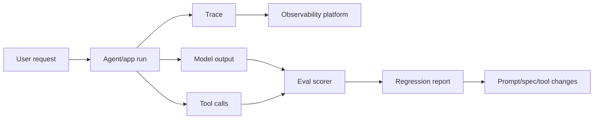

# Evals & Observability

Evals and observability are the production feedback layer. They answer a simple question: how do we know the AI system still behaves correctly after prompts, tools, retrieval, models, or workflows change?

Traditional tests prove deterministic code behavior. AI evals prove the probabilistic behavior of model output, prompts, retrieval, and tool paths still meets an acceptable bar over time.

## What this layer owns

| Concern | Output |
|---|---|
| Tracing | full run timeline across model calls, retrieval, tools, prompts |
| Quality evals | pass/fail or scored behavior on representative cases |
| Regression detection | whether new changes made behavior worse |
| Prompt/version tracking | which prompt produced which result |
| Dataset management | golden questions, expected evidence, edge cases |
| Cost and latency | token use, model route, end-to-end duration |
| Debugging | why an answer or action happened |
| Release gates | whether a change can ship |

## Traditional tests vs AI evals

| Test type | Best for | Example |
|---|---|---|
| Unit test | deterministic code | parser returns expected JSON |
| Integration test | API/tool wiring | CRM tool creates draft ticket |
| Contract test | schema compatibility | tool args match OpenAPI schema |
| Retrieval eval | context quality | expected policy doc appears in top 5 |
| Generation eval | answer quality | answer is grounded and complete |
| Agent trajectory eval | path quality | agent asks approval before write action |
| Safety eval | refusal and policy behavior | prompt injection does not trigger unsafe tool |

## Golden dataset pattern

A golden dataset is a curated set of representative cases that define expected behavior. It should include normal cases, edge cases, negative cases, and high-risk cases.

| Dataset field | Example |
|---|---|
| Input | user question or task |
| Expected evidence | documents, code files, records, or facts that should be used |
| Expected behavior | answer, refusal, tool call, approval request |
| Risk tag | security, privacy, legal, operational, product |
| Evaluation method | exact match, rubric score, LLM judge, human review |

## Trace-first debugging

When an AI system fails, do not start by rewriting the prompt. Inspect the trace first:

1. What instruction was active?
2. What context was retrieved?
3. Which model was used?
4. Which tool was called?
5. What arguments were passed?
6. Which guardrail or approval gate fired?
7. Which eval case should catch this next time?

## Metrics that matter

| Metric | Why it matters |
|---|---|
| Answer correctness | product value |
| Grounding/citation rate | trust and auditability |
| Retrieval precision/recall | RAG quality |
| Tool success/failure rate | operational reliability |
| Unsafe action attempts | security signal |
| Human approval rate | autonomy boundary health |
| Cost per successful task | business scalability |
| Latency percentiles | user experience |
| Regression rate | release quality |

## Tooling map

| Tool/category | Role |
|---|---|
| LangSmith | LangChain/LangGraph tracing and eval workflows |
| Langfuse | open-source LLM observability and prompt/eval tracking |
| Phoenix | tracing, evals, and ML/LLM observability |
| OpenTelemetry | vendor-neutral telemetry standard |
| CI eval gate | prevents regressions from merging |

## Step-by-step adoption guide

1. Instrument traces before optimizing prompts.
2. Create 30-50 golden cases for your highest-value workflow.
3. Add retrieval evals if the app uses RAG.
4. Add tool trajectory evals if the agent can take actions.
5. Run evals locally during development and in CI for critical changes.
6. Track prompt version, model route, retrieval configuration, and tool version.
7. Set failure thresholds by risk tier.
8. Review eval failures weekly and convert incidents into new cases.

## Failure modes

| Failure mode | Symptom | Better approach |
|---|---|---|
| No traces | failures are debated from screenshots | trace every run |
| Only unit tests | code passes but AI behavior regresses | add behavioral evals |
| Evals are too generic | scores look good while users complain | use real tasks and edge cases |
| No dataset ownership | evals decay over time | assign owner and review cadence |
| LLM judge only | flaky quality signal | combine deterministic checks, rubric, and human review |
| No CI gate | regressions ship repeatedly | block high-risk changes on eval threshold |

## References

- [LangSmith docs](https://docs.smith.langchain.com/)
- [Langfuse docs](https://langfuse.com/docs)
- [Arize Phoenix docs](https://docs.arize.com/phoenix)
- [OpenTelemetry](https://opentelemetry.io/)
- [LangGraph overview](https://docs.langchain.com/oss/python/langgraph/overview)
