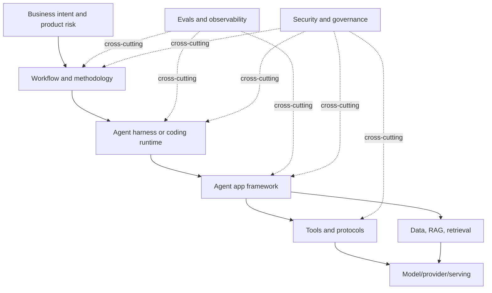
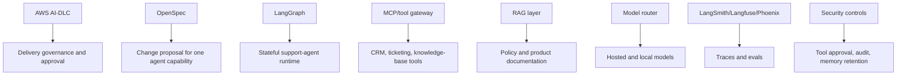

# AI Engineering Stack Map

This page is the mental map for the whole guide. The key idea is simple: many AI tools look similar because they all contain planning, execution, review, and iteration. They differ because they operate at different layers of the AI engineering stack.

If you compare tools at the wrong layer, every answer becomes fuzzy. LangGraph, Hermes, AWS AI-DLC, Spec Kit, and MCP can all appear in an "agentic" system, but they do not own the same problem.

## The stack

## Layer map

| Layer | Examples | Main question | Output |
|---|---|---|---|
| Workflow/methodology | Spec Kit, OpenSpec, AWS AI-DLC, GSD, Superpowers | How should humans and agents deliver software? | Specs, plans, approvals, tests, reviews |
| Agent harness/runtime | Codex CLI, Claude Code, Hermes | How does an agent run with tools, memory, filesystem, and subagents? | Tool calls, code changes, terminal actions |
| Agent app framework | LangChain, LangGraph, LlamaIndex, Semantic Kernel | How do we build an AI application or long-running agent service? | Chains, graphs, agents, state machines |
| Tool/protocol layer | MCP, OpenAPI tools, function calling, tool gateways | What can the model safely do? | Tool schemas, policies, audit events |
| Data/RAG layer | Embeddings, vector DBs, retrievers, rerankers | What knowledge does the AI use? | Indexed content, retrieved context, citations |
| Model/serving layer | OpenAI, Anthropic, local LLMs, vLLM, Ollama, LiteLLM | Which model runs inference, and how? | Responses, tool calls, token/cost/latency profile |
| Evals/observability | LangSmith, Langfuse, Phoenix, OpenTelemetry | How do we know the system behaves correctly? | Traces, eval scores, regression results |
| Security/governance | RBAC, sandboxing, audit logs, approval gates | What is allowed, reviewed, and accountable? | Policies, logs, approvals, risk records |

## Why the confusion happens

Different layers reuse similar verbs:

| Verb | In workflow frameworks | In app frameworks | In harnesses |
|---|---|---|---|
| Plan | Plan a feature or delivery unit | Plan agent execution path | Plan terminal/file actions |
| Implement | Generate code from specs/tasks | Execute a node/chain/tool path | Edit files and run commands |
| Review | Review spec, design, code, evidence | Evaluate outputs and traces | Inspect diffs, tests, logs |
| Iterate | Change artifacts and implementation | Improve prompts, tools, graphs | Retry tasks with better context |

The verbs are similar. The ownership is different.

This is why "plan -> implement -> review" is not enough to classify a framework. You must ask what artifact the framework owns, what risk it controls, and who is accountable for the result.

## How to read this guide

1. Use this page to identify the layer you are solving.
2. Use the deep-dive pages to understand each framework.
3. Use the comparison pages to choose a default workflow.
4. Use the reference architectures to combine layers safely.

## The shortest decision rule

| Problem | Start here |
|---|---|
| Requirements are vague | Spec Kit or OpenSpec |
| Enterprise delivery needs audit and approval | AWS AI-DLC |
| Long project execution is losing context | GSD |
| Agents code without engineering discipline | Superpowers |
| You need an open/custom agent harness | Hermes |
| You are building a RAG or tool-calling AI app | LangChain |
| You are building a stateful long-running agent app | LangGraph |
| You need production assurance | Evals, observability, security, governance |

## Practical example

For a production support agent, the layers might look like this:

No single framework owns all of that. A mature team combines a small number of layers with clear boundaries.

## References

- [GitHub Spec Kit](https://github.com/github/spec-kit)
- [OpenSpec](https://github.com/Fission-AI/OpenSpec)
- [AWS AI-DLC Workflows](https://github.com/awslabs/aidlc-workflows)
- [GSD Redux](https://github.com/open-gsd/get-shit-done-redux)
- [Superpowers](https://github.com/obra/superpowers)
- [Hermes Agent](https://github.com/NousResearch/hermes-agent)
- [LangChain overview](https://docs.langchain.com/oss/python/langchain/overview)
- [LangGraph overview](https://docs.langchain.com/oss/python/langgraph/overview)
- [Model Context Protocol](https://modelcontextprotocol.io/)
