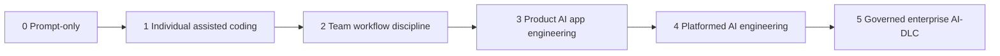

# AI Engineering Maturity Model

Maturity matters because different teams need different amounts of control. A solo prototype and a regulated enterprise agent should not use the same process.

The goal is not to reach the highest level immediately. The goal is to choose the right level for risk, team size, and production impact.

## Why maturity matters

Low maturity is not always bad. It is appropriate for exploration. High maturity is not always good. It can become process drag when applied to low-risk work.

The correct question is:

> What level of repeatability, evidence, and control does this AI workflow need?

## Levels

| Level | Name | Description |
|---|---|---|
| 0 | Prompt-only experimentation | AI use happens in ad hoc chats with little repeatability |
| 1 | Individual assisted coding | Developers use Codex/Claude/Cursor-style tools personally |
| 2 | Team workflow discipline | Specs, tests, reviews, and shared prompts become standard |
| 3 | Product AI app engineering | RAG, tools, evals, observability, and CI gates exist |
| 4 | Platformed AI engineering | Shared model routing, tool gateways, policies, and templates exist |
| 5 | Governed enterprise AI-DLC | Risk-tiered governance, audit, approvals, SLOs, and operations loops exist |

## Capability matrix

| Capability | L0 | L1 | L2 | L3 | L4 | L5 |
|---|---:|---:|---:|---:|---:|---:|
| Shared specs | no | optional | yes | yes | standardized | governed |
| Coding harness | no | personal | team recommended | integrated | platformed | governed |
| Tests | optional | developer-owned | required | required | policy-driven | audited |
| RAG/data pipeline | no | no | optional | yes | reusable platform | governed |
| Tool gateway | no | no | optional | per app | shared | governed |
| Evals | no | no | basic | CI gate | platform service | audit evidence |
| Observability | no | basic logs | CI/test logs | traces | shared telemetry | SLO and incident loop |
| Security governance | informal | personal judgment | team checklist | app controls | platform policy | risk-tiered AI-DLC |

## Recommended path by team type

| Team type | Recommended path |
|---|---|
| Solo builder | Level 0 -> Level 1, add OpenSpec only for larger changes |
| Startup product team | Level 1 -> Level 2, add Spec Kit/OpenSpec and Superpowers discipline |
| SaaS team building RAG | Level 2 -> Level 3, add LangChain, RAG evals, observability |
| Platform engineering team | Level 3 -> Level 4, add model router, tool gateway, templates |
| Regulated enterprise | Level 3/4 -> Level 5, add AWS AI-DLC-style gates and audit |

## Signs you are over-engineering

- Every typo fix requires a long AI-DLC flow.
- The team writes specs no one reads.
- Evals exist but do not represent user failures.
- Model routing exists before there are multiple real model policies.
- Tool gateway exists but only one safe read-only tool is used.
- Developers bypass the process because it adds no useful evidence.

## Signs you are under-engineering

- Agents edit important code without tests.
- RAG answers are trusted without retrieval evals.
- Tool calls are not logged.
- Sensitive data enters prompts without classification.
- No one can explain which model handled a production incident.
- Approvals happen in chat with no durable audit record.

## Upgrade sequence

1. Standardize specs and test discipline first.
2. Add traces before scaling AI apps.
3. Add evals before changing models/retrievers/prompts frequently.
4. Add tool gateway before write-capable production tools.
5. Add AI-DLC governance when work is high-risk or multi-stakeholder.
