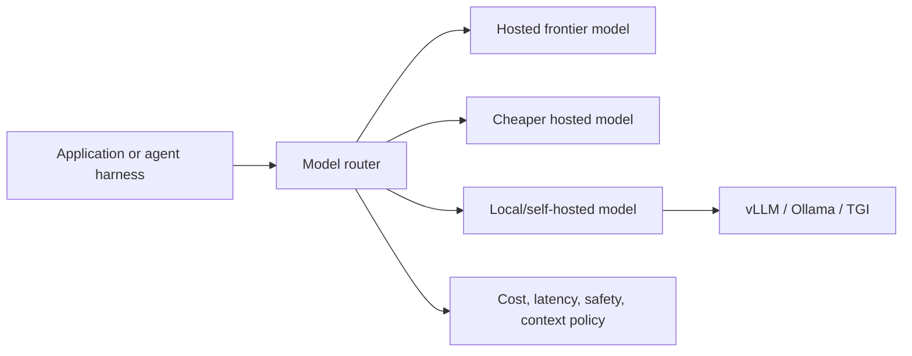

# Model & Serving Layer

The model and serving layer decides which model runs inference, where it runs, how requests are routed, and what operational envelope the rest of the stack must live within.

This is not a workflow framework. It determines reasoning capability, cost, latency, context window, tool-calling behavior, data boundaries, availability, and operational burden.

## What this layer owns

| Concern | Why it matters |
|---|---|
| Model capability | Coding, planning, extraction, classification, tool calling, multilingual quality |
| Context window | Whether the agent can hold specs, logs, retrieved context, and diffs |
| Latency | Whether the product feels interactive or batch-oriented |
| Cost | Whether the system can scale beyond demos |
| Data boundary | Whether prompts and outputs can leave your environment |
| Availability | Whether outages are handled through fallback models or queues |
| Serving operations | Whether your team owns GPU capacity, scaling, upgrades, and monitoring |

## Provider-hosted vs self-hosted

| Option | Best for | Tradeoff |
|---|---|---|
| Hosted frontier model | hardest reasoning, coding, multimodal, tool use | cost, latency, data boundary concerns |
| Hosted smaller model | classification, extraction, simple routing | weaker reasoning |
| Local/self-hosted model | data control, offline, cost predictability | ops burden, weaker frontier capability |
| Model router | mixed workload optimization | needs policy and observability |

Provider-hosted models are usually the fastest way to get high capability. Self-hosted models become attractive when data boundaries, predictable high-volume workloads, offline operation, or internal platform control matter more than maximum frontier capability.

## Model router pattern

A model router is useful when different tasks need different models:

| Task | Good routing choice |
|---|---|
| Architecture reasoning | strongest reasoning model |
| Code generation | strong coding model |
| Classification | cheaper fast model |
| Embedding | embedding-specific model |
| Sensitive local summarization | local or private model |
| Bulk extraction | cheaper model with structured-output checks |

The router should not be just a switch statement. It should log decisions, enforce data policy, track cost, and allow evaluation per route.

## Local LLM pattern

Local models are valuable when:

1. The data cannot leave a controlled environment.
2. The workload is repetitive enough to justify infrastructure.
3. The task does not require frontier-level reasoning.
4. The team can operate GPUs, model updates, quantization, and serving metrics.

Local serving is not automatically cheaper. GPU utilization, maintenance, latency tuning, evaluation, and incident response must be counted.

## Decision matrix

| Constraint | Prefer |
|---|---|
| Highest reasoning quality | Hosted frontier model |
| Strict data boundary | Local/self-hosted or private managed deployment |
| Many simple high-volume calls | Smaller hosted model or local batch serving |
| Multiple teams with mixed use cases | LiteLLM-style gateway/router |
| Need offline operation | Local/self-hosted |
| Need fast experimentation | Hosted model first |
| Regulated enterprise deployment | Router plus audit, retention, and approval policy |

## Step-by-step adoption guide

1. List workloads: coding, support, RAG answering, extraction, classification, summarization, embeddings.
2. Label each workload by risk: public, internal, confidential, regulated.
3. Define required model capabilities: context length, tool calling, structured output, multilingual support, latency.
4. Start with one hosted model for the hardest path and one cheaper model for simple paths.
5. Add a model router only when you have at least two real routing policies.
6. Add self-hosted serving only after evals prove the local model is good enough.
7. Log route, model, token count, latency, failure, and cost for every call.
8. Add fallback policy for outage, rate limit, and quality regression.

## Failure modes

| Failure mode | Consequence | Prevention |
|---|---|---|
| Choosing a weak model for complex coding | Agent appears "undisciplined" but the model is underpowered | Capability evals before rollout |
| No routing policy | Expensive models handle trivial tasks | Cost-aware routing |
| No data classification | Confidential prompts go to the wrong provider | Data boundary policy |
| Self-hosting too early | Platform team becomes GPU operations team | Prove need with cost and data analysis |
| No fallback | Provider outage becomes product outage | Fallback and queue policy |
| No telemetry | Cost and latency problems are invisible | Observability per model route |

## References

- [LiteLLM docs](https://docs.litellm.ai/)
- [vLLM docs](https://docs.vllm.ai/)
- [Ollama GitHub](https://github.com/ollama/ollama)
- [LangChain model integrations](https://docs.langchain.com/oss/python/langchain/overview)
- [Hermes Agent](https://github.com/NousResearch/hermes-agent)
