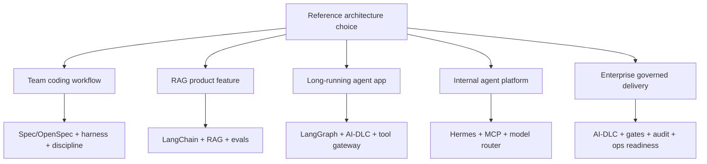

# Reference Architectures

Reference architectures show how the layers combine in real systems. They are not product templates. They are decision maps: which layer owns which responsibility, which framework should lead, and where teams usually overbuild.

## Architecture map



## Architecture 1: AI-assisted product engineering team

Recommended stack:

```text
Spec Kit or OpenSpec + Codex/Claude/Hermes + Superpowers-style TDD + CI
```

| Layer | Choice | Reason |
|---|---|---|
| Workflow | Spec Kit for larger features, OpenSpec for lightweight changes | keeps intent and implementation aligned |
| Harness | Codex CLI, Claude Code, or Hermes | performs coding, terminal, repo operations |
| Discipline | Superpowers-style TDD/review | prevents agent from coding without tests |
| Verification | CI tests and PR review | turns AI output into normal engineering evidence |

Use this when the main problem is software delivery quality, not building a production AI application.

Step-by-step:

1. Define when a change needs Spec Kit vs OpenSpec.
2. Define a minimal spec template with goals, non-goals, acceptance criteria, and risks.
3. Require TDD or test-first prompts for behavior changes.
4. Use the harness for implementation only after the spec/change artifact is reviewed.
5. Require CI and human PR review before merge.

## Architecture 2: Production RAG product feature

Recommended stack:

```text
OpenSpec + LangChain + Data/RAG layer + evals/observability + CI eval gate
```

| Layer | Choice | Reason |
|---|---|---|
| Change control | OpenSpec | lightweight proposal and spec delta |
| AI app framework | LangChain | fast RAG and tool orchestration |
| Data layer | ingestion, parsing, chunking, vector/hybrid search | RAG quality depends on data pipeline |
| Observability | LangSmith, Langfuse, Phoenix | traces and evals for retrieval/generation |
| CI gate | retrieval and answer evals | prevents prompt/retriever/model regressions |

Use this for chatbots, support assistants, documentation assistants, or knowledge search features.

Step-by-step:

1. Define allowed sources and data owners.
2. Create a golden dataset of user questions and expected evidence.
3. Build a narrow RAG pipeline first.
4. Add citations and refusal behavior.
5. Add traces and evals before broad rollout.
6. Add permission-aware retrieval before sensitive data.

## Architecture 3: Long-running agent service

Recommended stack:

```text
AI-DLC + LangGraph + tool gateway + evals + audit logs
```

| Layer | Choice | Reason |
|---|---|---|
| Delivery governance | AWS AI-DLC | risk, approval, NFR, audit |
| Runtime app framework | LangGraph | stateful graph, human-in-the-loop, long-running execution |
| Tools | Tool gateway/MCP/OpenAPI | controlled external actions |
| Evaluation | node evals and trajectory evals | verifies state transitions and actions |
| Observability | traces and audit logs | production debugging and accountability |

Use this when the AI system performs multi-step work over time, needs memory/state, or can trigger external actions.

Step-by-step:

1. Run AI-DLC inception for risk, stakeholders, NFRs, and approval model.
2. Design LangGraph state and node boundaries.
3. Classify tools and actions by risk.
4. Gate write/destructive actions.
5. Add node-level tests and full trajectory evals.
6. Add traces, audit logs, and rollback/runbook procedures.

## Architecture 4: Internal agent platform with custom harness

Recommended stack:

```text
Hermes + model router + MCP/tool gateway + OpenSpec + Superpowers-like skills
```

| Layer | Choice | Reason |
|---|---|---|
| Harness/runtime | Hermes | open/customizable agent runtime |
| Model layer | model router | hosted and local model control |
| Tool layer | MCP/tool gateway | standardized tool access and policy |
| Workflow | OpenSpec | lightweight change artifacts |
| Discipline | Superpowers-like skills | TDD, review, debugging, planning behavior |

Use this when you want to own the agent harness instead of depending only on managed coding CLIs.

Step-by-step:

1. Define why Codex/Claude-style CLIs are not enough.
2. Choose model routes by workload and data boundary.
3. Add MCP/tool gateway before exposing internal systems.
4. Pilot one repo with OpenSpec and a limited tool set.
5. Add skills for planning, TDD, review, and debugging.
6. Log tool calls and measure whether the custom harness improves outcomes.

## Architecture 5: Enterprise AI-DLC delivery system

Recommended stack:

```text
AWS AI-DLC + Spec Kit/OpenSpec patterns + security governance + release readiness + observability
```

| Layer | Choice | Reason |
|---|---|---|
| Lifecycle | AWS AI-DLC | governs AI-driven delivery |
| Requirements | Spec Kit/OpenSpec concepts | clearer acceptance criteria and change deltas |
| Security | risk-tiered gates | prevents speed from outrunning accountability |
| Operations | release readiness and runbooks | closes the gap between construction and production |
| Observability | traces, CI, incident feedback | evidence for production behavior |

Use this when multiple stakeholders, high-risk systems, regulated domains, or platform teams need repeatable delivery governance.

Step-by-step:

1. Define risk tiers.
2. Define approval owners for product, architecture, security, operations.
3. Define required artifacts per tier.
4. Use Spec Kit/OpenSpec patterns inside AI-DLC artifacts for clarity.
5. Add construction verification: tests, evals, security checks.
6. Add operations verification: rollout, rollback, monitoring, incident feedback.

## How to choose a reference architecture

| Main problem | Choose |
|---|---|
| Team wants better AI-assisted coding | Architecture 1 |
| Product needs RAG or knowledge assistant | Architecture 2 |
| Product needs stateful autonomous workflow | Architecture 3 |
| Platform team wants custom open agent runtime | Architecture 4 |
| Enterprise needs audit, approvals, NFRs, governance | Architecture 5 |

## Combination rule

Start with one owner per layer. Do not combine two frameworks that both claim the same artifact unless you explicitly define precedence.

Example:

| Artifact | Owner |
|---|---|
| Requirement spec | Spec Kit or OpenSpec, not both for the same feature |
| Lifecycle approval | AI-DLC |
| Agent execution | Codex/Claude/Hermes |
| AI app runtime | LangChain or LangGraph |
| Tool permissions | Tool gateway |
| Production proof | Evals and observability |
