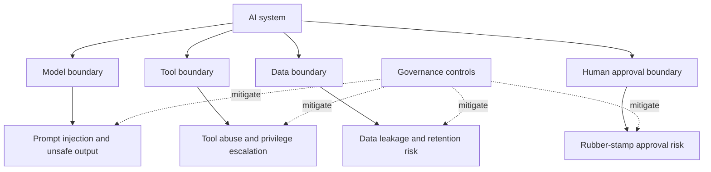

# Security & Governance

Security and governance define what the AI system is allowed to know, say, change, store, and trigger. This layer cuts across workflow frameworks, harnesses, app frameworks, tools, data, and models.

Governance should not slow every change equally. Good governance increases ceremony according to risk tier.

## What this layer owns

| Concern | Example control |
|---|---|
| Data boundary | classification, redaction, retention |
| Tool boundary | scoped credentials, allowlists, approval gates |
| Model boundary | provider policy, model routing, sensitive-data controls |
| Human boundary | named approvers, review evidence, escalation |
| Delivery boundary | risk-tiered AI-DLC gates, PR checks, release readiness |
| Audit boundary | traces, decision records, tool-call logs |
| Memory boundary | what is stored, where, for how long, and how deletion works |

## AI agent threat model

## Control map

| Risk | Control |
|---|---|
| Prompt injection | instruction hierarchy, retrieval filtering, tool confirmation |
| Data exfiltration | data classification, redaction, allowlisted tools |
| Tool abuse | scoped credentials, human approval for destructive actions |
| Memory leakage | retention policy, deletion policy, workspace isolation |
| Unreviewed AI code | PR review, tests, CI, AI-DLC audit for high-risk changes |
| Rubber-stamp governance | named approvers and evidence-based approval |

## Governance by risk tier

| Risk tier | Example | Required control |
|---|---|---|
| Low | UI copy, docs, small refactor | normal review and tests |
| Medium | product behavior, billing UX, data processing | spec/change artifact, tests, reviewer evidence |
| High | auth, payments, customer data, infrastructure | AI-DLC-style gates, security review, audit record |
| Critical | regulated data, destructive automation, prod deploys | named approvers, rollback plan, incident readiness, tool-call audit |

This is where AWS AI-DLC is strongest: it makes lifecycle state, approvals, and audit explicit. Spec Kit and OpenSpec can define changes, but governance must be added when risk is high.

## Security checklist for coding agents

- Use isolated workspaces or worktrees for risky changes.
- Never grant unrestricted production credentials to a coding agent.
- Require tests before merge.
- Review generated specs and generated code separately.
- Log shell commands and tool calls when possible.
- Require human approval for destructive filesystem or cloud actions.
- Store prompts and generated docs only in approved repo locations.
- Treat generated code like junior-developer code until reviewed.

## Security checklist for AI apps

- Classify data before it enters prompts, retrieval, memory, or logs.
- Filter retrieval results before model context construction.
- Scope tool credentials to least privilege.
- Gate write/destructive actions.
- Add prompt-injection tests for tool and RAG workflows.
- Add output validation for structured actions.
- Track model, prompt version, tool version, and trace ID.
- Define memory retention and deletion policy.
- Keep incident runbooks for unsafe outputs and tool misuse.

## Step-by-step adoption guide

1. Define risk tiers for your organization.
2. Map each AI workflow or app feature to a risk tier.
3. Define required evidence per tier: spec, tests, evals, approval, audit, rollback.
4. Identify all data classes touched by the agent/app.
5. Identify all tools and mark them read, write, destructive, or sensitive.
6. Add approval gates for high-risk actions.
7. Add logs and traces before production rollout.
8. Review controls after incidents and major model/tool changes.

## Failure modes

| Failure mode | Consequence | Prevention |
|---|---|---|
| Governance applied equally to everything | team bypasses process | risk-tiered ceremony |
| No named approvers | approvals become vague | explicit ownership |
| Prompt injection ignored | retrieved content can steer tools | safety evals and tool confirmation |
| Secrets in prompts/logs | data breach | redaction and secret scanning |
| Memory retained forever | privacy and compliance risk | retention and deletion policy |
| Agent given broad credentials | privilege escalation | scoped credentials and gateway |

## References

- [AWS AI-DLC Workflows](https://github.com/awslabs/aidlc-workflows)
- [Model Context Protocol](https://modelcontextprotocol.io/)
- [OpenTelemetry](https://opentelemetry.io/)
- [Langfuse docs](https://langfuse.com/docs)
- [Arize Phoenix docs](https://docs.arize.com/phoenix)
