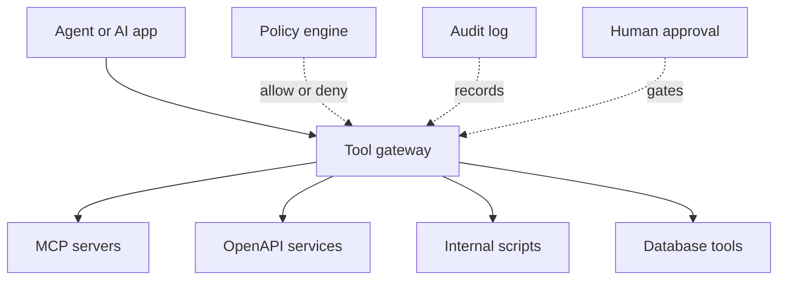

# Tools, MCP & Gateways

The tools layer defines what an AI app or agent can do outside the model. This includes calling APIs, reading files, querying databases, opening tickets, changing code, sending emails, and invoking internal systems.

This layer is where capability becomes risk. A model that can only answer text is limited. A model that can call tools can create value, but also needs authorization, policy, audit, and rollback boundaries.

## What this layer owns

| Concern | What it controls |
|---|---|
| Tool schema | What arguments the model can produce |
| Tool discovery | Which tools are visible to which agent/user |
| Authentication | Which identity is used to call the tool |
| Authorization | Whether the requested action is allowed |
| Approval | Whether human confirmation is required |
| Rate limit | How much tool usage is allowed |
| Audit | What was called, by whom, with what inputs, and why |
| Isolation | Whether tools can affect local files, prod systems, or sensitive data |

## Function calling vs MCP vs OpenAPI tools

| Mechanism | Meaning |
|---|---|
| Function calling | Model emits structured tool arguments |
| OpenAPI tool | Tool schema comes from an HTTP API contract |
| MCP | Standard protocol for exposing tools/resources/prompts to agents |
| Tool gateway | Organization-controlled boundary for policy, auth, rate limit, and audit |

Function calling is the model-facing shape. MCP is a protocol for exposing tool and context surfaces to AI apps. OpenAPI is a common way to describe existing HTTP services. A tool gateway is the enterprise control plane you add when many agents and many tools need consistent policy.

## Tool gateway pattern

A gateway is useful when you need one place to enforce:

1. Which tools are available to which agent.
2. Which actions require approval.
3. Which data classes can be sent to which tool.
4. Which calls must be logged.
5. Which credentials and scopes are used.
6. Which tools are read-only, write-capable, or destructive.

## Permission and approval model

| Action class | Example | Control |
|---|---|---|
| Read-only low risk | search docs, read public metadata | allow with logging |
| Read-only sensitive | read customer record, inspect incident logs | allow only with scoped identity |
| Write low risk | create draft ticket, update local branch | allow with trace |
| Write medium risk | update issue status, create pull request | approval or review gate |
| Destructive/high risk | delete resource, rotate secrets, deploy prod | explicit human approval and break-glass policy |

The right default is not "agents cannot use tools." The right default is "tools are scoped by risk."

## Tool safety checklist

- Does every tool have a clear name and narrow description?
- Are arguments typed and validated?
- Is the tool read-only by default?
- Is the credential scoped to the minimum permission?
- Is the user identity propagated when needed?
- Are destructive actions blocked or approval-gated?
- Are tool inputs and outputs logged with sensitive fields redacted?
- Are prompts prevented from inventing tool permissions?
- Are retries idempotent?
- Is there a rollback or compensation path for writes?

## Step-by-step adoption guide

1. Inventory the tools the agent needs: filesystem, shell, Git, issue tracker, CRM, database, cloud APIs.
2. Classify each tool as read-only, write, destructive, or sensitive.
3. Start with read-only tools and local development tools.
4. Wrap tool calls behind a gateway or policy layer before exposing production systems.
5. Add approval gates for write and destructive actions.
6. Log tool call intent, arguments, actor, result, and trace ID.
7. Add eval cases for unsafe tool requests.
8. Review tool access during every new agent capability rollout.

## Failure modes

| Failure mode | Symptom | Better approach |
|---|---|---|
| Broad shell access in production | agent can mutate systems unexpectedly | separate dev harness tools from prod app tools |
| Tool descriptions are vague | model calls the wrong tool | narrow schemas and examples |
| No approval for writes | accidental tickets, emails, or deploys | risk-tiered approval |
| Tool output leaks secrets | logs or prompts contain sensitive data | redaction and data classification |
| MCP treated as governance | protocol exists but policy is absent | add gateway, RBAC, audit, and approval |
| No audit log | impossible to investigate incidents | trace every tool call |

## References

- [Model Context Protocol](https://modelcontextprotocol.io/)
- [OpenTelemetry](https://opentelemetry.io/)
- [Hermes Agent](https://github.com/NousResearch/hermes-agent)
- [LangChain overview](https://docs.langchain.com/oss/python/langchain/overview)
- [LangGraph overview](https://docs.langchain.com/oss/python/langgraph/overview)
