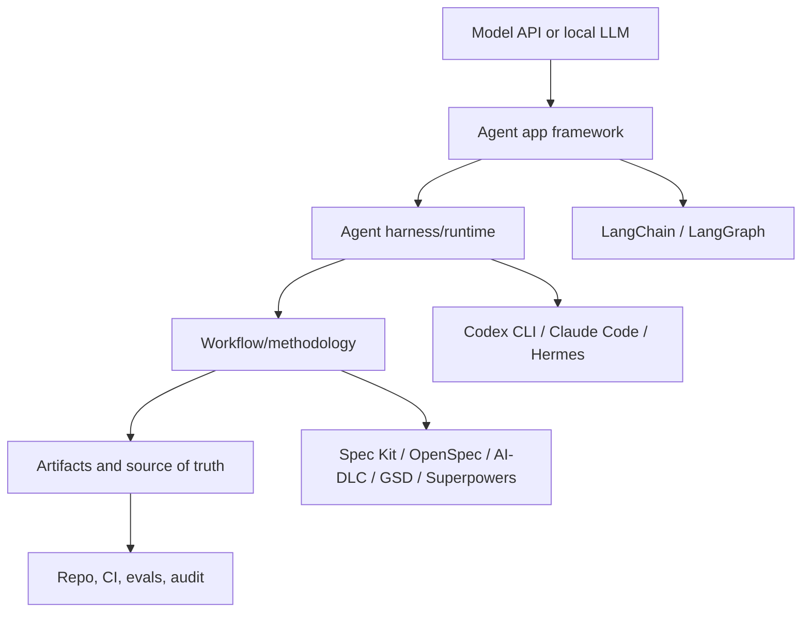
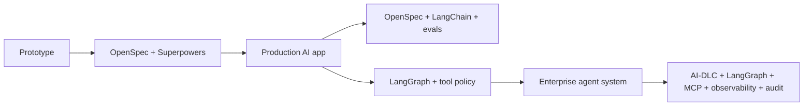

# One-Page Cheat Sheet

Use this page when you need the fastest possible answer to: **which tool belongs to which layer, and what should it produce?**

## The 30-second model

The key idea:

> Most frameworks share verbs like plan, implement, and review. They differ by **what they govern**.

## Choose by problem

| Your real problem | Best starting point | Why |
|---|---|---|
| The agent guesses requirements | GitHub Spec Kit | Make intent, spec, plan, and tasks explicit before coding |
| You want lightweight SDD | OpenSpec | Keep change proposals and delta specs without heavy process |
| You need enterprise traceability | AWS AI-DLC Workflows | Add approvals, risk records, NFRs, and audit trail |
| Work spans many sessions | GSD | Preserve context, phase plans, and handoffs |
| Agent coding lacks discipline | Superpowers | Enforce design, TDD, review, and finish habits |
| You are building a RAG or tool-calling app | LangChain | Compose models, prompts, tools, retrievers, and chains |
| You are building a stateful agent service | LangGraph | Model state, nodes, edges, checkpoints, and human-in-the-loop |
| You need a customizable agent runtime | Hermes | Own the harness, tools, memory, skills, and model routing |
| You need a protocol for tools | MCP | Standardize tool exposure and integration boundaries |

## Same words, different ownership

| Word | Workflow framework meaning | Harness/runtime meaning | App framework meaning |
|---|---|---|---|
| Plan | Delivery plan, spec, tasks, approval path | Agent execution plan for tool use | Graph, chain, node, or state transition design |
| Implement | Code changes against requirements | Tool calls, file edits, terminal actions | Runtime logic inside an AI app |
| Review | Human/code/spec review | Agent output verification | Eval, trace, or behavior inspection |
| Memory | Project context or long-lived handoff | Agent memory/session context | Application memory, state, or retrieval |
| Governance | Delivery gates and accountability | Tool permissions and sandboxing | Runtime guardrails and eval thresholds |

## Selection matrix

| Context | Primary workflow | Supporting layers | Minimum artifacts |
|---|---|---|---|
| Small product feature | Spec Kit or OpenSpec | Superpowers | spec/change proposal, tasks, tests |
| Startup MVP | OpenSpec | Superpowers, LangChain if AI app | change proposal, test checklist, done criteria |
| Enterprise modernization | AWS AI-DLC | Spec Kit, Superpowers | risk record, NFRs, approval log, migration plan |
| RAG product | OpenSpec | LangChain, evals, observability | data contract, eval set, prompt contract |
| Long-running agent service | AI-DLC or OpenSpec | LangGraph, security/governance | state schema, tool policy, eval gates |
| Internal agent platform | AI-DLC | Hermes, MCP, LangGraph, observability | tool registry, memory policy, audit trail |
| Multi-agent delivery project | GSD | Superpowers, Spec Kit/OpenSpec | phase plan, context packet, handoff notes |

## Do not compare these directly

| Wrong comparison | Better framing |
|---|---|
| LangGraph vs AI-DLC | LangGraph builds runtime behavior; AI-DLC governs delivery |
| Hermes vs Spec Kit | Hermes runs agents; Spec Kit structures specs |
| MCP vs LangChain | MCP exposes tools; LangChain builds app logic that may use tools |
| Superpowers vs Codex CLI | Superpowers is engineering method; Codex CLI is an agent harness |
| OpenSpec vs LangGraph | OpenSpec governs changes; LangGraph implements stateful agent behavior |

## Minimal stack by maturity

## Rule of thumb

Use **one primary workflow** as the source of truth. Add app frameworks, harnesses, tools, and eval layers around it, but do not let every layer invent its own plan.
