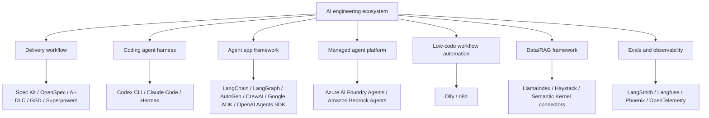

# Adjacent Agent Ecosystem Map

This guide focuses on AI engineering workflows, harnesses, and app frameworks. The broader ecosystem also includes agent SDKs, managed agent services, low-code automation, data frameworks, and observability platforms.

The goal of this page is to prevent category confusion.

## Ecosystem by layer

## Category definitions

| Category | Main question | Examples | Output |
|---|---|---|---|
| Delivery workflow/methodology | How should humans and agents deliver software? | Spec Kit, OpenSpec, AI-DLC, GSD, Superpowers | specs, plans, tasks, reviews, approvals |
| Coding agent harness/runtime | How does an AI coding agent run with tools, memory, files, shell, and policies? | Codex CLI, Claude Code, Hermes | tool calls, code changes, session memory |
| Agent app framework | How do we build an AI app or agent service? | LangChain, LangGraph, OpenAI Agents SDK, AutoGen, CrewAI, Google ADK | chains, graphs, agents, state, tool calls |
| Managed agent platform | How do we host/manage enterprise agents with provider services? | Azure AI Foundry Agent Service, Amazon Bedrock Agents | managed agents, connectors, deployment controls |
| Low-code AI workflow | How do non-specialist teams compose AI workflows quickly? | Dify, n8n | workflow canvas, nodes, app templates |
| Data/RAG framework | How do we ingest, index, retrieve, and ground knowledge? | LlamaIndex, Haystack | indexes, retrievers, document pipelines |
| Evals/observability | How do we know behavior is correct in production? | LangSmith, Langfuse, Phoenix, OpenTelemetry | traces, metrics, eval scores, alerts |

## How adjacent tools relate to this guide

| Tool | Best mental model | Competes with | Does not replace |
|---|---|---|---|
| OpenAI Agents SDK | App-level agent SDK for tool-using agents | Other app frameworks/SDKs in some use cases | AI-DLC, Spec Kit, OpenSpec, release governance |
| AutoGen | Multi-agent programming framework | CrewAI, LangGraph in some multi-agent workloads | Delivery workflow, source-of-truth artifacts |
| CrewAI | Role/task oriented multi-agent framework | AutoGen, LangGraph in some workloads | Governance, evals, tool policy |
| Google ADK | Agent development kit for building/deploying agents | Other agent app SDKs | SDD, AI-DLC, coding harness |
| Azure AI Foundry Agent Service | Managed enterprise agent service | Other managed agent platforms | Repo-level delivery workflow |
| Amazon Bedrock Agents | Managed AWS agent capability | Other managed agent platforms | Spec discipline or AI-DLC decisions |
| Dify | Low-code LLM app/agent workflow platform | n8n, some app framework use cases | Deep codebase workflow governance |
| n8n AI Agent | Workflow automation with AI agent nodes | Dify, automation platforms | Spec, tests, code review discipline |
| LlamaIndex | Data/RAG-focused framework | LangChain for data-heavy RAG flows | Delivery workflow or agent harness |
| Semantic Kernel | App orchestration SDK with enterprise integration patterns | LangChain/OpenAI SDK in some contexts | AI-DLC governance |

## When to add a deep dive

Do not add a deep dive for every popular AI tool. Add a deep dive only when one of these is true:

| Trigger | Add a page? | Why |
|---|---|---|
| Users commonly confuse it with SDD/workflow frameworks | Yes | It reduces decision confusion |
| It changes source-of-truth artifacts | Yes | It affects delivery method |
| It is only an implementation library | Maybe | Mention in ecosystem map unless heavily requested |
| It is provider-managed and enterprise-specific | Maybe | Add a platform page if readers need deployment guidance |
| It is low-code and audience is non-developer | Maybe | Add only if the guide targets citizen developers too |

## Practical selection examples

| Situation | Recommended combination |
|---|---|
| Build a custom RAG backend in code | OpenSpec + LangChain or LlamaIndex + evals |
| Build a stateful support agent | AI-DLC or OpenSpec + LangGraph + tool policy |
| Build a multi-agent research prototype | OpenSpec + AutoGen or CrewAI + Superpowers |
| Build enterprise agent on Azure | AI-DLC + Azure AI Foundry Agent Service + eval/audit gates |
| Build enterprise agent on AWS | AI-DLC + Amazon Bedrock Agents + eval/audit gates |
| Build internal automation with low code | OpenSpec-lite + n8n or Dify + tool permission matrix |
| Build your own coding/research agent harness | Hermes + Superpowers + tool permission matrix |

## Official references

- OpenAI Agents SDK: https://platform.openai.com/docs/guides/agents-sdk/
- Microsoft AutoGen: https://microsoft.github.io/autogen/
- CrewAI: https://docs.crewai.com/
- Google Agent Development Kit: https://google.github.io/adk-docs/
- Azure AI Foundry Agent Service: https://learn.microsoft.com/azure/ai-foundry/agents/overview
- Amazon Bedrock Agents: https://docs.aws.amazon.com/bedrock/latest/userguide/agents.html
- Dify: https://docs.dify.ai/
- n8n AI Agent node: https://docs.n8n.io/integrations/builtin/cluster-nodes/root-nodes/n8n-nodes-langchain.agent/
- LlamaIndex: https://docs.llamaindex.ai/
- Haystack: https://docs.haystack.deepset.ai/
- Semantic Kernel: https://learn.microsoft.com/semantic-kernel/

## Bottom line

If a tool builds the **runtime behavior**, it belongs in the app/platform layer. If it governs **how code changes are specified, approved, implemented, and reviewed**, it belongs in the workflow layer. Most strong teams need both, but they should not confuse the two.
