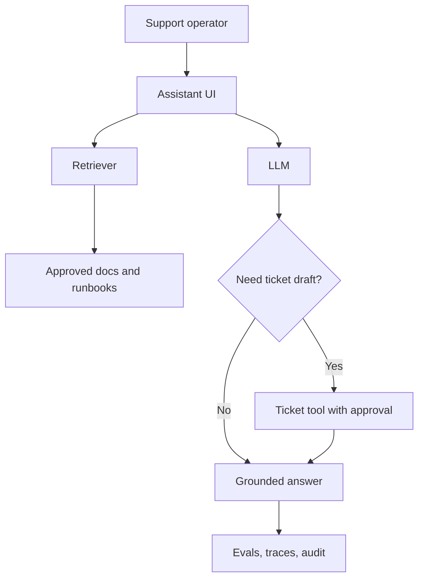
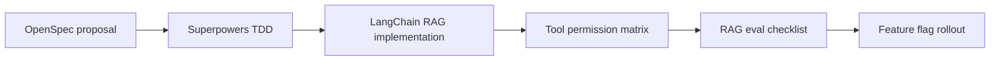
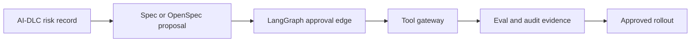

# Scenario Lab: One Feature, Different Workflows

This page makes the differences concrete by applying each workflow to the same product scenario.

## Scenario

Build a **RAG support assistant** for an internal SaaS operations team.

The assistant must:

- answer questions from approved product docs and runbooks;
- cite sources;
- refuse when the answer is not grounded;
- optionally create a draft incident ticket;
- log traces and eval results;
- support safe rollout behind a feature flag.

## Same target architecture

The runtime architecture does not change much across workflows. What changes is the **source of truth** and the **control surface**.

| Layer | Suggested choice | Why |
|---|---|---|
| App framework | LangChain | Fast RAG composition, retriever/tool integration |
| Stateful orchestration | LangGraph if ticket workflow becomes multi-step | Add state, checkpoint, approval edge |
| Tool protocol | MCP or explicit tool gateway | Keep ticket tool permissions auditable |
| Workflow | Depends on scenario below | Controls requirements, risk, and delivery |
| Evals | Golden Q&A set + grounding checks | Prevent hallucinated support answers |
| Observability | Trace every retrieval, model call, and tool proposal | Debug quality and support audit |

## Path 1: GitHub Spec Kit

Use Spec Kit when the main risk is vague requirements.

### Step-by-step

1. Write the feature spec: users, scope, data sources, refusal behavior, citation rules.
2. Generate the implementation plan: UI, retrieval, prompt contract, ticket tool, evals.
3. Break the plan into tasks: ingestion, retriever, prompt, tool policy, tests, docs.
4. Implement only against the accepted spec.
5. Review whether each requirement has tests or eval evidence.

### Artifacts

| Artifact | Example content |
|---|---|
| `spec.md` | "Assistant SHALL cite approved runbook source for each operational answer." |
| `plan.md` | RAG architecture, model choice, retrieval strategy, rollout |
| `tasks.md` | Task list mapped to requirements |
| eval report | Grounded answer rate, refusal correctness, source coverage |

### Best fit

Product teams where business/product ambiguity is the biggest source of agent mistakes.

## Path 2: OpenSpec

Use OpenSpec when the change is scoped and you want lightweight spec discipline.

### Step-by-step

1. Create a change proposal such as `add-support-rag-assistant`.
2. Add delta specs for new capabilities: grounded answer, source citation, ticket draft.
3. Define scenarios with `Given / When / Then`.
4. Implement the minimal change.
5. Validate the change and archive the proposal once adopted.

### Artifacts

| Artifact | Example content |
|---|---|
| change proposal | Why the assistant is needed and what changes |
| delta spec | New support assistant capability requirements |
| validation notes | Test/eval evidence and rollout status |

### Best fit

Small-to-mid teams that want SDD benefits without enterprise-level governance.

## Path 3: AWS AI-DLC Workflows

Use AI-DLC when the assistant can affect customers, operations, regulated data, or high-risk decisions.

### Step-by-step

1. Classify AI behavior: user-facing, tool-using, data-sensitive, operational impact.
2. Create risk register and required approvals.
3. Define NFRs: latency, data retention, auditability, availability, safety.
4. Require security review for document permissions and ticket tool side effects.
5. Define eval gates and deployment evidence.
6. Release behind feature flag with monitoring and rollback plan.

### Artifacts

| Artifact | Example content |
|---|---|
| risk register | Hallucinated runbook step, unauthorized ticket creation, stale docs |
| approval record | Product, security, platform, operations |
| NFR checklist | Latency, retention, availability, traceability |
| audit evidence | Eval run, traces, approval decisions, deployment record |

### Best fit

Enterprise teams where the cost of a wrong AI action is high.

## Path 4: GSD

Use GSD when the work is long-running, multi-agent, or easy to lose across sessions.

### Step-by-step

1. Create a mission and phase plan.
2. Build a context packet: repo map, data sources, existing support flows, constraints.
3. Assign phases: discovery, ingestion, retriever, prompt/tool, eval, rollout.
4. After each session, update handoff notes with decisions and remaining risks.
5. Use the context packet to resume without re-discovering the project.

### Artifacts

| Artifact | Example content |
|---|---|
| phase plan | Discovery -> RAG implementation -> eval -> rollout |
| context packet | Repo structure, docs inventory, tool API notes |
| handoff notes | What changed, what failed, what to do next |

### Best fit

Long-running delivery where continuity matters more than formal approval gates.

## Path 5: Superpowers

Use Superpowers when the agent needs stronger engineering discipline.

### Step-by-step

1. Brainstorm edge cases before implementation.
2. Write a design note for retrieval, prompting, ticket tool policy, and evals.
3. Write failing tests or eval cases first.
4. Implement the smallest useful change.
5. Run tests and inspect traces.
6. Review the diff for risk, missing tests, and behavior drift.

### Artifacts

| Artifact | Example content |
|---|---|
| design note | Retriever behavior, prompt contract, refusal policy |
| tests first | Source citation, no-answer refusal, ticket draft approval |
| review checklist | Edge cases, security, observability, docs |

### Best fit

Any team using an AI coding agent that tends to move too fast without verification.

## Combined best-practice stack

For this scenario, a pragmatic production stack is:

If the ticket tool can trigger real operational impact, upgrade governance:

## What this lab proves

The workflows are not just different branding around `plan -> implement -> review`.

| Framework | What changes in practice |
|---|---|
| Spec Kit | Requirements become the controlling artifact |
| OpenSpec | Change proposal and delta spec govern the work |
| AI-DLC | Risk, approval, and audit become first-class gates |
| GSD | Context continuity becomes the delivery backbone |
| Superpowers | Engineering discipline becomes explicit and repeatable |
| LangChain/LangGraph | Runtime behavior is implemented, not governed |
| Hermes | Agent execution is harnessed, not specified |
