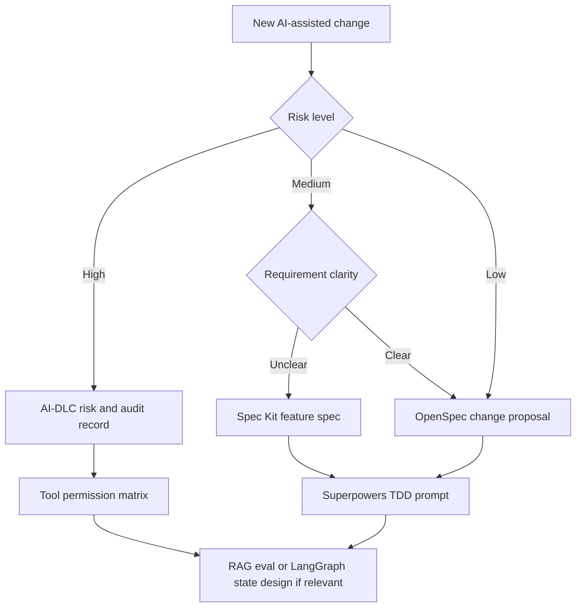

# Templates and Starter Artifacts

This pack turns the guide into a working toolkit. Use the templates as starting points for issues, pull requests, architecture notes, AI-DLC records, or agent prompts.

## Downloadable templates

| Template | Use when | Link |
|---|---|---|
| Spec Kit feature spec | Intent is ambiguous and needs a spec-first path | <a href="../../templates/spec-kit-spec-template.md" download>Download</a> |
| OpenSpec change proposal | You need lightweight SDD for a scoped change | <a href="../../templates/openspec-change-proposal-template.md" download>Download</a> |
| AI-DLC risk and audit record | Delivery needs governance, review, and traceability | <a href="../../templates/ai-dlc-risk-audit-template.md" download>Download</a> |
| GSD phase plan | Work spans many sessions, agents, or handoffs | <a href="../../templates/gsd-phase-plan-template.md" download>Download</a> |
| Superpowers TDD prompt | You want the coding agent to design, test, implement, review | <a href="../../templates/superpowers-tdd-prompt-template.md" download>Download</a> |
| LangGraph state design | You are building a stateful agent service | <a href="../../templates/langgraph-state-design-template.md" download>Download</a> |
| RAG eval checklist | You need a production-grade RAG release gate | <a href="../../templates/rag-eval-checklist-template.md" download>Download</a> |
| Tool permission matrix | You need safe tool use, audit, and approval rules | <a href="../../templates/tool-permission-matrix-template.md" download>Download</a> |
| Adoption scorecard | You need to assess maturity and prioritize improvements | <a href="../../templates/agent-adoption-scorecard.md" download>Download</a> |

## Which template should be required?

## Recommended minimum bundle

| Scenario | Required templates |
|---|---|
| Normal product feature | Spec Kit feature spec or OpenSpec proposal, Superpowers TDD prompt |
| RAG feature | OpenSpec proposal, RAG eval checklist, tool permission matrix |
| Stateful agent | LangGraph state design, tool permission matrix, eval checklist |
| Enterprise AI feature | AI-DLC risk/audit record, spec, tool permission matrix, release evidence |
| Internal agent platform | AI-DLC record, Hermes/tool policy notes, LangGraph state design if app runtime exists |

## How to use with a coding agent

1. Fill the smallest template that captures the risk.
2. Paste the completed artifact into the issue, PR, or agent session.
3. Tell the agent which artifact is the source of truth.
4. Ask the agent to produce a plan that maps every task to the artifact.
5. Require tests, evals, or review evidence before implementation is considered done.

## Template quality bar

A template is useful only if it changes behavior. If a section will not affect design, testing, review, or release, remove it for that change. Lightweight does not mean undocumented; it means every artifact earns its place.
