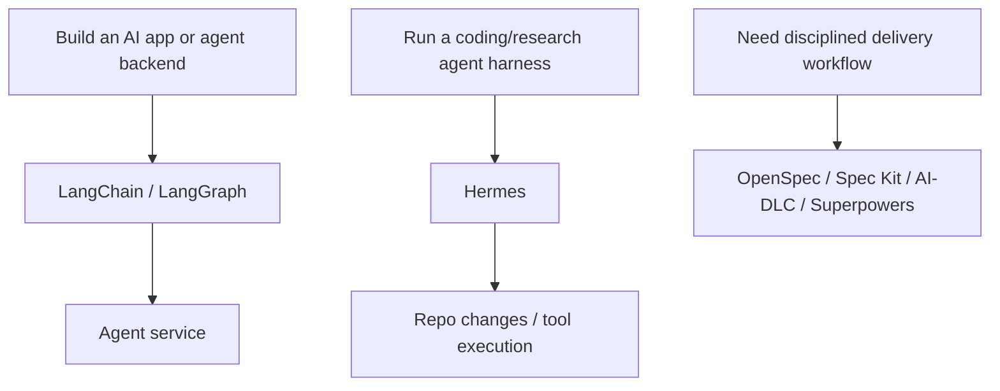
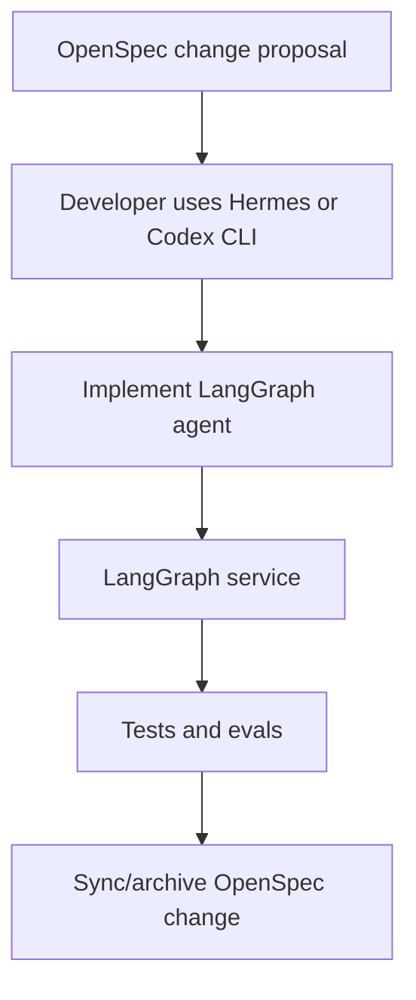

# LangChain/LangGraph vs Hermes

LangChain, LangGraph và Hermes có liên quan, nhưng không cùng vai trò.

| Tool | Tầng | Output chính |
|---|---|---|
| LangChain | Agent app framework | AI application hoặc agent logic |
| LangGraph | Stateful agent orchestration framework/runtime | Long-running graph-based agent service |
| Hermes | Agent harness/runtime CLI | Running/customizable agent với tools, memory, skills, subagents |

## Phân biệt đơn giản



## LangGraph vs Hermes

| Câu hỏi | LangGraph | Hermes |
|---|---|---|
| Là gì? | Framework/runtime để build stateful agent apps | Open-source agent CLI/runtime |
| Ai dùng? | Developers build agent backends | Developers/platform teams chạy/customize agents |
| Bạn viết gì? | Graph state, nodes, edges, tools | Runtime config, tools, skills, workflow instructions |
| Output | Agent service/application | Running agent harness |
| Phù hợp nhất | Long-running stateful app workflows | Hackable coding/research agent execution |

## Có kết hợp được không?

Có. Các combo thường gặp:

| Combo | Ý nghĩa |
|---|---|
| LangGraph + OpenSpec | OpenSpec govern changes cho LangGraph app |
| LangGraph + AI-DLC | AI-DLC govern high-risk agent app delivery |
| Hermes + LangGraph | Hermes là coding/runtime harness; LangGraph là app framework đang được build |
| LangChain + Superpowers | Implement LangChain app với TDD/review discipline |

## Đừng nhầm điều này

Đừng dùng LangGraph để thay delivery governance.

```text
LangGraph orchestrates runtime behavior.
AI-DLC governs delivery decisions.
OpenSpec/Spec Kit manage specs.
Superpowers enforces coding discipline.
Hermes runs/customizes agent execution.
```

## Stack ví dụ



