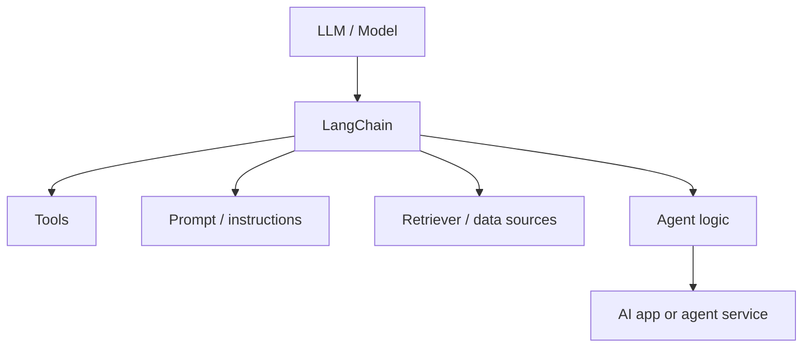
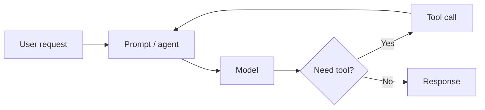
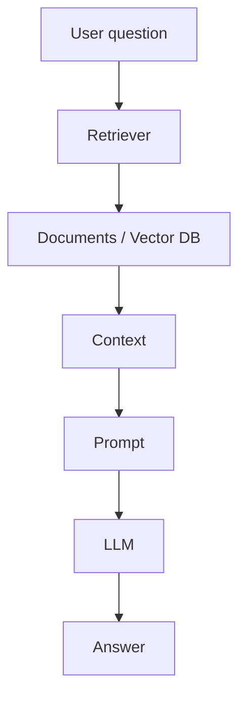
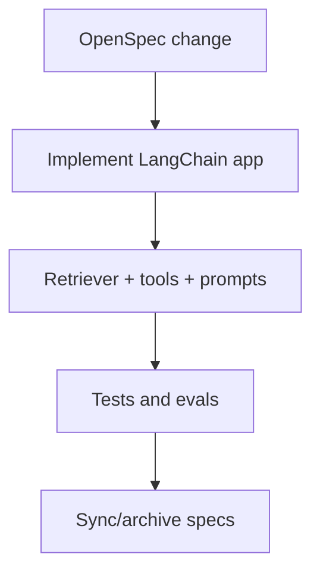

# LangChain

LangChain là open-source framework để xây LLM-powered applications và agents. Nó thuộc tầng **Agent App / Orchestration Framework**, không phải tầng software delivery workflow.

Nguồn chính: <https://docs.langchain.com/oss/python/langchain/overview>

## LangChain nằm ở đâu?

LangChain trả lời:

> Làm sao build AI app hoặc agent kết nối models, prompts, tools, data và application logic?

Nó không chủ yếu trả lời:

> AI coding agent nên quản lý specs, plans, approvals và delivery artifacts thế nào?

## Core concepts

| Concept | Vai trò |
|---|---|
| Model | LLM hoặc chat model app dùng |
| Prompt/instructions | Hướng dẫn behavior của model |
| Tools | Functions model/agent có thể gọi |
| Retriever | Component lấy external knowledge liên quan |
| Agent | Model-driven loop quyết định trả lời hay gọi tools |
| Middleware | Custom control quanh agent behavior |
| Messages/state | Conversation và execution context |

## Simple agent flow

## RAG app flow

## Khi nào dùng LangChain?

Dùng LangChain khi:

- Bạn đang build AI application hoặc backend service.
- Cần tools, model calls, prompts, retrievers hoặc structured outputs.
- Muốn build agents gọi functions nhanh.
- Cần integrations với model providers, vector stores, tools, observability.
- Vấn đề là runtime behavior của app, không phải software delivery governance.

## Khi nào không dùng LangChain?

Không dùng LangChain để thay thế:

| Nhu cầu | Tầng phù hợp hơn |
|---|---|
| Spec-first software delivery | Spec Kit hoặc OpenSpec |
| Enterprise approval/audit lifecycle | AWS AI-DLC |
| Agent CLI/harness để code trong repo | Codex CLI, Claude Code, Hermes |
| TDD/review discipline | Superpowers |
| Multi-phase coding project memory | GSD |

## LangChain và workflow frameworks

LangChain có thể là app framework bên trong repo được govern bởi workflow khác.

Ví dụ:

Trong stack đó:

- OpenSpec sở hữu change artifacts.
- LangChain implement AI app behavior.
- Superpowers enforce TDD/review.
- CI/evals chứng minh correctness.

## Step-by-step: build RAG chatbot

1. Định nghĩa feature bằng OpenSpec hoặc Spec Kit.
2. Xác định knowledge sources.
3. Tạo retriever/vector store.
4. Viết prompt/instructions.
5. Tạo LangChain chain hoặc agent.
6. Thêm citations/source references.
7. Thêm tests/evals cho answer quality.
8. Thêm latency và cost monitoring.
9. Review và ship.

## Definition of done

AI app built với LangChain done khi:

1. Inputs/outputs rõ.
2. Tool permissions explicit.
3. Retrieval behavior được test.
4. Prompt behavior được evaluate.
5. Errors và fallbacks được xử lý.
6. Cost và latency được đo.
7. Observability tồn tại cho production.

