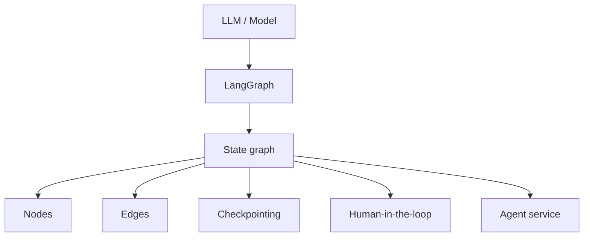
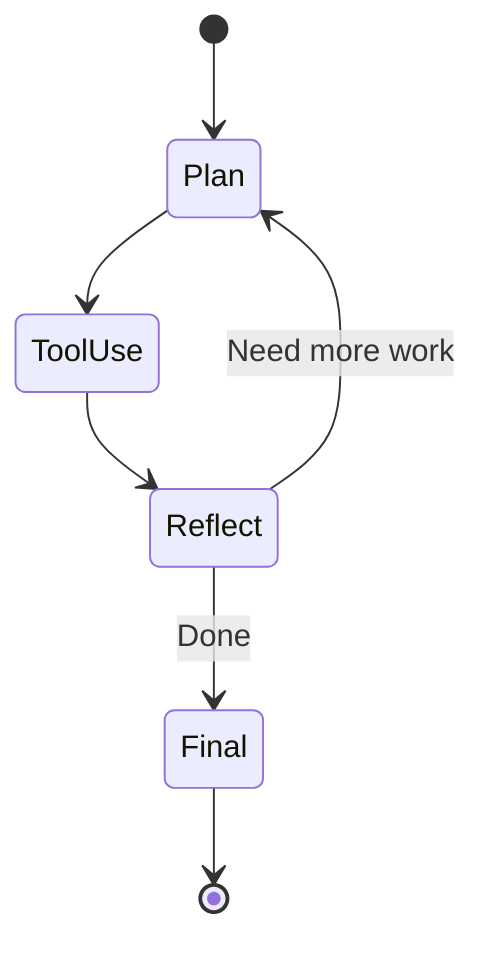
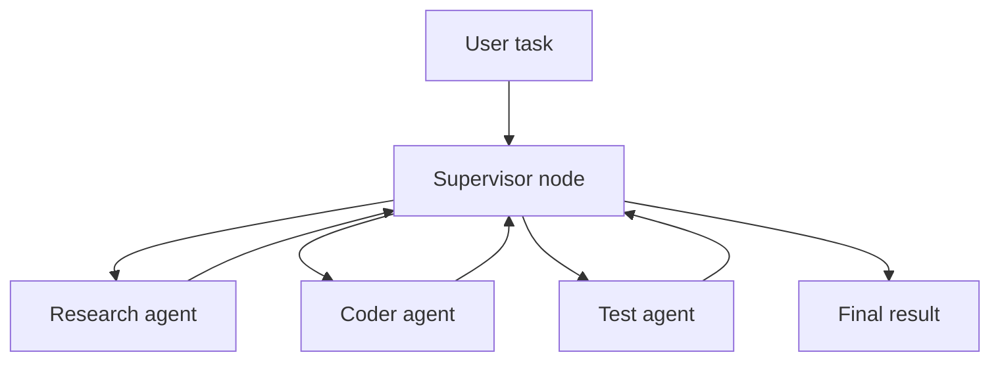

# LangGraph

LangGraph là low-level orchestration framework và runtime để build, manage, deploy long-running, stateful agents. Nó đặc biệt hữu ích khi agent workflow cần durable execution, state, memory, checkpoints, human-in-the-loop hoặc multi-agent orchestration.

Nguồn chính: <https://docs.langchain.com/oss/python/langgraph/overview>

## LangGraph nằm ở đâu?

LangGraph trả lời:

> Làm sao orchestrate stateful, long-running, controllable agent behavior?

Nó không chủ yếu trả lời:

> Software team nên approve specs, track delivery, review code thế nào?

## Core concepts

| Concept | Vai trò |
|---|---|
| State | Shared data đi qua graph |
| Node | Một đơn vị work, thường là model/tool/function step |
| Edge | Routing từ node này sang node khác |
| Checkpoint | Durable saved execution state |
| Human-in-the-loop | Human review hoặc input trong execution |
| Memory | Persistent context qua interactions |
| Multi-agent graph | Nhiều specialized agents được phối hợp bởi graph |

## Basic state graph

## Multi-agent orchestration

## Khi nào dùng LangGraph?

Dùng LangGraph khi:

- Simple chain không đủ.
- Cần stateful multi-step workflows.
- Agent execution có thể long-running.
- Cần human-in-the-loop review.
- Cần durable checkpoints.
- Cần multi-agent coordination.
- Cần runtime control và observability cho agent app.

## Khi nào không cần LangGraph?

Tránh LangGraph khi:

- simple prompt/tool call là đủ;
- basic LangChain agent là đủ;
- vấn đề là software delivery process, không phải app runtime orchestration;
- team không cần state, checkpoints hoặc graph control.

## LangGraph vs LangChain

| Dimension | LangChain | LangGraph |
|---|---|---|
| Phù hợp nhất | AI apps/agents đơn giản-vừa | Stateful, long-running, controllable agents |
| Abstraction | Higher-level app/agent building blocks | Lower-level graph orchestration |
| State | Có nhưng không phải mental model chính | Concept trung tâm |
| Human-in-loop | Có thể | Pattern first-class |
| Durable execution | Không phải trọng tâm chính | Điểm mạnh cốt lõi |
| Multi-agent | Có thể | Phù hợp hơn |

## Step-by-step: support agent

1. Định nghĩa support workflow states:
   - classify request;
   - retrieve customer context;
   - propose answer;
   - escalate if needed;
   - human approval for risky replies.
2. Model state schema.
3. Tạo nodes.
4. Thêm edges và routing logic.
5. Thêm checkpointing.
6. Thêm human-in-the-loop nodes.
7. Thêm tool permissions.
8. Thêm tests/evals per node và full graph.
9. Thêm monitoring và tracing.
10. Deploy như agent service.

## Definition of done

LangGraph agent production-ready khi:

1. State schema explicit.
2. Node responsibilities rõ.
3. Edges và fallback paths được test.
4. Checkpoints configured.
5. Human-in-the-loop gates defined.
6. Tool permissions safe.
7. Observability tồn tại.
8. Evals cover scenarios quan trọng.

