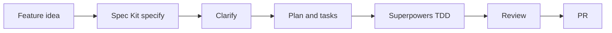
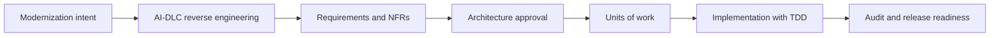
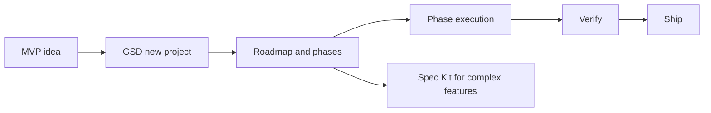

# Playbook triển khai

Cách an toàn nhất là chọn một primary workflow và dùng framework khác như supporting layer.

Để xem pattern kết hợp chi tiết, đọc [Kết hợp framework](./combinations). Để xem tình huống end-to-end cụ thể, đọc [Use case thực tế](./use-cases).

## Nguyên tắc 1: chỉ một source of truth

Mẫu xấu:

```text
specs/             # nói A
aidlc-docs/        # nói B
.planning/         # nói C
docs/superpowers/  # nói D
code               # implement E
```

Mẫu tốt:

```text
Primary source of truth: specs/
Supporting:
- Superpowers cho TDD và review
- GSD chỉ cho phase execution notes
- AI-DLC chỉ cho high-risk work
```

## Combo hợp lý

| Combo | Khi nào dùng | Chia trách nhiệm |
|---|---|---|
| Spec Kit + Superpowers | Feature cần rõ và code quality quan trọng | Spec Kit giữ spec/plan/tasks; Superpowers giữ TDD/review |
| AWS AI-DLC + Superpowers | Enterprise delivery cần implementation discipline | AI-DLC giữ gates/audit; Superpowers giữ coding loop |
| GSD + Superpowers | Startup ship nhanh nhưng không muốn ẩu | GSD giữ phases/subagents; Superpowers giữ tests/review |
| AWS AI-DLC + ý tưởng Spec Kit | Enterprise muốn spec quality tốt hơn | AI-DLC primary; mượn constitution/checklist thinking |
| Spec Kit + GSD | Feature lớn cần clarity và execution | Spec Kit giữ source spec; GSD execute phases |

## Rollout theo risk

| Phase | Hành động |
|---|---|
| Tuần 1 | Chọn một pilot feature và một primary framework |
| Tuần 2 | Chạy workflow end-to-end và ghi friction |
| Tuần 3 | Thêm quality gate: tests, review hoặc approval |
| Tuần 4 | Quyết định artifact nào authoritative |
| Tháng 2 | Scale sang team khác chỉ sau khi templates ổn định |

## Playbook A: product feature

Khuyến nghị: Spec Kit + Superpowers.



## Playbook B: enterprise modernization

Khuyến nghị: AWS AI-DLC primary, Superpowers làm implementation discipline.



## Playbook C: solo MVP

Khuyến nghị: GSD primary, chỉ dùng Spec Kit cho feature phức tạp.



## Definition of done

Dù chọn workflow nào, hãy định nghĩa done bằng evidence:

1. Requirement hoặc intent rõ.
2. Câu hỏi quan trọng đã trả lời.
3. Implementation được scope rõ.
4. Relevant tests pass.
5. Review issues resolved.
6. Source-of-truth artifact được update.
7. Release hoặc next-step state được ghi lại.

## Rollout 30/60/90 ngày

Dùng phần này khi đưa workflow vào team thật.

### 30 ngày đầu: chứng minh loop chạy được

Mục tiêu: một workflow chạy end-to-end.

1. Chọn một primary framework.
2. Chọn một feature vừa phải.
3. Định nghĩa source-of-truth location.
4. Bắt buộc test evidence.
5. Retrospective một lần sau khi ship.

Pilot đề xuất:

| Team context | Pilot |
|---|---|
| Product team có requirement mơ hồ | Spec Kit |
| Brownfield product team cần change specs nhẹ | OpenSpec |
| Enterprise architecture team | AWS AI-DLC |
| Solo builder hoặc startup team | GSD |
| Repo hiện hữu nhiều bugs/refactors | Superpowers |

### Ngày 31-60: chuẩn hóa artifact hữu ích

Mục tiêu: giữ thứ có ích, bỏ ceremony.

1. Tạo templates từ pilot artifacts tốt nhất.
2. Định nghĩa khi nào được skip workflow.
3. Thêm review checklists.
4. Gắn CI verification vào process.
5. Quyết định artifact map với issue tracker và PR thế nào.

### Ngày 61-90: scale cẩn thận

Mục tiêu: mở rộng mà không tạo process debt.

1. Train thêm engineer hoặc team khác.
2. Tạo examples của spec, plan, review và audit entry tốt.
3. Chỉ thêm automation ở nơi review đáng tin.
4. Theo dõi cycle time, rework rate, escaped defects và review effort.
5. Review lại source-of-truth decision.

## Trách nhiệm theo vai trò

| Role | Trách nhiệm |
|---|---|
| Product owner | User outcome, acceptance criteria, non-goals |
| Tech lead | Implementation plan, task slicing, code review |
| Solution architect | Architecture trade-offs, NFRs, integration boundaries |
| Security owner | Threat model, abuse cases, privacy, secrets, permissions |
| QA/quality engineer | Test strategy, regression risk, evidence |
| Operations owner | Deployment, monitoring, runbooks, incident feedback |

## Production readiness checklist

Dùng checklist này trước khi merge AI-generated work vào production systems:

| Area | Evidence cần có |
|---|---|
| Requirement | Source-of-truth artifact tồn tại và khớp implementation |
| Tests | Relevant automated tests pass |
| Review | Human review hoàn thành |
| Security | Auth, authorization, secrets, privacy và abuse cases đã check |
| Data | Migration, rollback, retention và compatibility đã review |
| Operations | Logs, metrics, alerts và rollback path rõ |
| Documentation | User-facing hoặc operator-facing docs được update khi cần |

## Metrics nên theo dõi

| Metric | Vì sao quan trọng |
|---|---|
| Rework rate | Cho biết specs/plans có đủ rõ không |
| Review findings per PR | Cho biết quality của agent output |
| Escaped defects | Cho biết verification quality |
| Cycle time | Cho biết workflow có quá nặng không |
| Artifact drift incidents | Cho biết source of truth có được giữ không |
| Human approval latency | Cho biết gates có thực tế không |
