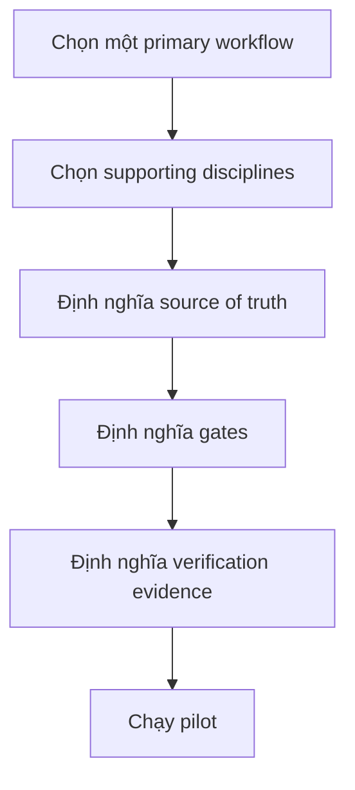
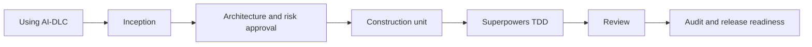
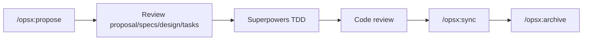
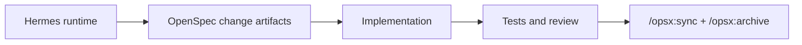
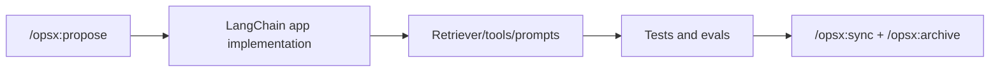

# Kết hợp framework

Các framework này có thể kết hợp, nhưng chỉ khi bạn phân quyền sở hữu rõ. Sai lầm lớn nhất là để mỗi framework tạo một source of truth riêng và cạnh tranh với nhau.

## Nguyên tắc kết hợp



## Các combo khuyến nghị

| Combo | Primary | Supporting layer | Phù hợp nhất | Rủi ro |
|---|---|---|---|---|
| LangChain + OpenSpec | OpenSpec | LangChain làm app framework | RAG/tool-agent feature có lightweight change specs | App evals có thể thiếu rõ |
| LangGraph + AI-DLC | AI-DLC | LangGraph làm app framework | Long-running agent app có enterprise risk | Dễ nhầm runtime orchestration với delivery governance |
| LangGraph + Hermes | Tùy bối cảnh | Hermes làm harness, LangGraph là app code | Internal agent platform | Layer ownership không rõ |
| Hermes + OpenSpec | OpenSpec | Hermes làm runtime | Custom/self-hosted agent execute lightweight change specs | Runtime complexity |
| Hermes + AI-DLC | AI-DLC | Hermes làm runtime | Internal agent platform có enterprise governance | Cần safety controls mạnh |
| Hermes + Superpowers | Superpowers | Hermes skills/runtime | Custom agent có TDD/review discipline | Skills phải được enforce |
| Spec Kit + Superpowers | Spec Kit | Superpowers | Product feature cần clarity và code quality | TDD có thể thấy chậm nếu team chưa quen |
| OpenSpec + Superpowers | OpenSpec | Superpowers | Brownfield changes nhẹ nhưng vẫn cần test discipline | Quá nhẹ nếu security/governance cao |
| OpenSpec + GSD | OpenSpec | GSD | Change specs iterative cộng multi-phase execution | Duplicate change state nếu boundary không rõ |
| AWS AI-DLC + Superpowers | AWS AI-DLC | Superpowers | Enterprise delivery cần implementation discipline | Quá nhiều gate nếu không risk-based |
| GSD + Superpowers | GSD | Superpowers | Startup/solo ship nhanh nhưng vẫn cần test/review | Parallel execution có thể vượt quá khả năng review |
| Spec Kit + GSD | Spec Kit | GSD | Feature lớn cần spec rõ và execution nhiều phase | `.planning/` có thể lặp lại specs |
| AWS AI-DLC + ý tưởng Spec Kit | AWS AI-DLC | Constitution/checklist concept | Enterprise muốn spec quality tốt hơn | Hai hệ docs có thể drift |
| AWS AI-DLC + GSD | AWS AI-DLC | GSD chỉ cho execution | Modernization lớn vừa cần governance vừa cần throughput | Complexity cao nhất |

## Combo 1: Spec Kit + Superpowers

Dùng như workflow mặc định cho product feature chất lượng cao.


### Ownership map

| Concern | Owner |
|---|---|
| Source of truth | Spec Kit `specs/` |
| Test discipline | Superpowers TDD |
| Review discipline | Superpowers code review |
| Project management | Issue tracker của bạn |
| CI evidence | CI system |

### Step-by-step

1. Cài và initialize Spec Kit. Tham khảo: [github/spec-kit](https://github.com/github/spec-kit).
2. Cài Superpowers vào agent. Tham khảo: [obra/superpowers](https://github.com/obra/superpowers).
3. Tạo hoặc update Spec Kit constitution.
4. Tạo feature spec.
5. Chạy clarification đến khi unknowns quan trọng được đóng.
6. Generate implementation plan và tasks.
7. Bắt đầu Superpowers TDD cho task đầu tiên.
8. Request code review sau implementation.
9. Fix review findings.
10. Update spec nếu behavior đổi.

### Prompt pattern

```text
Use Spec Kit to create the feature spec and tasks first.
After tasks are approved, use Superpowers test-driven development for implementation.
Do not edit code until the spec, plan, and first task are approved.
```

## Combo 2: AWS AI-DLC + Superpowers

Dùng cho enterprise hoặc high-risk work khi governance và implementation quality đều quan trọng.



### Ownership map

| Concern | Owner |
|---|---|
| Lifecycle state | AI-DLC `aidlc-docs/` |
| Approval gates | AI-DLC governance map |
| Tests | Superpowers TDD + CI |
| Code review | Superpowers review |
| Operations readiness | AI-DLC operations extension hoặc checklist nội bộ |

### Step-by-step

1. Cài AI-DLC rules cho agent. Tham khảo: [awslabs/aidlc-workflows](https://github.com/awslabs/aidlc-workflows).
2. Cài Superpowers. Tham khảo: [obra/superpowers](https://github.com/obra/superpowers).
3. Định nghĩa approvers cho product, architecture, security, operations.
4. Bắt đầu bằng `Using AI-DLC, ...`.
5. Để AI-DLC tạo questions và inception artifacts.
6. Chỉ approve inception khi business, architecture và risk rõ.
7. Với mỗi construction unit, yêu cầu dùng Superpowers TDD.
8. Bắt buộc resolve code review findings trước khi hoàn tất audit.
9. Ghi material decisions vào `audit.md`.
10. Hoàn tất production readiness trước release.

### Prompt pattern

```text
Using AI-DLC, run inception for this change and create units of work.
For each approved construction unit, use Superpowers TDD and request code review.
Record approval decisions and test evidence in the AI-DLC audit trail.
```

## Combo 3: GSD + Superpowers

Dùng khi tốc độ quan trọng nhưng không muốn agent-generated chaos.


### Ownership map

| Concern | Owner |
|---|---|
| Project memory | GSD `.planning/` |
| Phase execution | GSD |
| Test-first implementation | Superpowers |
| Review trước ship | Superpowers + GSD verifier |
| Final state | `.planning/STATE.md` và PR |

### Step-by-step

1. Cài GSD. Tham khảo: [open-gsd/gsd-core](https://github.com/open-gsd/gsd-core).
2. Cài Superpowers. Tham khảo: [obra/superpowers](https://github.com/obra/superpowers).
3. Chạy codebase mapping nếu repo đã tồn tại.
4. Tạo `.planning/` project memory.
5. Discuss và plan một phase hẹp.
6. Chỉ split task song song nếu thật sự độc lập.
7. Với mỗi behavior-changing task, dùng Superpowers TDD.
8. Chạy GSD verification.
9. Chạy Superpowers code review hoặc reviewer agent tương đương.
10. Ship và update `.planning/STATE.md`.

## Combo 4: Spec Kit + GSD

Dùng khi feature cần spec clarity mạnh và multi-phase execution.

| Boundary | Rule |
|---|---|
| Feature intent | Spec Kit sở hữu |
| Roadmap và phase execution | GSD sở hữu |
| Task details | Spec Kit tasks có thể import vào GSD phase plans |
| Behavior changes | Update Spec Kit spec trước |

### Step-by-step

1. Tạo Spec Kit spec, clarification, plan và tasks.
2. Chuyển approved tasks thành GSD phase plan.
3. Chạy GSD execution phase.
4. Verify bằng GSD.
5. Nếu implementation làm lộ requirement change, update Spec Kit spec trước khi tiếp tục.
6. Ship phase và update cả PR summary lẫn `.planning/STATE.md`.

## Combo 5: AWS AI-DLC + GSD

Combo này mạnh nhưng nặng. Chỉ dùng khi project vừa high-risk vừa execution-heavy.

Boundary khuyến nghị:

| Concern | Owner |
|---|---|
| Governance, approvals, audit | AI-DLC |
| Execution memory và phase orchestration | GSD |
| Risk gates | AI-DLC |
| Parallel execution | GSD, chỉ sau AI-DLC approval |

Rule:

> AI-DLC quyết định work có được approve không. GSD quyết định approved work được execute thế nào.

## Combo 6: OpenSpec + Superpowers

Dùng khi bạn muốn change specs nhẹ và implementation discipline mạnh.



### Step-by-step

1. Initialize OpenSpec. Tham khảo: [Fission-AI/OpenSpec](https://github.com/Fission-AI/OpenSpec).
2. Cài Superpowers. Tham khảo: [obra/superpowers](https://github.com/obra/superpowers).
3. Chạy `/opsx:explore` nếu idea còn mơ hồ.
4. Chạy `/opsx:propose <change>`.
5. Review `proposal.md`, `specs/`, `design.md`, `tasks.md`.
6. Dùng Superpowers TDD cho từng behavior-changing task.
7. Request code review.
8. Chạy `/opsx:sync` sau khi behavior verified.
9. Chạy `/opsx:archive`.

### Boundary rule

> OpenSpec sở hữu change artifacts. Superpowers sở hữu implementation discipline.

## Combo 7: OpenSpec + GSD

Dùng khi change cần spec control nhẹ nhưng execution kéo dài nhiều phase hoặc nhiều agents.

| Concern | Owner |
|---|---|
| Current/proposed behavior | OpenSpec |
| Multi-phase execution | GSD |
| Context memory | GSD `.planning/` |
| Change archive | OpenSpec |

Rule:

> OpenSpec định nghĩa change. GSD execute work. Đừng duplicate OpenSpec requirements trong `.planning/`; hãy link tới chúng.

## Combo xấu nên tránh

| Pattern | Vì sao fail |
|---|---|
| Spec Kit và AI-DLC cùng sở hữu requirements | Specs drift và reviewer mất trust |
| OpenSpec và Spec Kit cùng sở hữu cùng feature spec | Hai hệ SDD cạnh tranh |
| GSD yolo mode trên high-risk AI-DLC work | Execution vượt governance |
| Superpowers TDD nhưng không chạy test thật | Discipline trở thành diễn kịch |
| Cài cả bốn framework mà không có source-of-truth rule | Team tốn thời gian reconcile docs hơn là build |

## Runtime combinations với Hermes

Hermes thường nên được coi là execution harness, không phải workflow source of truth.

### Hermes + OpenSpec



Boundary:

| Concern | Owner |
|---|---|
| Runtime, tools, memory, subagents | Hermes |
| Current/proposed behavior | OpenSpec |
| Test discipline | CI hoặc Superpowers-like skills |

### Hermes + AI-DLC

Dùng khi muốn custom runtime nhưng vẫn cần enterprise governance.

| Concern | Owner |
|---|---|
| Agent runtime | Hermes |
| Lifecycle state và audit | AI-DLC |
| Human approvals | AI-DLC governance map |
| Tool safety | Platform team |

Rule:

> Hermes execute. AI-DLC govern.

### Hermes + Superpowers

Dùng khi build internal agent runtime nhưng vẫn bắt buộc TDD/review discipline.

| Concern | Owner |
|---|---|
| Runtime | Hermes |
| Skills | Superpowers-like methodology |
| Test evidence | Repo CI |
| Review evidence | PR review hoặc reviewer agent |

## App framework combinations

### LangChain + OpenSpec

Dùng cho RAG hoặc tool-agent features khi muốn lightweight change specs.



### LangGraph + AI-DLC

Dùng khi build high-risk stateful agent system.

| Concern | Owner |
|---|---|
| Runtime orchestration | LangGraph |
| Lifecycle governance | AI-DLC |
| TDD/review discipline | Superpowers hoặc CI/review policy |
| Production readiness | AI-DLC operations checklist |

### LangGraph + Hermes

Dùng khi Hermes là harness cho developer/platform, còn LangGraph là framework trong app đang được build.

Rule:

> LangGraph build agent app. Hermes chạy coding/research agent hoặc platform harness.

## Link setup tham khảo

| Framework | Link chính |
|---|---|
| GitHub Spec Kit | <https://github.com/github/spec-kit> |
| OpenSpec | <https://github.com/Fission-AI/OpenSpec> |
| AWS AI-DLC Workflows | <https://github.com/awslabs/aidlc-workflows> |
| GSD Core | <https://github.com/open-gsd/gsd-core> |
| Superpowers | <https://github.com/obra/superpowers> |
| Hermes Agent | <https://github.com/NousResearch/hermes-agent> |
