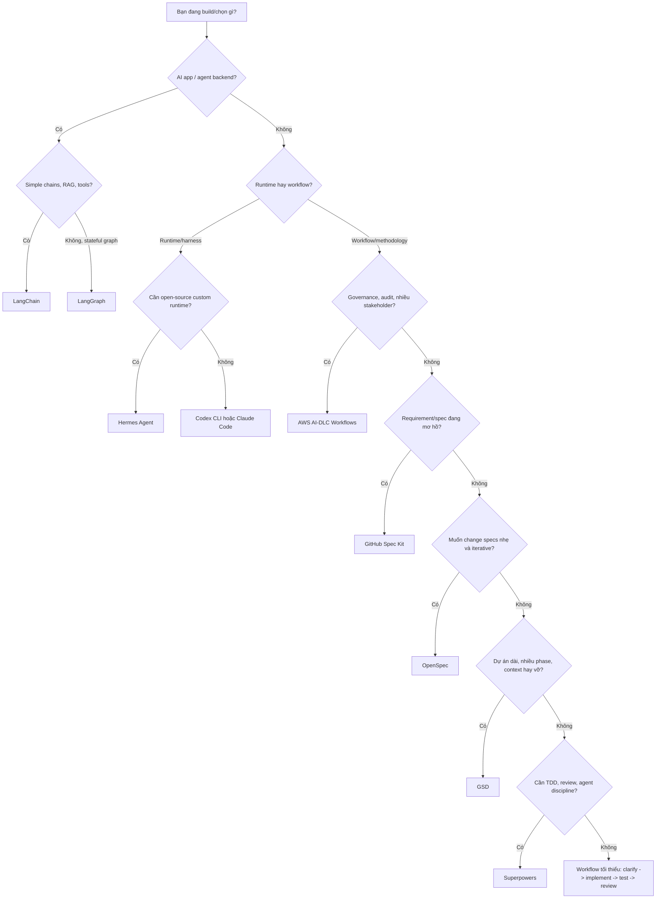

# Hướng dẫn chọn

Câu hỏi sai là "framework nào tốt nhất?". Câu hỏi đúng là "tầng nào của AI engineering đang hỏng trong bối cảnh của tôi?"

| Câu hỏi đầu tiên | Đi tới |
|---|---|
| Bạn đang build AI app? | [LangChain](../app-frameworks/langchain), [LangGraph](../app-frameworks/langgraph), [Data/RAG](../stack/data-rag), [Tools/MCP](../stack/tools-mcp) |
| Bạn đang cải thiện software delivery bằng agents? | Spec Kit, OpenSpec, AI-DLC, GSD, Superpowers |
| Bạn đang chạy/customize agent harness? | [Hermes](../harnesses/hermes), [Codex vs Claude vs Hermes](../harnesses/codex-claude-hermes) |
| Bạn đang chuẩn bị production? | [Evals và Observability](../stack/evals-observability), [Security và Governance](../stack/security-governance) |
| Bạn đang chọn model hoặc serving strategy? | [Tầng model và serving](../stack/model-serving) |

## Chọn theo nhu cầu

| Tôi cần... | Chọn |
|---|---|
| Context đầy đủ về AI engineering stack | [Bản đồ AI Engineering Stack](../stack/) |
| Model routing, local LLMs hoặc serving strategy | [Tầng model và serving](../stack/model-serving) |
| RAG data pipeline và retrieval quality | [Data, RAG và Retrieval](../stack/data-rag) |
| Dùng tools an toàn, MCP hoặc tool gateways | [Tools, MCP và Gateway](../stack/tools-mcp) |
| Evals, tracing và production feedback | [Evals và Observability](../stack/evals-observability) |
| Security, governance và risk tiers | [Security và Governance](../stack/security-governance) |
| Build AI app, RAG hoặc tool-calling agent | LangChain |
| Build stateful long-running agent backend | LangGraph |
| Coding agent CLI polished | Codex CLI hoặc Claude Code |
| Agent runtime open-source/customizable | Hermes Agent |
| Cách mô tả feature để AI build đúng | Spec Kit |
| Spec layer nhẹ cho brownfield changes iterative | OpenSpec |
| Lifecycle có approval và audit | AWS AI-DLC Workflows |
| Hệ thống cho nhiều phase qua nhiều session | GSD |
| Skill layer để agent không code ẩu | Superpowers |
| MVP nhanh nhưng vẫn có structure | GSD + Spec Kit nhẹ |
| Feature quan trọng có acceptance criteria | Spec Kit + Superpowers |
| Enterprise modernization | AWS AI-DLC primary |
| Refactor an toàn hơn | Superpowers + tests |
| Compliance hoặc security-sensitive delivery | AWS AI-DLC + security gates rõ |

## Chọn theo độ lớn công việc

| Độ lớn | Workflow đề xuất |
|---|---|
| 5-30 phút | Superpowers nhẹ hoặc prompt thủ công có test |
| Nửa ngày đến 2 ngày | Spec Kit hoặc Superpowers |
| Brownfield change iterative 1-5 ngày | OpenSpec |
| 1-3 tuần | Spec Kit + GSD, hoặc AWS AI-DLC nếu risk cao |
| 1-3 tháng | AWS AI-DLC hoặc GSD có governance bổ sung |
| Enterprise program | AWS AI-DLC primary; framework khác làm supporting layer |

## Chọn theo codebase

| Codebase | Best fit |
|---|---|
| Greenfield product app | Spec Kit nếu cần clarity; GSD nếu cần speed |
| Brownfield monolith | AWS AI-DLC cho modernization; Superpowers cho refactor nhỏ |
| Brownfield feature change risk thấp-vừa | OpenSpec |
| API/library | Spec Kit vì contract clarity quan trọng |
| Internal tool | GSD hoặc Spec Kit |
| Regulated system | AWS AI-DLC |
| Open-source project | Spec Kit hoặc Superpowers để dễ review PR |

## Red flags

| Dấu hiệu | Tránh điều gì |
|---|---|
| Muốn cài tất cả framework cùng lúc | Sẽ tạo nhiều source of truth |
| Không có người review generated docs | Đừng dùng governance flow nặng |
| CI yếu | Đừng cho automation sửa rộng |
| Feature security-sensitive | Đừng dùng workflow chỉ tối ưu tốc độ |
| Task rất nhỏ | Đừng tạo full lifecycle artifacts |
| Cần formal audit | Đừng chỉ dựa vào OpenSpec |
| Chỉ cần workflow process | Đừng thêm Hermes nếu runtime customization không quan trọng |
