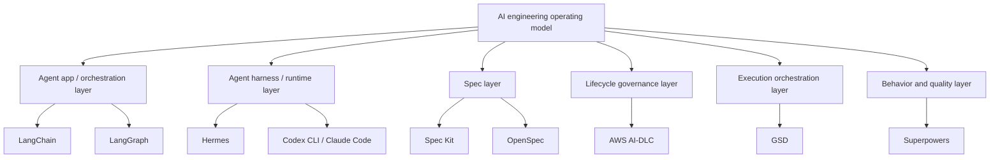

# Ma trận so sánh

Sau khi hiểu từng framework riêng, insight chính là chúng tối ưu các tầng khác nhau của AI-assisted software delivery.

## So sánh cross-layer

| Tầng | Tools | Source of truth | Output chính |
|---|---|---|---|
| Agent app/orchestration | LangChain, LangGraph | App code, state graph, prompts, tools | AI app hoặc agent service |
| Agent harness/runtime | Hermes, Codex CLI, Claude Code | Runtime/session state, instructions, memory | Agent execution trong repo/tools |
| Workflow/methodology | Spec Kit, OpenSpec, AI-DLC, GSD, Superpowers | Specs, changes, audit, `.planning/`, tests | Delivery process và evidence |
| Repo/CI/deployment | Git, tests, CI/CD | Code, tests, build logs, release artifacts | Verified software delivery |

## So sánh lõi

| Tiêu chí | Spec Kit | OpenSpec | AWS AI-DLC Workflows | GSD / Get Shit Done | Superpowers |
|---|---|---|---|---|---|
| Mục đích chính | SDD toolkit | Lightweight change-spec workflow | AI-native lifecycle governance | Context và execution orchestration | Agent discipline methodology |
| Vấn đề gốc | Feature spec mơ hồ | Proposed changes bị kẹt trong chat | Delivery thiếu kiểm soát | Context rot và throughput thấp | Agent code thiếu discipline |
| Artifact chính | Specs, plans, tasks | `openspec/specs`, `openspec/changes` | `aidlc-docs/`, state, audit | `.planning/` | Plans, tests, reviews, worktrees |
| Đơn vị làm việc | Feature | Change | Project, stage, unit of work | Milestone, phase, task | Task, behavior, branch |
| Người dùng chính | Product + engineering | Solo/small team và brownfield product team | Enterprise delivery team | Builder/team tối ưu shipping | Developer nâng chất lượng AI code |

## Coverage theo lifecycle

| Activity | Spec Kit | OpenSpec | AWS AI-DLC | GSD | Superpowers |
|---|---|---|---|---|---|
| Requirement clarification | Rất mạnh | Mạnh | Rất mạnh | Trung bình-mạnh | Mạnh với brainstorming |
| Architecture design | Mạnh trong plan | Trung bình-mạnh qua `design.md` | Rất mạnh | Trung bình | Mạnh khi dùng design skill |
| NFR | Qua spec/constitution | Cần template/gate rõ | Rất mạnh | Cần bổ sung | Cần explicit design |
| Infrastructure | Có trong plan nếu yêu cầu | Không phải trọng tâm | Mạnh | Không phải trọng tâm | Không phải trọng tâm |
| Task decomposition | Mạnh | Mạnh qua `tasks.md` | Mạnh | Rất mạnh | Mạnh |
| Parallel execution | Không phải trọng tâm | Change isolation có ích nhưng không phải trọng tâm | Không phải trọng tâm | Rất mạnh | Có thể qua subagents |
| TDD | Có thể cấu hình | Có thể cấu hình | Có thể cấu hình | Tùy quality agents | Rất mạnh |
| Audit trail | Trung bình | Trung bình qua change archive | Rất mạnh | Trung bình | Thấp-trung bình |
| Operations | Không phải trọng tâm | Không phải trọng tâm | Có một phần, nên mở rộng | Không phải trọng tâm | Không phải trọng tâm |

## Human control

| Control point | Spec Kit | OpenSpec | AWS AI-DLC | GSD | Superpowers |
|---|---|---|---|---|---|
| Approve requirements | Có | Review proposal/specs trước apply | Rất rõ | Có thể | Qua design |
| Approve architecture | Trong plan | Trong `design.md` | Rất rõ | Có thể | Trước implementation |
| Approve từng stage | Giới hạn | Fluid, action-based | Mạnh nhất | Theo phase | Theo task/branch |
| Agent autonomy | Trung bình | Trung bình | Thấp-trung bình | Cao | Trung bình |
| Rủi ro nếu human lơ là | Spec sai -> code sai | Changes sync mà không review thật | Governance hình thức | Quá nhiều diff không review | Skill bị bỏ qua hoặc test yếu |

## Scoring matrix

Thang điểm tương đối 1-5.

| Tiêu chí | Spec Kit | OpenSpec | AWS AI-DLC | GSD | Superpowers |
|---|---:|---:|---:|---:|---:|
| Requirement clarity | 5 | 4 | 4 | 3 | 4 |
| Lifecycle governance | 3 | 2 | 5 | 3 | 2 |
| Auditability | 3 | 3 | 5 | 3 | 2 |
| Context management | 4 | 4 | 4 | 5 | 3 |
| Execution throughput | 3 | 4 | 3 | 5 | 3 |
| TDD discipline | 3 | 2 | 3 | 3 | 5 |
| Enterprise readiness | 4 | 3 | 5 | 3 | 3 |
| Solo builder fit | 4 | 5 | 2 | 5 | 5 |
| Risk of over-process | 3 | 2 | 5 | 4 | 3 |
| Risk of over-automation | 2 | 3 | 2 | 5 | 3 |

## So sánh từng cặp

| Cặp | Kết luận ngắn |
|---|---|
| Spec Kit vs AI-DLC | Spec Kit sâu về SDD; AI-DLC rộng về lifecycle governance |
| Spec Kit vs OpenSpec | Spec Kit structured hơn; OpenSpec nhẹ và fluid hơn |
| OpenSpec vs AI-DLC | OpenSpec quản change specs; AI-DLC quản lifecycle accountability |
| OpenSpec vs GSD | OpenSpec isolate proposed changes; GSD orchestrate execution qua phases/agents |
| OpenSpec vs Superpowers | OpenSpec quản artifacts; Superpowers quản engineering behavior |
| Spec Kit vs GSD | Spec Kit giúp định nghĩa đúng thứ cần build; GSD giúp đẩy nhiều task qua delivery |
| Spec Kit vs Superpowers | Spec Kit quản spec artifacts; Superpowers quản engineering behavior |
| AI-DLC vs GSD | AI-DLC kiểm soát risk; GSD tăng throughput |
| AI-DLC vs Superpowers | AI-DLC governance delivery; Superpowers nâng discipline implementation |
| GSD vs Superpowers | GSD tổ chức nhiều task; Superpowers làm từng task sạch hơn |
