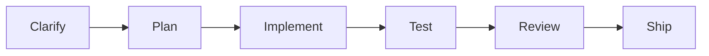
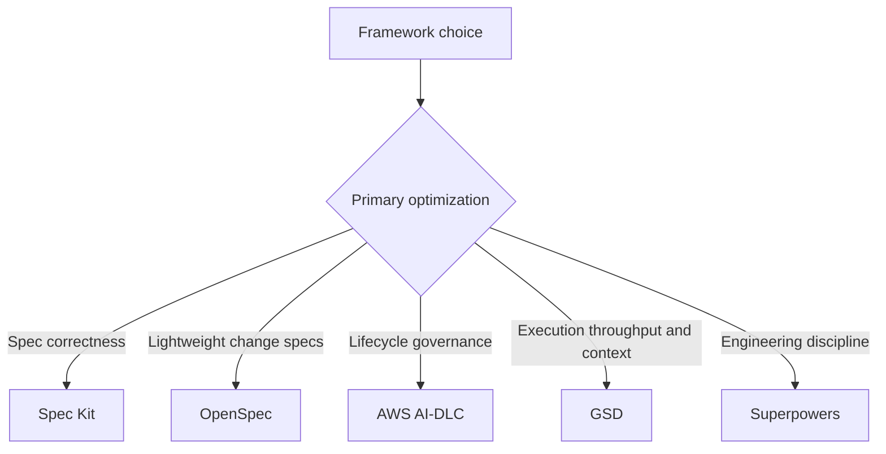
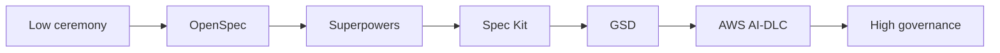
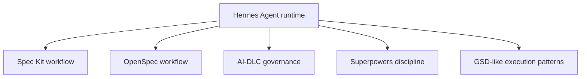
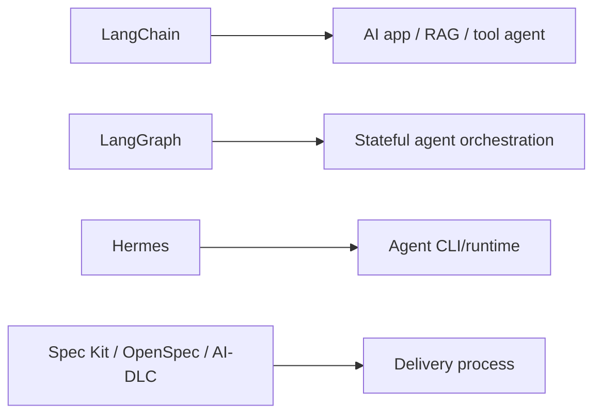

# Cùng flow, khác mục đích

Nhiều AI workflow framework nhìn rất giống nhau vì mọi quy trình phát triển phần mềm nghiêm túc đều có backbone gần giống:



Sự giống nhau này là thật. Khác biệt nằm ở **framework đó xem vấn đề chính là gì** và **artifact nào được coi là authoritative**.

## Điểm gây mơ hồ

Khi người dùng thấy framework nào cũng có:

```text
plan -> implement -> review
```

họ dễ nghĩ các framework thay thế cho nhau.

Không đúng.

Flow chung chỉ là bộ xương. Điểm khác biệt là operating model.

| Câu hỏi | Vì sao quan trọng |
|---|---|
| Source of truth là gì? | Quyết định agent phải tuân theo cái gì |
| Framework tối ưu để chống failure nào? | Quyết định khi nào nó hữu ích |
| Ai approve decisions? | Quyết định governance model |
| Context được giữ ở đâu? | Quyết định độ bền với dự án dài |
| Correctness được chứng minh thế nào? | Quyết định verification strength |
| Ceremony nhiều hay ít? | Quyết định fit với team |

## Cùng động từ, khác quyền sở hữu

`Plan`, `implement` và `review` cũng xuất hiện bên ngoài workflow frameworks. Harness có thể plan file edits, app framework có thể plan tool path, eval loop review outputs, còn governance workflow review evidence.

| Layer | `plan` nghĩa là gì | `review` nghĩa là gì |
|---|---|---|
| Workflow/methodology | plan delivery artifacts và task order | review specs, plans, code evidence, approvals |
| Agent harness/runtime | plan terminal commands, file edits, tool calls | inspect diffs, command output, tests |
| Agent app framework | plan runtime path qua chains, tools hoặc graph nodes | evaluate output, state transitions, tool trajectory |
| Evals/observability | plan test coverage và datasets | so sánh traces, scores, regressions |
| Security/governance | plan risk controls và approval boundaries | approve evidence và audit trail |

Đây là lý do [Bản đồ AI Engineering Stack](../stack/) quan trọng. Cùng một động từ nhưng artifact và accountability khác nhau ở mỗi layer.

## Cùng động từ, khác ý nghĩa

| Động từ | Spec Kit | OpenSpec | AWS AI-DLC | GSD | Superpowers |
|---|---|---|---|---|---|
| Plan | Biến spec thành implementation plan | Tạo/chỉnh change artifacts | Gate lifecycle decisions và construction plans | Chuẩn bị executable phase plan | Viết detailed implementation plan |
| Implement | Build tasks từ spec | Apply change tasks | Execute approved construction units | Dispatch tasks, thường qua subagents | Implement test-first |
| Review | Check consistency giữa spec/plan/tasks | Review change artifacts trước sync/archive | Human approval và audit | Verify phase output | Code review và TDD evidence |
| Ship | Hoàn thành feature theo spec | Sync/archive change vào current specs | Update state/audit và release readiness | Ship phase/PR/milestone | Finish branch |

Động từ giống nhau. Contract phía sau khác nhau.

## Mỗi framework thật sự tối ưu điều gì?



| Framework | Primary optimization | Mental model tốt nhất |
|---|---|---|
| Spec Kit | Độ đúng của feature specification | Spec compiler |
| OpenSpec | Lightweight iterative change control | Change proposal và delta-spec workspace |
| AWS AI-DLC | Governed AI delivery lifecycle | Delivery governance cockpit |
| GSD | Multi-session, multi-agent execution | Agent delivery factory |
| Superpowers | Test-first engineering behavior | Engineering discipline layer |

## Khác nhau ở source of truth

| Framework | Source of truth |
|---|---|
| Spec Kit | Feature specs, plans và tasks |
| OpenSpec | `openspec/specs/` cho current behavior; `openspec/changes/` cho proposed behavior |
| AWS AI-DLC | `aidlc-docs/`, state, audit, lifecycle artifacts |
| GSD | `.planning/` project memory và phase state |
| Superpowers | Approved plan, tests, review findings, branch state |

Đây là khác biệt quan trọng nhất. Biết source of truth là biết framework đó suy nghĩ thế nào.

## Khác nhau ở failure mode

| Framework | Nó chống... | Nhưng có thể fail vì... |
|---|---|---|
| Spec Kit | Build sai feature do requirement mơ hồ | Spec nghe hay nhưng sai domain |
| OpenSpec | Mất dấu proposed changes trong chat history | Quá nhẹ cho governance high-risk |
| AWS AI-DLC | AI delivery thiếu accountability | Thành paperwork nếu approval hình thức |
| GSD | Context collapse và execution chậm | Automate quá nhiều trước khi review kịp |
| Superpowers | Agent code trước, thiếu test/review | Thành nghi thức nếu test yếu hoặc bị bỏ |

## Spectrum ceremony



Đây không phải ranking chất lượng. Đây là ranking về ceremony/governance. Ít ceremony tốt cho tốc độ. Nhiều governance cần thiết khi rủi ro cao.

## Khi hai framework nhìn giống nhau, hãy hỏi

1. Framework này sở hữu requirements, execution, governance hay behavior?
2. Nó lưu memory ở đâu?
3. Khi code và spec mâu thuẫn, nó làm gì?
4. Nó tối ưu clarity, speed, control hay quality?
5. Nó giả định một agent, nhiều agents hay human review boards?
6. Có thể skip step an toàn với low-risk work không?
7. Evidence nào chứng minh "done"?

## Bảng phân biệt nhanh

| Người dùng nói... | Framework phù hợp |
|---|---|
| "Tôi cần AI hiểu đúng feature trước khi code." | Spec Kit |
| "Tôi muốn spec nhẹ, hợp codebase hiện có và iteration linh hoạt." | OpenSpec |
| "Tôi cần approvals, audit, NFR và human accountability." | AWS AI-DLC |
| "Tôi cần AI làm việc qua nhiều session và parallel tasks." | GSD |
| "Tôi cần agent bớt code ẩu, có tests/review." | Superpowers |

## Một câu chốt

> Framework nào cũng có planning, implementation và review vì software delivery tốt đều cần các bước đó. Chúng khác nhau ở thứ được coi là authoritative: Spec Kit coi feature specs là authoritative, OpenSpec coi current specs và proposed changes là authoritative, AI-DLC coi lifecycle approvals là authoritative, GSD coi project memory và phase execution là authoritative, còn Superpowers coi engineering discipline và test evidence là authoritative.

## Hermes nằm ở đâu?

Hermes lại khác một tầng nữa: nó không chủ yếu là một workflow plan/implement/review. Nó là agent harness/runtime có thể execute các workflow đó.



Trong đa số trường hợp, không nên hỏi "Hermes vs Spec Kit". Câu đúng hơn là:

```text
Hermes có nên là runtime để chạy Spec Kit/OpenSpec/AI-DLC/Superpowers không?
```

| Câu hỏi | Câu trả lời |
|---|---|
| Hermes có định nghĩa source-of-truth artifact model như OpenSpec không? | Không phải trọng tâm |
| Hermes có định nghĩa enterprise lifecycle governance như AI-DLC không? | Không |
| Hermes có định nghĩa TDD/review discipline như Superpowers không? | Không tự thân |
| Hermes có cung cấp tools, memory, skills, subagents, runtime control không? | Có |

Nếu workflow frameworks là quy trình vận hành, Hermes là cỗ máy agent có thể chạy quy trình đó.

## LangChain và LangGraph nằm ở đâu?

LangChain và LangGraph khác cả workflow frameworks lẫn coding agent CLIs. Chúng dùng để build AI applications hoặc agent systems.



| Tool | Chủ yếu định nghĩa |
|---|---|
| LangChain | App-level model/tool/retriever/agent composition |
| LangGraph | Stateful graph orchestration cho agent apps |
| Hermes | Runtime/harness để chạy agent |
| Spec Kit/OpenSpec/AI-DLC | Delivery workflow và artifacts |

Đừng dùng LangGraph để thay AI-DLC. LangGraph orchestrate runtime behavior; AI-DLC govern delivery decisions.
