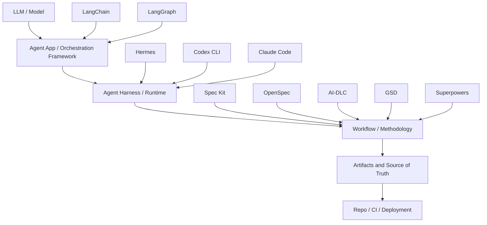
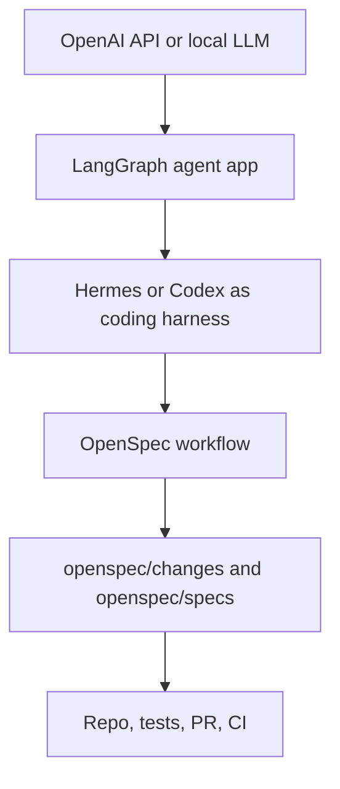

# Agent Harness vs Workflow Framework

Nhầm lẫn phổ biến nhất trong AI engineering là trộn lẫn **agent chạy ở đâu** với **agent nên làm việc theo quy trình nào**.

Để có ngữ cảnh kiến trúc lớn hơn, hãy đọc [Bản đồ AI Engineering Stack](../stack/) trước. Harness vs workflow chỉ là một lát cắt trong toàn bộ stack.



## Các tầng

| Tầng | Ví dụ | Trả lời câu hỏi |
|---|---|---|
| Model | GPT, Claude, Hermes models, local LLMs | Bộ máy suy luận là gì? |
| Agent app/orchestration framework | LangChain, LangGraph, LlamaIndex, Semantic Kernel | Làm sao build AI app hoặc stateful agent system? |
| Agent harness/runtime | Codex CLI, Claude Code, Hermes Agent, OpenCode, Cursor Agent | Agent chạy ở đâu và dùng tools thế nào? |
| Workflow/methodology | Spec Kit, OpenSpec, AI-DLC, GSD, Superpowers | Agent nên làm việc theo quy trình nào? |
| Artifact/source-of-truth | `specs/`, `openspec/`, `aidlc-docs/`, `.planning/`, tests | Agent phải tuân theo cái gì? |
| Repo/CI/deployment | Git, test runner, CI, GitHub Pages, production | Evidence và delivery diễn ra ở đâu? |

## Vì sao phân biệt này quan trọng?

Nếu nhầm tầng, bạn sẽ so sánh sai:

```text
Sai: Hermes vs OpenSpec
Đúng hơn: Hermes + OpenSpec

Sai: Codex CLI vs Spec Kit
Đúng hơn: Codex CLI chạy workflow Spec Kit
```

LangChain và LangGraph là app/orchestration frameworks. Hermes, Codex CLI, Claude Code là harnesses. Spec Kit, OpenSpec, AI-DLC, GSD, Superpowers là workflows hoặc methodologies.

```text
Sai: LangGraph vs AI-DLC
Đúng hơn: LangGraph build agent app; AI-DLC govern delivery của app đó.
```

## Harness làm gì?

Agent harness/runtime thường cung cấp:

- kết nối model/provider;
- load prompt và instruction;
- tool execution;
- đọc/ghi file;
- shell commands;
- memory;
- skills;
- subagents;
- approvals hoặc safety controls;
- session/task lifecycle.

## Workflow framework làm gì?

Workflow framework thường định nghĩa:

- artifact nào xuất hiện trước;
- source of truth là gì;
- khi nào phải hỏi;
- plan viết thế nào;
- task chia ra sao;
- khi nào implement;
- review thế nào;
- evidence nào chứng minh done;
- archive/update docs thế nào.

## Agent app framework làm gì?

Agent app/orchestration framework thường cung cấp:

- model abstraction;
- prompts và structured outputs;
- tool calling;
- retrievers và data integrations;
- state management;
- graph orchestration;
- checkpoints;
- human-in-the-loop;
- deployment/runtime hooks cho AI apps.

## Stack ví dụ



Harness có thể đổi mà không đổi workflow. Workflow có thể đổi mà không đổi model.

## Quy tắc thực dụng

> Chọn harness khi bạn cần execution capabilities. Chọn workflow khi bạn cần process discipline.

| Nhu cầu | Chọn |
|---|---|
| Build AI app, RAG hoặc tool-calling agent | LangChain |
| Build long-running stateful agent system | LangGraph |
| CLI coding experience tốt hơn | Codex CLI hoặc Claude Code |
| Runtime open-source/customizable | Hermes Agent |
| Spec-first feature workflow mạnh | Spec Kit |
| Change specs nhẹ | OpenSpec |
| Enterprise approval/audit lifecycle | AWS AI-DLC |
| Multi-agent phase execution | GSD |
| TDD và review discipline | Superpowers |
