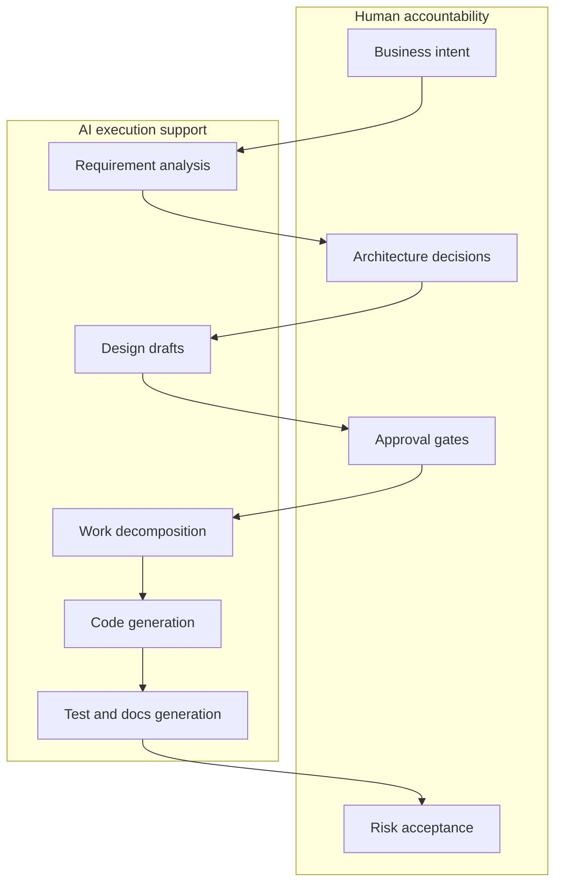

# AI-DLC

AI-DLC là **AI-Driven Development Life Cycle**: mô hình phát triển phần mềm trong đó AI không chỉ là autocomplete mà là cộng tác viên tham gia requirement, design, planning, coding, testing, documentation và feedback vận hành.

Ý quan trọng không phải là "để AI làm hết". Ý quan trọng là **AI hỗ trợ thực thi, con người vẫn chịu trách nhiệm quyết định**.

## Vì sao AI-DLC tồn tại?

Prompt trực tiếp cho agent có thể hiệu quả với task nhỏ, nhưng không đủ cho delivery nghiêm túc. Một tổ chức vẫn cần:

| Nhu cầu | Vì sao quan trọng |
|---|---|
| Ownership | Phải có người quyết định hệ thống nên làm gì và chấp nhận rủi ro nào |
| Traceability | Requirement, design, code, test và release phải liên kết được |
| Non-functional requirements | Security, privacy, reliability, cost, latency, scalability không tự xuất hiện nếu chỉ generate code |
| Brownfield understanding | Hệ thống cũ cần được reverse engineer trước khi sửa |
| Audit evidence | Dự án rủi ro cao cần ghi lại câu hỏi, quyết định, approval và verification |

AI-DLC biến các nhu cầu này thành workflow.

## AI-DLC khác SDLC truyền thống thế nào?

| Trục | SDLC truyền thống | AI-DLC |
|---|---|---|
| Tạo artifact | Chủ yếu do con người viết | AI tạo draft, con người review/approve |
| Tốc độ iteration | Chậm hơn do nhiều handoff | Nhanh hơn vì AI sinh draft nhanh |
| Rủi ro chính | Tài liệu lỗi thời | AI suy diễn sai intent hoặc automate sai hướng |
| Cơ chế kiểm soát | Meeting, ticket, review board | Rules, generated artifacts, approval gates, audit logs |
| Vai trò developer | Implement theo ticket | Điều phối, verify, refactor và guardrail AI |
| Vai trò architect | Thiết kế trực tiếp | Định nghĩa decision, constraint, review và quality gates |

## Ba pha lifecycle

| Pha | Câu hỏi chính | Output thường có | Human gate |
|---|---|---|---|
| Inception | What và why? | Requirements, user stories, application design, work units | Approve scope/design |
| Construction | Build như thế nào? | Functional design, NFR, infrastructure design, code plan, tests | Approve plan/code/test |
| Operations | Vận hành thế nào? | Deployment, monitoring, incident feedback, production readiness | Release/risk acceptance |

AWS AI-DLC Workflows hiện làm rõ Inception và Construction. Phần Operations nên được bổ sung thêm CI/CD, observability, rollback, SLO, runbook và incident feedback loop.

## Khi nào nên dùng AI-DLC?

Dùng AI-DLC khi:

- Có nhiều stakeholder cần review.
- Security, privacy, availability, performance hoặc cost là yêu cầu quan trọng.
- Hệ thống brownfield cần hiểu trước khi sửa.
- Architecture và infrastructure quan trọng như application code.
- Tổ chức cần auditability hoặc evidence review.
- Sai implementation có thể tạo rủi ro business, compliance hoặc operation.

Không nên dùng full AI-DLC cho:

- Task cực nhỏ như sửa text hoặc CSS.
- Prototype 1 ngày, ưu tiên học nhanh hơn traceability.
- Team không thật sự đọc và approve artifact.

## Failure modes thường gặp

| Failure mode | Dấu hiệu | Cách giảm rủi ro |
|---|---|---|
| Quá nhiều ceremony | Bug nhỏ cũng sinh nhiều docs | Phân loại task theo risk và dùng path nhẹ hơn |
| Approval hình thức | Con người approve mà không đọc | Dùng checklist ngắn và approver rõ |
| Artifact drift | Docs khác code thật | Đưa doc update vào definition of done |
| Quá tin AI design | Architecture nghe hợp lý nhưng thiếu constraint | Architect review trade-off, NFR và threat model |
| Operations yếu | Code xong nhưng release readiness không rõ | Thêm production readiness gate |

