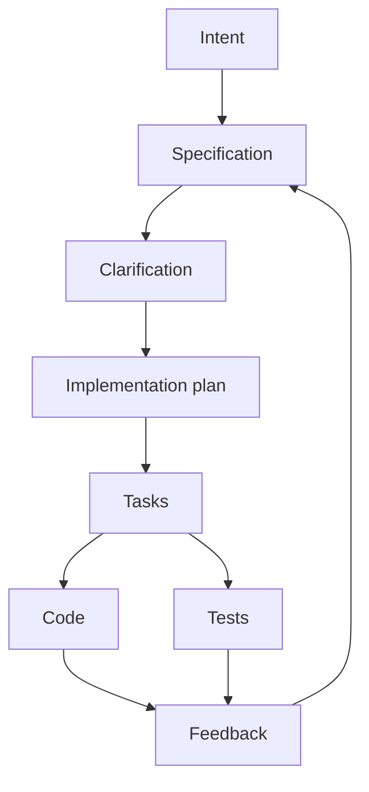
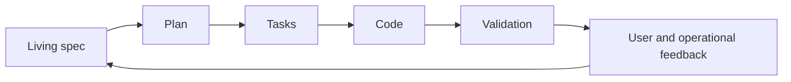

# Spec-Driven Development

Spec-Driven Development, hay SDD, là mô hình phát triển trong đó **specification là nguồn chân lý chính** và code là một implementation của specification đó.

Trong AI-assisted development, SDD quan trọng vì agent rất nhạy với ambiguity. Prompt mơ hồ tạo ra code nghe có vẻ hợp lý nhưng không đáng tin. Spec rõ tạo ra target ổn định cho agent.

## SDD thay đổi điều gì?

| Thói quen cũ | Thói quen SDD |
|---|---|
| Code là nguồn chân lý duy nhất | Spec giữ intent authoritative |
| Requirement viết một lần | Spec sống cùng implementation và feedback |
| Nhảy vào technical work nhanh | Làm rõ ambiguity trước implementation |
| Test viết sau code | Acceptance criteria và tests xuất phát từ spec |
| AI nhận prompt | AI nhận structured context |

## Một spec tốt cho AI cần gì?

1. Business goal.
2. User hoặc actor.
3. Main user journeys.
4. Acceptance criteria.
5. Non-goals.
6. Edge cases.
7. Data model hoặc API contracts.
8. Error handling.
9. Security/privacy constraints.
10. Performance/reliability constraints nếu có.
11. Open questions.
12. Test expectations.

Spec yếu thường dùng từ như "đẹp", "nhanh", "thông minh", "dễ dùng" nhưng không có tiêu chí đo được.

## SDD không phải waterfall

SDD không có nghĩa là đóng băng requirement từ đầu. SDD tốt phải iterative:

Điểm mấu chốt: khi intent thay đổi, spec phải thay đổi trước hoặc ít nhất thay đổi cùng code.

## Use case tốt

| Use case | Vì sao SDD hữu ích |
|---|---|
| Feature product mới | Làm rõ user value, acceptance và edge cases |
| API/contract design | Liên kết requirement với implementation và tests |
| Multi-agent development | Mọi agent dùng cùng source of truth |
| Refactor giữ nguyên behavior | Định nghĩa expected behavior trước khi đổi internals |
| Onboarding team | Giải thích vì sao code tồn tại, không chỉ code hoạt động ra sao |

## Khi nào SDD có thể lãng phí?

| Tình huống | Rủi ro |
|---|---|
| Sửa cực nhỏ | Process tốn hơn thay đổi |
| Research spike | Spec tạo cảm giác chắc chắn giả trước khi discovery |
| Team không update docs | Spec thành tài liệu chết |
| Product discovery chưa rõ | Nên discovery/experiment trước khi formalize |

