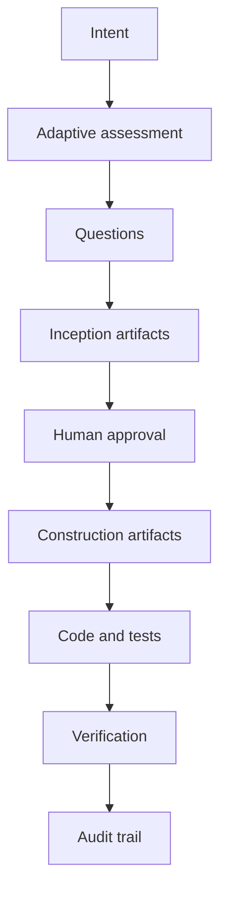
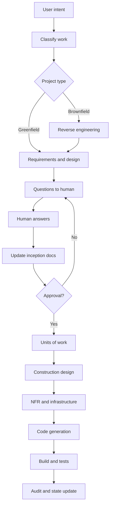
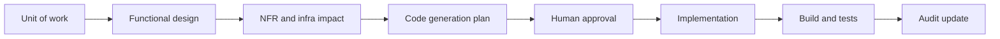

# AWS AI-DLC Workflows

AWS AI-DLC Workflows là bộ steering/rules files để áp dụng AI-Driven Development Life Cycle trong AI coding tools. Nó sinh documents, theo dõi state, hỏi human quyết định, và đưa công việc qua Inception, Construction và hướng tới Operations.

Nếu Spec Kit là spec compiler, AWS AI-DLC Workflows là **delivery governance cockpit**.



## Mental model

Workflow xem AI như development partner nhưng phải đi qua gates:

1. Hiểu project type và complexity.
2. Hỏi các câu còn thiếu.
3. Sinh Inception artifacts.
4. Chờ human review.
5. Chia scope thành units of work.
6. Sinh construction plans.
7. Implement.
8. Build/test.
9. Update state và audit records.

## Artifact model

AWS AI-DLC Workflows thường sinh nội dung dưới `aidlc-docs/`.

| Artifact | Vai trò |
|---|---|
| `aidlc-state.md` | Trạng thái workflow hiện tại |
| `audit.md` | Quyết định, approval và stage movement |
| Requirements | Business và functional requirements |
| User stories | Actor, goal và acceptance |
| Application design | Cấu trúc solution cấp cao |
| Reverse engineering docs | Hiểu brownfield codebase |
| Units of work | Chia scope thành phần executable |
| Functional design | Thiết kế chi tiết theo unit |
| NFR design | Security, performance, reliability, scalability |
| Infrastructure design | Cloud resources và deployment architecture |
| Code generation plan | Agent sẽ implement thế nào |
| Build/test instructions | Verify kết quả thế nào |

## Workflow chi tiết



## Điểm mạnh

1. **Human oversight được thiết kế vào workflow.** AI hỏi, chờ, update và yêu cầu review.
2. **Enterprise-ready hơn các framework còn lại.** Approval, traceability, NFR, infrastructure và audit là first-class concerns.
3. **Hỗ trợ brownfield rõ.** Reverse engineering giảm rủi ro sửa hệ thống agent chưa hiểu.
4. **Adaptive.** Không nên chạy cùng một mức ceremony cho mọi task; depth phải scale theo risk.
5. **Hợp với solution architecture.** Buộc nghĩ về application design, NFR và infrastructure trước implementation.

## Điểm yếu

| Điểm yếu | Hệ quả thực tế |
|---|---|
| Nặng với task nhỏ | Team có thể ghét framework nếu bug nhỏ cũng full ceremony |
| Operations cần bổ sung | Cần thêm CI/CD, observability, rollback, SLO, runbook |
| Review burden thật sự lớn | Generated docs chỉ hữu ích nếu human đọc |
| Có thể xung đột docs hiện có | Phải map authority giữa `aidlc-docs/`, ADRs, specs và issue tracker |
| Có thể thành AI bureaucracy | Nhiều tài liệu không tự động tạo quyết định tốt |

## Use case tốt nhất

| Use case | Vì sao AWS AI-DLC hợp |
|---|---|
| Enterprise application delivery | Cần gates, approval, NFR và architecture |
| Brownfield modernization | Cần reverse engineering trước thay đổi |
| Regulated hoặc high-risk systems | Cần audit trail và decision records |
| Multi-team delivery | Shared artifacts align product, engineering, security, ops |
| Cloud-heavy architecture | Infrastructure design là một phần workflow |
| Feature nhạy cảm security | Risk review phải xảy ra trước code |

## Ví dụ: forgot password

AWS AI-DLC mở rộng feature vượt khỏi "thêm endpoint":

| Góc nhìn | Câu hỏi được lộ ra |
|---|---|
| Business | Loại user nào được reset? Có tenant scope không? |
| Security | Tránh user enumeration thế nào? Token lifetime? |
| Privacy | Email reset chứa gì? Có lộ data nhạy cảm không? |
| Infrastructure | Email provider nào? Retry? Dead-letter? |
| Operations | Monitor abuse và delivery failure thế nào? |
| Audit | Ghi event nào để compliance/investigation? |

Giá trị là lifecycle control, không chỉ code generation.

## Adoption guidance

Phân loại công việc trước:

| Category | Path đề xuất |
|---|---|
| Trivial | Không dùng full AI-DLC; dùng normal code review |
| Small | Lightweight questions và test evidence |
| Medium | Inception + construction artifacts |
| High-risk | Full AI-DLC với architecture/security/ops approval rõ |

## Hướng dẫn triển khai cấp chuyên gia

Dùng AWS AI-DLC Workflows khi bạn cần nhiều hơn code generation: bạn cần delivery lifecycle có kiểm soát và human ownership rõ.

### Bước 1: Chọn kiểu tích hợp

Upstream hỗ trợ nhiều coding environments qua project rules hoặc steering files. Pattern chung:

1. Download hoặc copy AI-DLC rules.
2. Đặt core workflow rules vào nơi agent đọc project rules.
3. Đặt rule details cạnh đó để core workflow tham chiếu inception, construction, extension và operations guidance.
4. Kiểm tra agent có đọc được rules.
5. Bắt đầu conversation bằng `Using AI-DLC, ...`.

Với tool kiểu Cursor, project rule thường tốt hơn global rule vì workflow gắn với repo. Với agent generic, đặt rule vào `AGENTS.md` có thể là fallback đơn giản nhất.

### Bước 2: Định nghĩa governance map trước khi chạy

AI-DLC chỉ hiệu quả khi approval model rõ.

| Quyết định | Owner |
|---|---|
| Business scope | Product owner |
| Architecture direction | Solution architect hoặc tech lead |
| Security/privacy risk | Security owner |
| NFR acceptance | Architect + operations |
| Release readiness | Engineering lead + operations |
| Residual risk | Accountable business/technical owner |

Ghi ownership model này trong repo trước khi chạy workflow high-risk.

### Bước 3: Bắt đầu bằng activation prompt tốt

Prompt yếu:

```text
Using AI-DLC, build forgot password.
```

Prompt tốt hơn:

```text
Using AI-DLC, implement a forgot password flow for our multi-tenant SaaS app.
The feature must avoid user enumeration, support token expiry, rate-limit requests,
send email through our existing provider, and produce test evidence for API and UI flows.
Ask questions before creating the execution plan.
```

Mục tiêu không phải trả lời hết từ đầu. Mục tiêu là cho đủ context để AI-DLC hỏi đúng.

### Bước 4: Chạy Inception như design review

Inception nên tạo:

| Output | Acceptance check |
|---|---|
| Requirements | Có testable và scoped không? |
| User stories | Actor và outcome rõ không? |
| Application design | Có tôn trọng architecture hiện tại không? |
| Units of work | Có implement/review độc lập được không? |
| Risk assessment | Security, data, migration, operational risks đã lộ chưa? |

Đừng approve Inception nếu team chưa thể giải thích solution mà không đọc generated code.

### Bước 5: Chạy Construction theo unit of work

Cho mỗi unit:

1. Review functional design.
2. Review NFR impact.
3. Review infrastructure changes.
4. Review code generation plan.
5. Approve implementation scope.
6. Cho agent implement.
7. Yêu cầu build/test evidence.
8. Update audit và state.



### Bước 6: Mở rộng Operations có chủ đích

Default workflow cho hướng đi, nhưng production team nên thêm operations checklist:

| Operations concern | Evidence cần có |
|---|---|
| Deployment | CI/CD job, environment config, rollback path |
| Observability | Logs, metrics, traces, dashboards |
| Reliability | Health checks, retry behavior, failure modes |
| Security | Secrets, IAM, audit events, abuse monitoring |
| Support | Runbook, alert owner, incident triage steps |
| Cost | Expected resource usage và budget guardrails |

### Bước 7: Giữ audit trail hữu ích

Audit entry nên ghi quyết định, không ghi noise.

Audit tốt:

```text
Decision: Token lifetime set to 15 minutes.
Reason: Reduces account takeover window while preserving normal email delivery latency.
Approver: Security owner.
Evidence: API tests cover expired token and reused token.
```

Audit yếu:

```text
Approved plan.
```

## Playbook tối ưu

### Cho low-risk work

Dùng AI-DLC nhẹ:

- Questions.
- Small plan.
- Test evidence.
- Short approval.

Không cần full generated docs cho typo fix.

### Cho high-risk work

Bắt buộc:

- Inception approval.
- Architecture approval.
- Security review.
- NFR checklist.
- Operations checklist.
- Audit trail có named approvers.

### Cho brownfield modernization

Thêm reverse-engineering stage bắt buộc:

1. Map system boundaries.
2. Identify integration points.
3. Identify data ownership.
4. Identify test coverage.
5. Identify deployment constraints.
6. Sau đó mới generate units of work.

## Definition of done cho AI-DLC

Work done khi:

1. `aidlc-docs/` state khớp với work thực tế.
2. Inception artifacts được approve theo risk level.
3. Construction artifacts tồn tại cho từng unit of work.
4. Code và tests link được với units of work.
5. Security/NFR/infra concerns được xử lý hoặc accept rõ.
6. Build/test evidence được ghi lại.
7. Operations readiness hoàn thành cho production work.
8. Audit entries giải thích material decisions.
