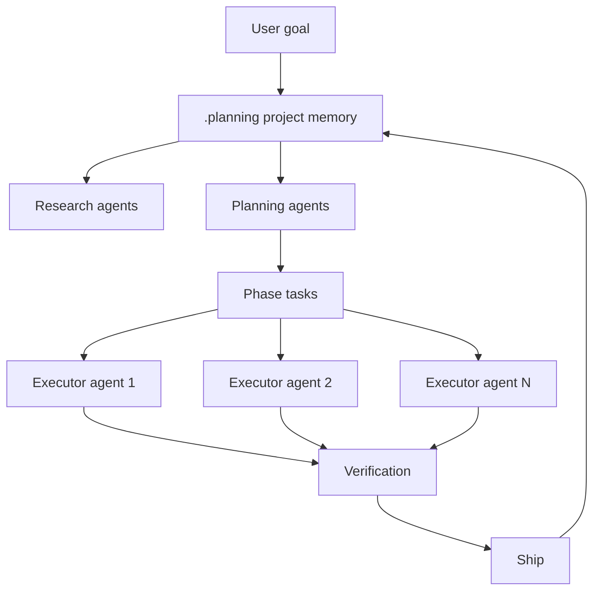
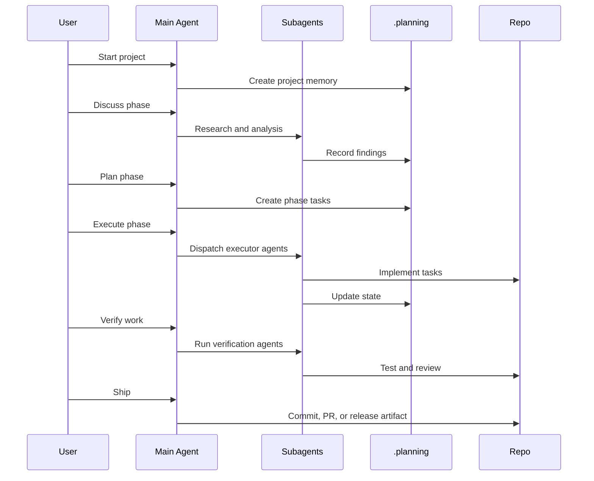
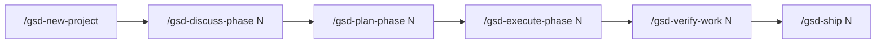

# GSD / Get Shit Done

GSD là framework context-engineering và multi-agent execution, tập trung vào shipping velocity trong giới hạn context window thực tế của AI agent.

Repo gốc nhiều người biết hiện trỏ sang maintained continuation `open-gsd/gsd-core`. Khi đánh giá hiện tại, nên xem repo maintained và architecture docs mới.

Nếu Spec Kit là spec compiler và AWS AI-DLC là governance cockpit, GSD là **delivery factory cho agents**.



## Mental model

GSD giả định rằng một chat dài không phải bộ não dự án đáng tin. Vì vậy:

- Project state nên nằm trong files.
- Main context nên nhẹ.
- Research, planning, execution và verification nên tách agent/role.
- Task độc lập có thể chạy song song.
- Ship phải update project memory và tạo commit/PR rõ.

## Artifact model

GSD thường dùng `.planning/` làm project memory bền vững.

| Artifact | Vai trò |
|---|---|
| `.planning/PROJECT.md` | Mục tiêu và context dự án |
| `.planning/REQUIREMENTS.md` | Requirements |
| `.planning/ROADMAP.md` | Milestones và phases |
| `.planning/STATE.md` | Trạng thái hiện tại |
| `.planning/config.json` | Mode, model profile, parallelism, quality agents |
| Phase artifacts | Discussion, plan, tasks và verification theo phase |

## Workflow



## Điểm mạnh

1. **Đánh trực diện vào context rot.** State được đưa ra `.planning/`, subagents có fresh context.
2. **Hỗ trợ dự án dài ngày.** Có thể tiếp tục qua nhiều session mà không dựa vào chat memory.
3. **Cho phép parallel execution.** Task độc lập có thể chia cho executor agents.
4. **Tách vai trò.** Researcher, planner, executor, checker, verifier là các vai trò khác nhau.
5. **Tối ưu cho shipping.** Workflow không dừng ở tài liệu mà đi tới verified output.

## Điểm yếu

| Điểm yếu | Hệ quả thực tế |
|---|---|
| Automation-heavy | Quá nhiều subagents có thể tạo diff rộng khó review |
| Không governance-first | Cần thêm process cho compliance, security, formal approval |
| Command surface lớn | User phải học workflow và config |
| Tooling/version risk | Cần theo dõi repo maintained và package security |
| Source-of-truth conflicts | `.planning/` có thể xung đột specs, ADRs hoặc `aidlc-docs/` |

## Use case tốt nhất

| Use case | Vì sao GSD hợp |
|---|---|
| Solo founder build app nhiều ngày/tuần | `.planning/` giữ memory và roadmap |
| Startup tối ưu tốc độ ship | Phase execution và parallel agents tăng throughput |
| Nhiều task độc lập | Subagents execute song song |
| Migration chia phase | Roadmap và state files theo dõi tiến độ |
| Long-running AI project | Ít phụ thuộc vào một cuộc hội thoại dài |

## Khi không nên dùng làm primary

Ưu tiên framework khác khi:

- Compliance/audit là vấn đề chính: dùng AWS AI-DLC.
- Specification correctness là vấn đề chính: dùng Spec Kit.
- Task nhỏ và cần quality discipline: dùng Superpowers.
- Team không review an toàn được parallel changes.

## Ví dụ: forgot password

GSD sẽ tổ chức thành một phase:

| Phase step | Output |
|---|---|
| Discuss | Flow, security constraints, email provider, success criteria |
| Plan | Backend, frontend, email, tests, verification tasks |
| Execute | Subagents implement model/API, UI, email template, tests |
| Verify | Review riêng cho security, tests và UX |
| Ship | Commit/PR và update `.planning/STATE.md` |

Giá trị không chỉ là spec. Giá trị là orchestration và context stability.

## Hướng dẫn triển khai cấp chuyên gia

Dùng GSD khi vấn đề delivery không chỉ là "build cái gì?" mà là "làm sao giữ AI productive qua nhiều session và nhiều task mà không sập context?"

### Bước 1: Quyết định GSD có nên là primary không

GSD nên là primary khi:

- Project có nhiều phase.
- Công việc kéo dài nhiều ngày hoặc nhiều tuần.
- Nhiều task độc lập.
- Bạn muốn subagents research, plan, execute, verify.
- Team review được generated changes an toàn.

Không nên để GSD primary nếu compliance approval, không phải execution throughput, là vấn đề trung tâm.

### Bước 2: Map code hiện có trước

Với brownfield projects, hãy map codebase trước khi tạo project context mới. Pattern được repo maintained khuyến nghị cho existing codebase:

```text
/gsd-map-codebase
/gsd-new-project
```

Mapping nên ghi lại:

| Khu vực | Cần extract |
|---|---|
| Stack | Frameworks, languages, package managers |
| Architecture | Modules, boundaries, data flow |
| Conventions | Naming, testing, linting, PR style |
| Risk areas | Auth, billing, migrations, shared components |
| Test commands | Fast tests, full tests, e2e tests |

### Bước 3: Tạo project memory

`/gsd-new-project` nên tạo hoặc update `.planning/` artifacts:

- Project goal.
- Requirements.
- Roadmap.
- Current state.
- Configuration.

Hãy coi `.planning/` là operational memory, không phải tài liệu marketing. Nó cần đủ ngắn để agent reload và đủ đúng để human tin.

### Bước 4: Chạy vòng lặp sáu lệnh



Loop này tốt nhất khi mỗi phase có một delivery outcome rõ. Tránh phase kiểu "improve the app"; hãy dùng "add password reset email request and token verification flow".

### Bước 5: Tune `.planning/config.json`

GSD maintained docs mô tả nhiều dial quan trọng. Dùng chúng có chủ đích.

| Dial | Conservative | Aggressive | Khi dùng |
|---|---|---|---|
| `mode` | `interactive` | `yolo` | Interactive cho production; yolo chỉ cho prototype low-risk |
| Model profile | `quality` | `budget` | Quality cho design/risk; budget cho task lặp |
| Research agent | On | Off | On khi domain/code lạ |
| Plan checker | On | Off | On trước parallel execution |
| Verifier | On | Off | Giữ on trừ khi tests cực trivial |
| Parallelization | Off | On | Chỉ on khi task thật sự độc lập |

### Bước 6: Chỉ parallelize khi boundary cứng

Task parallel tốt:

- Backend endpoint và frontend copy updates.
- Independent test suites.
- Documentation và isolated UI component.
- Migration script và read-only analysis.

Task parallel xấu:

- Hai agents sửa cùng component.
- Database schema và API contract khi chưa có shared plan.
- Auth changes trong shared middleware.
- Cross-cutting refactor chưa rõ ownership.

Rule:

> Nếu hai task có thể sửa cùng file hoặc phụ thuộc cùng design decision, đừng chạy song song.

### Bước 7: Verification là bắt buộc

`/gsd-verify-work` nên gồm:

1. Automated test commands.
2. Manual acceptance checklist.
3. Diff review.
4. Security/regression review cho risky areas.
5. Update `.planning/STATE.md`.

Bỏ verification là biến GSD thành công cụ tăng tốc technical debt.

## Playbook tối ưu

### Cho solo builders

Dùng GSD để giữ momentum:

- Phase ngắn.
- Interactive mode đến khi đủ trust.
- Parallelism cho docs/tests/UI polish, không phải core architecture.
- Ship sau mỗi verified phase.

### Cho teams

Thêm controls:

- Require PR review trước `/gsd-ship`.
- Giữ `.planning/ROADMAP.md` align với issue tracker.
- Giới hạn phase size để review được.
- Ghi test evidence trong PR descriptions.

### Cho enterprise

GSD vẫn hữu ích, nhưng cần governance:

- AI-DLC hoặc internal review cho high-risk phases.
- Security review cho auth/data/infra changes.
- Architecture approval trước parallel work.
- CI gating trước merge.

## Definition of done cho GSD

Phase done khi:

1. Phase decisions được ghi lại.
2. Plan đã được check.
3. Parallel tasks không conflict.
4. Verification pass.
5. Manual acceptance checklist complete.
6. `.planning/STATE.md` được update.
7. PR/commit scope dễ hiểu.
8. Next phase rõ.
