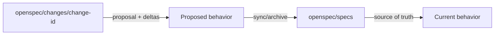
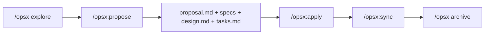

# OpenSpec

OpenSpec là một spec framework nhẹ cho AI coding assistants. Triết lý của nó là **fluid, iterative, easy, brownfield-first**. Nó thêm spec layer nhưng không ép bạn vào quy trình phase-gate cứng.

Cách định vị ngắn nhất:

> OpenSpec dành cho team muốn spec discipline nhưng không muốn ceremony nặng của lifecycle framework.

Link chính: [Fission-AI/OpenSpec](https://github.com/Fission-AI/OpenSpec)

## Mental model

OpenSpec tách current truth khỏi proposed changes:



| Khu vực | Ý nghĩa |
|---|---|
| `openspec/specs/` | Source of truth mô tả hệ thống hiện hoạt động thế nào |
| `openspec/changes/<change>/` | Proposed modification với artifacts và delta specs |
| `proposal.md` | Vì sao thay đổi tồn tại và thay đổi gì |
| `specs/` trong change | Requirements và scenarios cho behavior thay đổi |
| `design.md` | Technical approach |
| `tasks.md` | Implementation checklist |

## Vì sao OpenSpec tồn tại?

OpenSpec tồn tại vì nhiều team muốn lợi ích của SDD nhưng thấy process nặng quá rigid. Project nhấn mạnh:

| Nguyên tắc | Ý nghĩa thực tế |
|---|---|
| Fluid not rigid | Commands là actions, không phải phase locks |
| Iterative not waterfall | Artifact có thể đổi khi hiểu biết sâu hơn |
| Easy not complex | Init nhanh, customize sau |
| Brownfield-first | Thiết kế cho thay đổi behavior hiện có, không chỉ greenfield |

## Setup

OpenSpec yêu cầu Node.js 20.19.0 trở lên.

```bash
npm install -g @fission-ai/openspec@latest
cd your-project
openspec init
```

Sau đó bắt đầu trong AI coding assistant:

```text
/opsx:propose add-dark-mode
```

Docs tham khảo:

- Installation: <https://github.com/Fission-AI/OpenSpec/blob/main/docs/installation.md>
- Commands: <https://github.com/Fission-AI/OpenSpec/blob/main/docs/commands.md>
- Concepts: <https://github.com/Fission-AI/OpenSpec/blob/main/docs/concepts.md>
- Workflows: <https://github.com/Fission-AI/OpenSpec/blob/main/docs/workflows.md>

## Core workflow

OPSX core profile mặc định có:

| Command | Mục đích |
|---|---|
| `/opsx:propose` | Tạo change và planning artifacts |
| `/opsx:explore` | Explore idea trước khi commit vào change |
| `/opsx:apply` | Implement tasks từ change |
| `/opsx:sync` | Merge delta specs vào main specs |
| `/opsx:archive` | Archive completed change |



Expanded workflow có thể bật bằng:

```bash
openspec config profile
openspec update
```

Expanded commands gồm `/opsx:new`, `/opsx:continue`, `/opsx:ff`, `/opsx:verify`, `/opsx:bulk-archive`, `/opsx:onboard`.

## Điểm mạnh

1. **Ít ceremony hơn Spec Kit và AI-DLC.** Có structure nhưng không quá nhiều gate.
2. **Brownfield-friendly.** Change/delta model hợp với hệ thống có sẵn.
3. **Tool-flexible.** Hỗ trợ nhiều AI coding assistants qua generated instructions và slash commands.
4. **Fluid workflow.** Có thể quay lại proposal, design, specs, tasks khi học thêm.
5. **Change isolation rõ.** Mỗi change có folder riêng trước khi merge vào current specs.

## Điểm yếu

| Điểm yếu | Hệ quả thực tế |
|---|---|
| Governance yếu hơn AI-DLC | High-risk enterprise work cần approval/audit bổ sung |
| Ít opinionated hơn Spec Kit | Team phải tự quyết review strict đến đâu |
| Có thể quá nhẹ cho regulated work | Cần thêm security, NFR, operations gates |
| Cần artifact discipline | Nếu bỏ `/opsx:sync` hoặc archive, specs có thể drift |
| Ecosystem mới hơn | Cần verify supported tools và workflow profile cho team |

## Use case tốt nhất

| Use case | Vì sao OpenSpec hợp |
|---|---|
| Brownfield feature change | Proposed deltas được isolate trước khi thành source of truth |
| Solo/small-team AI coding | Setup nhẹ, ít ceremony |
| Iterative product work | Artifact có thể evolve khi học thêm |
| Team thấy SDD khác quá nặng | Giữ specs mà không phase gates cứng |
| Multi-tool AI environments | Dùng generated agent instructions |

## Khi không nên dùng làm primary

Chọn framework khác khi:

- Cần enterprise audit và approval: dùng AWS AI-DLC.
- Cần high-throughput multi-agent execution: dùng GSD.
- Cần TDD/review strict: kết hợp Superpowers.
- Cần organization-level SDD standards rất formal: Spec Kit có thể dễ chuẩn hóa hơn.

## OpenSpec vs Spec Kit

| Dimension | OpenSpec | Spec Kit |
|---|---|---|
| Philosophy | Fluid, iterative, lightweight | Structured SDD với phase progression rõ hơn |
| Setup | Node/npm CLI | Specify CLI, templates, integrations |
| Artifact shape | `openspec/specs` và `openspec/changes` | specs/plans/tasks theo templates |
| Change model | Change folders và delta specs | Feature specs và implementation plans |
| Best fit | Brownfield iterative changes | Feature-level spec-first delivery |
| Risk | Quá nhẹ nếu team cần strict gates | Quá nặng nếu team muốn iteration fluid |

## Step-by-step: feature change

Ví dụ: thêm customer export feature.

1. Cài và initialize OpenSpec.
2. Chạy:

```text
/opsx:explore customer export requirements
```

3. Khi scope rõ:

```text
/opsx:propose add-customer-export
```

4. Review generated artifacts:
   - `proposal.md`
   - change `specs/`
   - `design.md`
   - `tasks.md`
5. Sửa artifact thủ công nếu sai.
6. Chạy:

```text
/opsx:apply
```

7. Verify implementation thủ công hoặc dùng expanded `/opsx:verify`.
8. Chạy:

```text
/opsx:sync
/opsx:archive
```

9. Xác nhận `openspec/specs/` đã phản ánh current behavior.

## Definition of done

Change done khi:

1. Change folder giải thích vì sao thay đổi tồn tại.
2. Specs mô tả behavior rõ.
3. Design giải thích technical choices quan trọng.
4. Tasks hoàn tất.
5. Implementation có test evidence.
6. Delta specs được sync vào current specs.
7. Change được archive để traceability.

