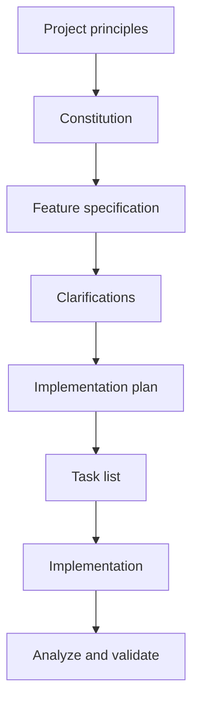
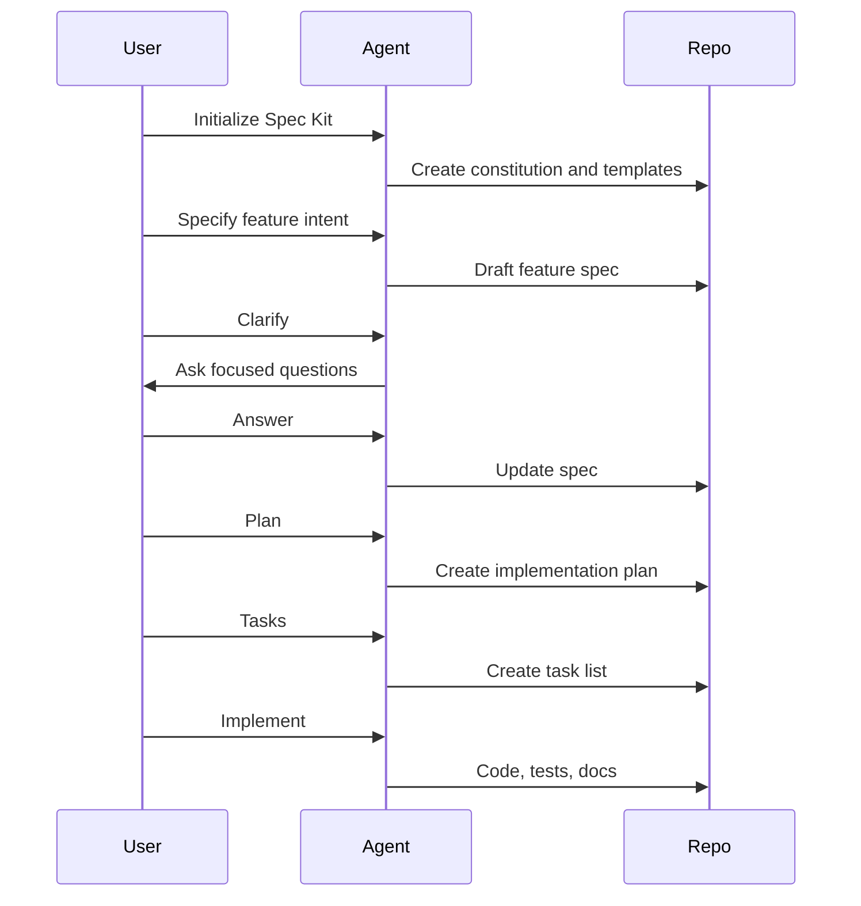
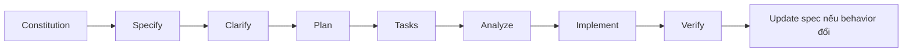

# GitHub Spec Kit

GitHub Spec Kit là toolkit open source để thực hành Spec-Driven Development với AI coding agents. Nó cung cấp CLI, templates và workflow kiểu slash-command để đi từ constitution đến specification, clarification, plan, tasks, analysis và implementation.

Hãy hiểu Spec Kit là **SDD workflow scaffold**, không phải app framework và cũng không phải enterprise governance system đầy đủ.



## Mental model

Spec Kit giống một "compiler" từ product intent sang executable work:

```text
Human intent
  -> /speckit.specify
Specification
  -> /speckit.clarify
Resolved ambiguity
  -> /speckit.plan
Technical plan
  -> /speckit.tasks
Executable work
  -> /speckit.implement
Code and tests
```

## Core artifacts

| Artifact | Vai trò | Vì sao quan trọng |
|---|---|---|
| Constitution | Nguyên tắc cấp project | Giữ stable rules về quality, testing, architecture, UX, performance |
| Feature spec | What và why | Ngăn agent nhảy vào implementation quá sớm |
| Clarification | Câu hỏi mở | Ép ambiguity lộ ra trước khi code |
| Plan | How | Kết nối spec với architecture và technical choices |
| Tasks | Work breakdown | Tạo đơn vị executable cho agent hoặc human |
| Analyze/checklist | Consistency check | Bắt gap trước implementation |

## Workflow chi tiết



## Điểm mạnh

1. **Giảm ambiguity ở requirement.** Phần lớn lỗi AI coding là lỗi hiểu intent, không phải lỗi syntax.
2. **Tách what/why khỏi how.** Tránh quyết định database, framework hoặc architecture quá sớm.
3. **Constitution tạo luật nền ổn định.** Không cần nhắc lại testing, accessibility, architecture boundary trong từng prompt.
4. **Artifact dễ review theo vai trò.** Product review spec, architect review plan, engineer review tasks.
5. **Hợp với multi-agent.** Shared spec đáng tin hơn chat history.

## Điểm yếu

| Điểm yếu | Hệ quả thực tế |
|---|---|
| Không tự biết spec có đúng domain không | Domain expert vẫn phải review |
| Spec viết hay có thể tạo tự tin giả | Tài liệu nghe đủ nhưng thiếu hidden constraints |
| Không phải full governance | Approval matrix, audit trail, security review, production readiness cần bổ sung |
| Có thể spec drift | Code đổi nhưng spec không đổi thì source of truth vỡ |
| Task nhỏ thấy nặng | Copy edit hoặc bug nhỏ không cần full SDD |

## Use case tốt nhất

| Use case | Vì sao Spec Kit hợp |
|---|---|
| Feature product mới | Làm rõ user journey và acceptance criteria |
| Greenfield MVP có scope rõ | Tạo nền spec/plan/tasks từ đầu |
| API design | Contract rõ trước khi code |
| Refactor giữ behavior | Định nghĩa expected behavior trước khi đổi internal |
| Team học AI workflow | Command flow rõ, có cấu trúc |

## Khi không nên dùng làm primary

Chọn framework khác khi:

- Enterprise approval/audit là vấn đề chính: ưu tiên AWS AI-DLC.
- Dự án dài nhiều phase là vấn đề chính: ưu tiên GSD.
- Vấn đề chính là agent coding thiếu discipline: ưu tiên Superpowers.
- Task quá nhỏ để dùng full spec-plan-task.

## Ví dụ: forgot password

Spec Kit sẽ ép lộ ra các câu hỏi quan trọng:

| Bước | Output |
|---|---|
| Constitution | Security rules: token expiration, no user enumeration, audit reset events |
| Specify | User có thể yêu cầu reset password qua email |
| Clarify | Token sống bao lâu? Rate limit? Email copy? Tenant boundary? |
| Plan | Endpoint, token model, email service, UI flow |
| Tasks | Backend model, API route, email integration, UI, tests |
| Implement | Code và verification |

Giá trị không chỉ là tài liệu. Giá trị là ngăn agent tự đưa ra assumption bảo mật và UX.

## Hướng dẫn triển khai cấp chuyên gia

Dùng phần này khi bạn muốn vận hành Spec Kit như workflow lặp lại trong team, không chỉ như một prompt helper.

### Bước 1: Chốt ranh giới source of truth

Trước khi cài gì, hãy quyết định Spec Kit sở hữu phần nào.

| Quyết định | Khuyến nghị |
|---|---|
| Feature intent | Do Spec Kit specs sở hữu |
| Architecture decisions | Plan tham chiếu, nhưng ADR dài hạn có thể nằm riêng |
| Implementation tasks | Do Spec Kit task artifacts sở hữu trước khi chuyển sang issue tracker |
| Sprint/project management | Do tracker của team sở hữu; Spec Kit feed dữ liệu vào |
| Test evidence | Do CI sở hữu, link ngược lại implementation summary |

Anti-pattern: Jira, README, PR description và Spec Kit specs cùng mô tả một requirement nhưng mỗi nơi một kiểu.

### Bước 2: Cài và initialize

Upstream khuyến nghị cài Specify CLI rồi initialize project với agent integration phù hợp.

```bash
uv tool install specify-cli --from git+https://github.com/github/spec-kit.git@vX.Y.Z
specify init my-project --integration copilot
cd my-project
```

Với repo có sẵn, initialize ngay trong repo và kiểm tra generated files trước khi commit. Commit đầu tiên chỉ nên chứa scaffolding và project principles.

### Bước 3: Viết constitution như engineering contract

Constitution không phải trang khẩu hiệu. Hãy coi nó là hợp đồng kỹ thuật ngắn gọn.

| Khu vực | Ví dụ rule |
|---|---|
| Testing | Behavior-changing tasks phải có automated tests trước khi xem là done |
| Architecture | Dependency mới cần justification rõ trong plan |
| UX | Flow user-facing phải có loading, empty, error, success states |
| Security | Auth, authorization và privacy assumptions phải rõ trong spec |
| Performance | Endpoint mới phải nêu expected latency hoặc giải thích vì sao không quan trọng |
| Accessibility | Interactive UI phải dùng được bằng keyboard và screen reader |

Tránh rule mơ hồ như "viết code tốt". Constitution phải review được.

### Bước 4: Chạy feature loop



Với feature có security, data, migration hoặc UX risk, hãy dùng clarification và analysis thật kỹ.

### Bước 5: Review đúng vai trò

| Artifact | Reviewer chính | Câu hỏi review |
|---|---|---|
| Spec | Product/domain owner | Đây có phải user outcome đúng không? |
| Clarifications | Product + engineering | Unknowns đã được trả lời hoặc defer có chủ ý chưa? |
| Plan | Tech lead/architect | Approach có đơn giản, compatible, maintainable không? |
| Tasks | Senior engineer | Task có executable và testable độc lập không? |
| Implementation | Engineer/reviewer | Code có đáp ứng spec và tests không? |

Spec Kit thất bại khi một người approve mọi tầng một cách hình thức.

### Bước 6: Biến tasks thành delivery units

Task tốt nên:

- Đủ nhỏ cho một PR hoặc một agent session.
- Có thứ tự dependency.
- Nêu file/module khi có thể.
- Đi kèm test hoặc verification.
- Link được với acceptance criteria.

Nếu task quá rộng, yêu cầu agent chia theo vertical slice: data, API, UI, tests, migration, docs.

### Bước 7: Chỉ dùng presets/extensions sau khi base flow ổn

Spec Kit hỗ trợ presets để customize templates và extensions để thêm workflow.

| Nhu cầu | Dùng |
|---|---|
| Enforce spec sections theo công ty | Preset |
| Thêm workflow command mới | Extension |
| Traceability cho compliance | Preset |
| Tích hợp Jira hoặc external tool | Extension |
| Localize terminology | Preset |

Đừng customize quá sớm. Chạy 3 feature thật bằng default workflow trước, rồi mới nhận diện gap lặp lại.

## Playbook tối ưu

### Cho startup

Dùng Spec Kit cho feature ảnh hưởng behavior. Bỏ qua cho UI polish nhỏ. Spec nên ngắn nhưng bắt buộc có acceptance criteria và non-goals.

### Cho enterprise

Tạo organization presets cho:

- Security/privacy sections.
- Data classification.
- NFR checklist.
- Architecture decision references.
- Test evidence links.
- Release readiness.

### Cho độ tin cậy của AI agent

Thêm rule:

> Nếu spec và implementation conflict, dừng lại và hỏi nên update spec hay sửa code.

Rule này giảm spec drift âm thầm.

## Definition of done cho Spec Kit

Feature chỉ done khi:

1. Spec có acceptance criteria và non-goals.
2. Clarifications được trả lời hoặc defer rõ.
3. Plan giải thích technical choices chính.
4. Tasks map được với acceptance criteria.
5. Tests verify behavior quan trọng.
6. Implementation summary link ngược về spec.
7. Behavior change được phản ánh lại trong spec.

## Maturity levels

| Level | Hành vi |
|---|---|
| Level 1: Prompt discipline | Dùng `/speckit.specify` cho feature lớn |
| Level 2: Artifact discipline | Dùng clarify, plan, tasks, analysis đều đặn |
| Level 3: Team workflow | Product review spec, tech lead review plan, engineers execute tasks |
| Level 4: Organizational workflow | Presets enforce security, NFR, domain language, compliance |
| Level 5: Continuous specification | Bugs, incidents và analytics feed ngược vào specs |
