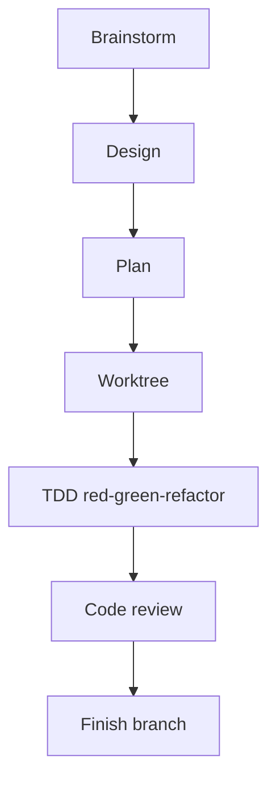
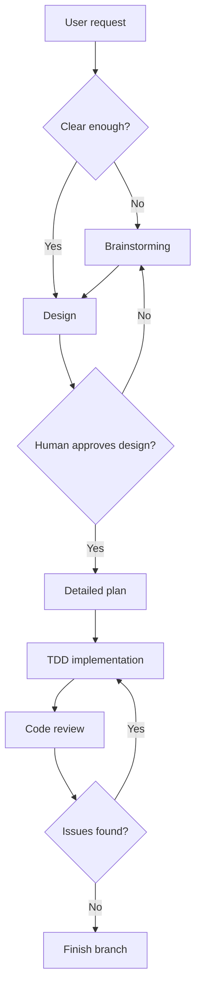
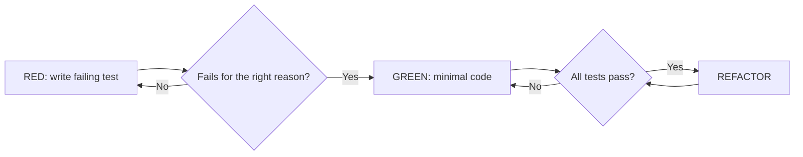
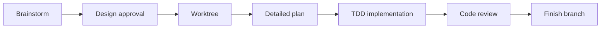
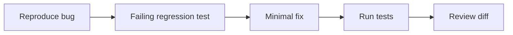

# Superpowers

Superpowers là methodology và skill library giúp AI coding agents hành xử giống software engineer có discipline hơn. Nó nhấn mạnh brainstorming, design approval, detailed planning, test-driven development, subagent execution, code review, worktrees và branch finishing.

Nếu Spec Kit là spec compiler, AWS AI-DLC là governance cockpit, GSD là delivery factory, thì Superpowers là **engineering discipline layer**.



## Mental model

Superpowers không cố sở hữu toàn bộ project lifecycle. Nó cung cấp situational skills:

| Tình huống | Skill mindset |
|---|---|
| Request mơ hồ | Brainstorm trước khi chốt solution |
| Change không tầm thường | Tạo và approve design |
| Implementation phức tạp | Viết detailed plan |
| Behavior thay đổi | Dùng test-driven development |
| Có thể parallelize | Dùng subagent-driven development |
| Code xong | Request code review |
| Branch work xong | Finish development branch sạch |

## Workflow



## TDD là điểm mạnh cốt lõi

Superpowers nhấn mạnh red-green-refactor:



Điều này quan trọng vì AI agent thường tự tin bằng lời nói. TDD chuyển confidence từ lời nói sang executable proof.

## Điểm mạnh

1. **Chống code trước nghĩ sau.** Agent bị đẩy qua brainstorm, design và plan trước khi sửa nhiều file.
2. **TDD giảm hallucinated correctness.** Behavior được chứng minh bằng failing/passing tests.
3. **Review rõ ràng.** Bước review riêng giúp bắt lỗi implementer bỏ sót.
4. **Composable.** Có thể dùng một skill cho bug nhỏ hoặc nhiều skill cho change lớn.
5. **Tool-agnostic về tinh thần.** Method có thể áp dụng qua nhiều coding agents.

## Điểm yếu

| Điểm yếu | Hệ quả thực tế |
|---|---|
| Không phải spec management system đầy đủ | Dùng Spec Kit nếu cần SDD artifacts chuẩn hóa |
| Không phải governance framework | Dùng AWS AI-DLC nếu cần audit, NFR, approval matrix |
| TDD có chi phí ban đầu | Team chưa quen TDD có thể thấy chậm |
| Phụ thuộc agent dùng đúng skill | Cần rules hoặc user nhắc khi agent lệch |
| Không phải project memory system sâu | GSD mạnh hơn cho long-running multi-phase memory |

## Use case tốt nhất

| Use case | Vì sao Superpowers hợp |
|---|---|
| Bug fix cần regression tests | TDD là workflow tự nhiên |
| Feature trong codebase hiện hữu | Design, plan, test, review mà không quá ceremony |
| Refactor | Tests và review giảm regression risk |
| Team muốn nâng chất lượng AI | Skills tác động trực tiếp đến hành vi agent |
| Agent hay đoán | Brainstorming và design approval ép clarification |

## Ví dụ: forgot password

Với Superpowers:

| Bước | Output |
|---|---|
| Brainstorm | Làm rõ UX, security, token, email và abuse cases |
| Design | API, model, flow và edge cases |
| Plan | Files, tests và implementation order |
| TDD | Failing tests cho expiration, invalid token, rate limit, no enumeration |
| Implement | Code tối thiểu để pass tests |
| Review | Security và quality review |
| Finish | Branch summary và verification |

Lợi ích cốt lõi là disciplined execution, không phải lifecycle governance.

## Hướng dẫn triển khai cấp chuyên gia

Dùng Superpowers khi bạn muốn đổi thói quen làm việc của agent: hỏi trước khi code, design trước khi đổi architecture, test trước implementation, review trước khi tuyên bố done.

### Bước 1: Chỉ cài vào agent bạn thật sự dùng

Superpowers hỗ trợ nhiều agent harness và plugin systems. Cài ở nơi team làm việc hằng ngày, không cài mọi nơi cùng lúc.

| Kiểu môi trường | Hướng dẫn thực tế |
|---|---|
| Plugin marketplace kiểu Claude | Cài Superpowers plugin và verify skills được list |
| Agent kiểu Cursor | Thêm plugin/rules và test bằng một design task nhỏ |
| CLI agent | Theo install path của agent rồi yêu cầu list available skills |
| Mixed team | Chuẩn hóa một primary harness trước khi scale |

Sau khi cài, chạy một task nhỏ và kiểm tra agent dùng đúng skill thay vì nhảy vào code.

### Bước 2: Kích hoạt skill rõ ràng

Trong vài tuần đầu, đừng trông chờ agent tự suy luận hết. Prompt trực tiếp:

```text
Use brainstorming first. Do not edit files until we approve the design.
```

```text
Use test-driven development. Start by writing the failing test for the behavior.
```

```text
Request a code review after implementation and fix all review findings before finalizing.
```

Cách này huấn luyện collaboration pattern cho cả human và agent.

### Bước 3: Dùng full workflow cho non-trivial changes



Task nhỏ dùng subset. Task high-risk dùng full chain.

### Bước 4: Áp dụng TDD đúng

TDD đúng:

1. Mô tả behavior tiếp theo.
2. Viết failing test.
3. Xác nhận test fail đúng lý do.
4. Viết minimal implementation.
5. Chạy test.
6. Refactor chỉ sau khi green.
7. Lặp lại cho behavior tiếp theo.

TDD sai:

- Viết implementation trước rồi test sau.
- Test mirror implementation details.
- Accept failing test mà không kiểm tra failure reason.
- Bỏ refactor vì "AI code nhìn ổn".

### Bước 5: Dùng worktrees để cô lập rủi ro

Dùng worktree khi:

- Change có thể đụng nhiều file.
- Muốn clean baseline.
- Nhiều agents làm song song.
- Muốn bỏ một experiment an toàn.

Trước implementation:

| Check | Lý do |
|---|---|
| Git status sạch | Tránh trộn unrelated work |
| Baseline tests pass | Biết failure nào là mới |
| Branch name phản ánh task | Dễ review và cleanup |
| Setup commands documented | Subagents reproduce được environment |

### Bước 6: Treat review như một phase riêng

Review nên kiểm tra:

| Review layer | Câu hỏi |
|---|---|
| Spec compliance | Có build đúng thứ đã đồng ý không? |
| Test quality | Tests chứng minh behavior hay chỉ mirror implementation? |
| Code quality | Change có đơn giản và maintainable không? |
| Architecture | Boundaries có còn nguyên không? |
| Risk | Auth, data, migration hoặc operations risks có đổi không? |

Pattern mạnh nhất là two-stage review: trước tiên compliance với plan/spec, sau đó code quality.

## Playbook tối ưu

### Cho bug fixes

Dùng loop ngắn nhưng chất lượng:



### Cho feature work

Dùng brainstorming, design, plan, TDD, review. Nếu feature lớn, kết hợp Spec Kit để quản artifact tốt hơn.

### Cho refactoring

Bắt buộc:

- Baseline tests pass trước refactor.
- Characterization tests cho risky behavior.
- Small commits hoặc reviewable diff chunks.
- Không đổi behavior trừ khi được approve rõ.

### Cho teams

Tạo team rule:

> Mọi AI-generated behavior change phải bắt đầu bằng failing test hoặc có documented reason vì sao TDD không phù hợp.

## Definition of done cho Superpowers

Task done khi:

1. Design được clarify cho non-trivial work.
2. Plan được approve hoặc change đủ nhỏ để bỏ formal planning.
3. Tests được viết trước hoặc cùng implementation.
4. Relevant tests pass.
5. Code review được request.
6. Review findings được fix hoặc reject có rationale.
7. Branch/worktree sạch và sẵn sàng merge.
