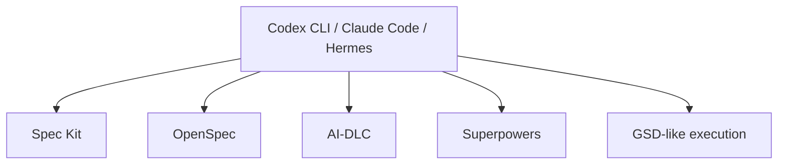

# Codex CLI vs Claude Code vs Hermes

Codex CLI, Claude Code và Hermes Agent đều nằm gần cùng một tầng kiến trúc: **agent harness / coding agent runtime**. Chúng có thể đọc repo, dùng tools, chạy commands và thực thi coding tasks. Khác biệt nằm ở product focus, openness, runtime customization và operational model.

## So sánh nhanh

| Tool | Category | Phù hợp nhất |
|---|---|---|
| Codex CLI | Polished coding agent CLI | Coding workflow hằng ngày trong repo |
| Claude Code | Polished coding agent CLI | Agentic coding trong Claude ecosystem |
| Hermes Agent | Open-source, hackable agent runtime | Custom/self-hosted/internal agent platforms |

## Điểm giống nhau

Cả ba đều có thể là execution layer cho workflow frameworks:



Chúng trả lời:

> AI agent tương tác với repo và tools của tôi thế nào?

Nhưng tự chúng chưa trả lời đầy đủ:

> Artifact nào là source of truth? Governance model của team là gì?

## Khác biệt chính

| Dimension | Codex CLI | Claude Code | Hermes Agent |
|---|---|---|---|
| Product style | Polished developer CLI | Polished developer CLI | Open-source runtime/CLI |
| Use mặc định tốt nhất | Coding và repo tasks | Coding và repo tasks | Custom agent platform hoặc research |
| Runtime hackability | Thấp hơn | Thấp hơn | Cao hơn |
| Self-host/local model fit | Tùy product support | Tùy product support | Hợp hơn về concept |
| Memory/skills/subagents | Tùy product | Tùy product | Điểm nhấn chính |
| Enterprise governance | Cần workflow/process | Cần workflow/process | Cần workflow/process |
| Best paired with | Spec Kit, OpenSpec, Superpowers | Spec Kit, OpenSpec, Superpowers | OpenSpec, AI-DLC, Superpowers, custom tools |

## Hướng dẫn chọn

| Tình huống | Chọn |
|---|---|
| Muốn nhanh nhất để code repo chất lượng | Codex CLI hoặc Claude Code |
| Đã productive với Codex/Claude | Không thêm Hermes nếu không có runtime requirement |
| Cần local/self-hosted models hoặc custom routing | Cân nhắc Hermes |
| Cần custom internal tools và memory | Cân nhắc Hermes |
| Cần spec/change workflow | Thêm OpenSpec hoặc Spec Kit vào bất kỳ harness nào |
| Cần enterprise governance | Thêm AI-DLC vào bất kỳ harness nào |
| Cần TDD/review discipline | Thêm Superpowers vào bất kỳ harness nào |

## Stack thường gặp

### Developer productivity stack

```text
Codex CLI or Claude Code
  + OpenSpec or Spec Kit
  + Superpowers
  + repo tests/CI
```

### Internal agent platform stack

```text
Hermes Agent
  + model router or local LLM
  + internal tools
  + OpenSpec for change specs
  + AI-DLC for high-risk governance
  + CI/test evidence
```

## Kết luận thực dụng

Nếu bạn đã dùng Codex CLI hoặc Claude Code hiệu quả, Hermes không tự động là bản nâng cấp. Nó là trade-off khác:

> Codex CLI và Claude Code tối ưu developer productivity hằng ngày. Hermes tối ưu open, customizable agent runtime control.

